# [📈 Live Status](https://demo.upptime.js.org): <!--live status--> **🟧 Partial outage**

This repository contains the open-source uptime monitor and status page for [Linkspreed](https://linkspreed.com), powered by [Linkspreed](https://github.com/linkspreed).

We use [Issues](https://github.com/linkspreed/linkspreed_uptime/issues) as incident reports, [Actions](https://github.com/linkspreed/linkspreed_uptime/actions) as uptime monitors, and [Pages](https://status.linkspreed.com) for the status page.

<!--start: status pages-->
<!-- This summary is generated by Upptime (https://github.com/upptime/upptime) -->
<!-- Do not edit this manually, your changes will be overwritten -->
<!-- prettier-ignore -->
| URL | Status | History | Response Time | Uptime |
| --- | ------ | ------- | ------------- | ------ |
|  [Adseasy](https://adseasy.tk) | 🟩 Up | [adseasy.yml](https://github.com/linkspreed/linkspreed_uptime/commits/HEAD/history/adseasy.yml) | 

 1051ms
     
 | 

<a href="https://status.linkspreed.com/history/adseasy">99.92%</a>
    

|  [Airr](https://airr.tk) | 🟩 Up | [airr.yml](https://github.com/linkspreed/linkspreed_uptime/commits/HEAD/history/airr.yml) | 

 1881ms
     
 | 

<a href="https://status.linkspreed.com/history/airr">99.92%</a>
    

|  [Analytix](https://analytix.tk) | 🟩 Up | [analytix.yml](https://github.com/linkspreed/linkspreed_uptime/commits/HEAD/history/analytix.yml) | 

 915ms
     
 | 

<a href="https://status.linkspreed.com/history/analytix">99.92%</a>
    

|  [Articly](https://articly.tk) | 🟩 Up | [articly.yml](https://github.com/linkspreed/linkspreed_uptime/commits/HEAD/history/articly.yml) | 

 856ms
     
 | 

<a href="https://status.linkspreed.com/history/articly">99.92%</a>
    

|  [Backpay](https://backpay.cf) | 🟥 Down | [backpay.yml](https://github.com/linkspreed/linkspreed_uptime/commits/HEAD/history/backpay.yml) | 

 0ms
     
 | 

<a href="https://status.linkspreed.com/history/backpay">0.00%</a>
    

|  [BeSave](https://besave.tk) | 🟩 Up | [be-save.yml](https://github.com/linkspreed/linkspreed_uptime/commits/HEAD/history/be-save.yml) | 

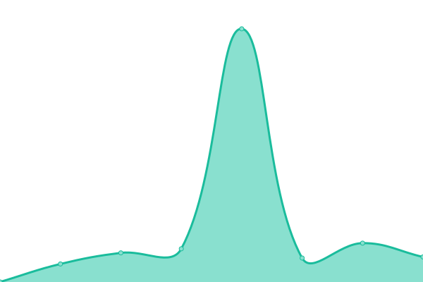 597ms
     
 | 

<a href="https://status.linkspreed.com/history/be-save">99.92%</a>
    

|  [BeYou](https://beyou.cf) | 🟩 Up | [be-you.yml](https://github.com/linkspreed/linkspreed_uptime/commits/HEAD/history/be-you.yml) | 

 992ms
     
 | 

<a href="https://status.linkspreed.com/history/be-you">99.92%</a>
    

|  [Biospreed](https://biospreed.tk) | 🟩 Up | [biospreed.yml](https://github.com/linkspreed/linkspreed_uptime/commits/HEAD/history/biospreed.yml) | 

 782ms
     
 | 

<a href="https://status.linkspreed.com/history/biospreed">99.92%</a>
    

|  [BioX](https://biox.ga) | 🟩 Up | [bio-x.yml](https://github.com/linkspreed/linkspreed_uptime/commits/HEAD/history/bio-x.yml) | 

 2133ms
     
 | 

<a href="https://status.linkspreed.com/history/bio-x">99.92%</a>
    

|  [CallCloud](https://callcloud.cf) | 🟩 Up | [call-cloud.yml](https://github.com/linkspreed/linkspreed_uptime/commits/HEAD/history/call-cloud.yml) | 

 814ms
     
 | 

<a href="https://status.linkspreed.com/history/call-cloud">99.92%</a>
    

|  [Ceal](https://ceal.ga) | 🟩 Up | [ceal.yml](https://github.com/linkspreed/linkspreed_uptime/commits/HEAD/history/ceal.yml) | 

 873ms
     
 | 

<a href="https://status.linkspreed.com/history/ceal">100.00%</a>
    

|  [Cheezz](https://cheezz.tk) | 🟩 Up | [cheezz.yml](https://github.com/linkspreed/linkspreed_uptime/commits/HEAD/history/cheezz.yml) | 

 955ms
     
 | 

<a href="https://status.linkspreed.com/history/cheezz">100.00%</a>
    

|  [Chirp](https://chirp.ga) | 🟩 Up | [chirp.yml](https://github.com/linkspreed/linkspreed_uptime/commits/HEAD/history/chirp.yml) | 

 1021ms
     
 | 

<a href="https://status.linkspreed.com/history/chirp">100.00%</a>
    

|  [Chitter](https://chitter.ml) | 🟩 Up | [chitter.yml](https://github.com/linkspreed/linkspreed_uptime/commits/HEAD/history/chitter.yml) | 

 1072ms
     
 | 

<a href="https://status.linkspreed.com/history/chitter">94.94%</a>
    

|  [Cloud2Go](https://cloud2go.tk) | 🟩 Up | [cloud2-go.yml](https://github.com/linkspreed/linkspreed_uptime/commits/HEAD/history/cloud2-go.yml) | 

 1359ms
     
 | 

<a href="https://status.linkspreed.com/history/cloud2-go">100.00%</a>
    

|  [Cloud2Go Share](http://share.cloud2go.tk) | 🟩 Up | [cloud2-go-share.yml](https://github.com/linkspreed/linkspreed_uptime/commits/HEAD/history/cloud2-go-share.yml) | 

 1398ms
     
 | 

<a href="https://status.linkspreed.com/history/cloud2-go-share">100.00%</a>
    

|  [Cloud2Share](https://cloud2share.tk) | 🟩 Up | [cloud2-share.yml](https://github.com/linkspreed/linkspreed_uptime/commits/HEAD/history/cloud2-share.yml) | 

 437ms
     
 | 

<a href="https://status.linkspreed.com/history/cloud2-share">100.00%</a>
    

|  [CloudSpreed](https://cloudspreed.tk) | 🟩 Up | [cloud-spreed.yml](https://github.com/linkspreed/linkspreed_uptime/commits/HEAD/history/cloud-spreed.yml) | 

 1219ms
     
 | 

<a href="https://status.linkspreed.com/history/cloud-spreed">100.00%</a>
    

|  [Connected](https://connected.tk) | 🟩 Up | [connected.yml](https://github.com/linkspreed/linkspreed_uptime/commits/HEAD/history/connected.yml) | 

 859ms
     
 | 

<a href="https://status.linkspreed.com/history/connected">100.00%</a>
    

|  [Contribution](https://contribution.tk) | 🟩 Up | [contribution.yml](https://github.com/linkspreed/linkspreed_uptime/commits/HEAD/history/contribution.yml) | 

 845ms
     
 | 

<a href="https://status.linkspreed.com/history/contribution">100.00%</a>
    

|  [Critch](https://critch.cf) | 🟩 Up | [critch.yml](https://github.com/linkspreed/linkspreed_uptime/commits/HEAD/history/critch.yml) | 

 951ms
     
 | 

<a href="https://status.linkspreed.com/history/critch">100.00%</a>
    

|  [CrossQA](https://crossqa.tk) | 🟩 Up | [cross-qa.yml](https://github.com/linkspreed/linkspreed_uptime/commits/HEAD/history/cross-qa.yml) | 

 737ms
     
 | 

<a href="https://status.linkspreed.com/history/cross-qa">100.00%</a>
    

|  [Datify](https://datify.cf) | 🟩 Up | [datify.yml](https://github.com/linkspreed/linkspreed_uptime/commits/HEAD/history/datify.yml) | 

 1232ms
     
 | 

<a href="https://status.linkspreed.com/history/datify">100.00%</a>
    

|  [DeePage](https://deepage.tk) | 🟩 Up | [dee-page.yml](https://github.com/linkspreed/linkspreed_uptime/commits/HEAD/history/dee-page.yml) | 

 744ms
     
 | 

<a href="https://status.linkspreed.com/history/dee-page">100.00%</a>
    

|  [Discounty](https://discounty.tk) | 🟥 Down | [discounty.yml](https://github.com/linkspreed/linkspreed_uptime/commits/HEAD/history/discounty.yml) | 

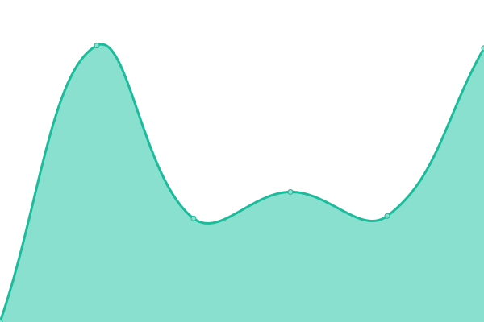 911ms
     
 | 

<a href="https://status.linkspreed.com/history/discounty">0.00%</a>
    

|  [Diskit](https://diskit.tk) | 🟩 Up | [diskit.yml](https://github.com/linkspreed/linkspreed_uptime/commits/HEAD/history/diskit.yml) | 

 770ms
     
 | 

<a href="https://status.linkspreed.com/history/diskit">100.00%</a>
    

|  [DNServer](https://dnserver.cf) | 🟩 Up | [dn-server.yml](https://github.com/linkspreed/linkspreed_uptime/commits/HEAD/history/dn-server.yml) | 

 1417ms
     
 | 

<a href="https://status.linkspreed.com/history/dn-server">100.00%</a>
    

|  [Downflix](https://downflix.cf) | 🟩 Up | [downflix.yml](https://github.com/linkspreed/linkspreed_uptime/commits/HEAD/history/downflix.yml) | 

 898ms
     
 | 

<a href="https://status.linkspreed.com/history/downflix">100.00%</a>
    

|  [Dreambuild](https://dreambuild.tk) | 🟩 Up | [dreambuild.yml](https://github.com/linkspreed/linkspreed_uptime/commits/HEAD/history/dreambuild.yml) | 

 1439ms
     
 | 

<a href="https://status.linkspreed.com/history/dreambuild">100.00%</a>
    

|  [Firelaps](https://firelaps.cf) | 🟥 Down | [firelaps.yml](https://github.com/linkspreed/linkspreed_uptime/commits/HEAD/history/firelaps.yml) | 

 720ms
     
 | 

<a href="https://status.linkspreed.com/history/firelaps">0.00%</a>
    

|  [FlipX](https://flipx.tk) | 🟩 Up | [flip-x.yml](https://github.com/linkspreed/linkspreed_uptime/commits/HEAD/history/flip-x.yml) | 

 1744ms
     
 | 

<a href="https://status.linkspreed.com/history/flip-x">100.00%</a>
    

|  [ForJu](https://forju.tk) | 🟩 Up | [for-ju.yml](https://github.com/linkspreed/linkspreed_uptime/commits/HEAD/history/for-ju.yml) | 

 963ms
     
 | 

<a href="https://status.linkspreed.com/history/for-ju">100.00%</a>
    

|  [GetPro](https://getpro.gq/) | 🟩 Up | [get-pro.yml](https://github.com/linkspreed/linkspreed_uptime/commits/HEAD/history/get-pro.yml) | 

 1447ms
     
 | 

<a href="https://status.linkspreed.com/history/get-pro">100.00%</a>
    

|  [Gogola](https://gogola.ga) | 🟥 Down | [gogola.yml](https://github.com/linkspreed/linkspreed_uptime/commits/HEAD/history/gogola.yml) | 

 23528ms
     
 | 

<a href="https://status.linkspreed.com/history/gogola">70.18%</a>
    

|  [Grown](https://grown.tk) | 🟩 Up | [grown.yml](https://github.com/linkspreed/linkspreed_uptime/commits/HEAD/history/grown.yml) | 

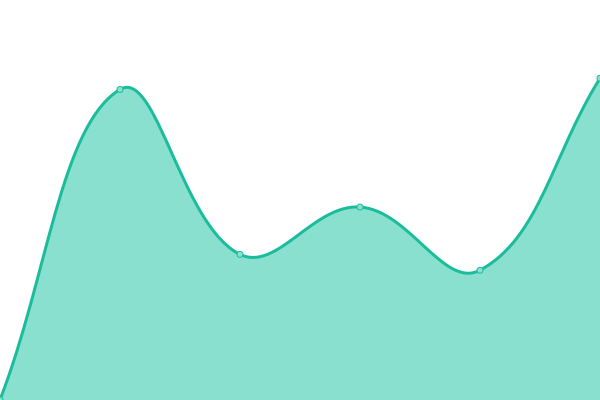 1131ms
     
 | 

<a href="https://status.linkspreed.com/history/grown">100.00%</a>
    

|  [Guju](https://guju.tk) | 🟩 Up | [guju.yml](https://github.com/linkspreed/linkspreed_uptime/commits/HEAD/history/guju.yml) | 

 962ms
     
 | 

<a href="https://status.linkspreed.com/history/guju">100.00%</a>
    

|  [Him4Her](https://him4her.tk) | 🟩 Up | [him4-her.yml](https://github.com/linkspreed/linkspreed_uptime/commits/HEAD/history/him4-her.yml) | 

 893ms
     
 | 

<a href="https://status.linkspreed.com/history/him4-her">100.00%</a>
    

|  [Hutty](https://hutty.tk) | 🟥 Down | [hutty.yml](https://github.com/linkspreed/linkspreed_uptime/commits/HEAD/history/hutty.yml) | 

 1339ms
     
 | 

<a href="https://status.linkspreed.com/history/hutty">0.00%</a>
    

|  [IceCloud](https://icecloud.cf) | 🟩 Up | [ice-cloud.yml](https://github.com/linkspreed/linkspreed_uptime/commits/HEAD/history/ice-cloud.yml) | 

 1278ms
     
 | 

<a href="https://status.linkspreed.com/history/ice-cloud">100.00%</a>
    

|  [Ignyte](https://ignyte.tk) | 🟩 Up | [ignyte.yml](https://github.com/linkspreed/linkspreed_uptime/commits/HEAD/history/ignyte.yml) | 

 741ms
     
 | 

<a href="https://status.linkspreed.com/history/ignyte">100.00%</a>
    

|  [Joyn](https://joyn.tk) | 🟩 Up | [joyn.yml](https://github.com/linkspreed/linkspreed_uptime/commits/HEAD/history/joyn.yml) | 

 640ms
     
 | 

<a href="https://status.linkspreed.com/history/joyn">100.00%</a>
    

|  [Kisk](https://kisk.tk) | 🟩 Up | [kisk.yml](https://github.com/linkspreed/linkspreed_uptime/commits/HEAD/history/kisk.yml) | 

 1510ms
     
 | 

<a href="https://status.linkspreed.com/history/kisk">100.00%</a>
    

|  [KitChat](https://kitchat.tk) | 🟩 Up | [kit-chat.yml](https://github.com/linkspreed/linkspreed_uptime/commits/HEAD/history/kit-chat.yml) | 

 852ms
     
 | 

<a href="https://status.linkspreed.com/history/kit-chat">100.00%</a>
    

|  [LaaS](https://laas.ml) | 🟩 Up | [laa-s.yml](https://github.com/linkspreed/linkspreed_uptime/commits/HEAD/history/laa-s.yml) | 

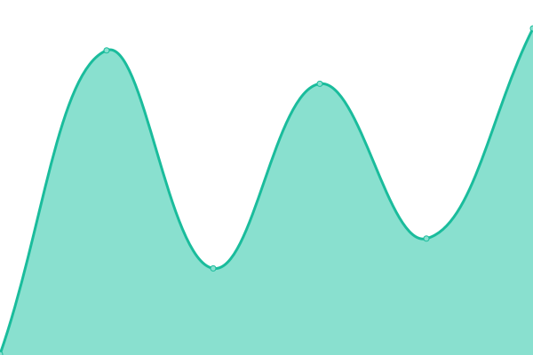 1263ms
     
 | 

<a href="https://status.linkspreed.com/history/laa-s">100.00%</a>
    

|  [Lime](https://lime.gq) | 🟩 Up | [lime.yml](https://github.com/linkspreed/linkspreed_uptime/commits/HEAD/history/lime.yml) | 

 997ms
     
 | 

<a href="https://status.linkspreed.com/history/lime">100.00%</a>
    

|  [LinkCream](https://linkcream.tk) | 🟥 Down | [link-cream.yml](https://github.com/linkspreed/linkspreed_uptime/commits/HEAD/history/link-cream.yml) | 

 703ms
     
 | 

<a href="https://status.linkspreed.com/history/link-cream">0.00%</a>
    

|  [Linkspreed](https://linkspreed.com) | 🟩 Up | [linkspreed.yml](https://github.com/linkspreed/linkspreed_uptime/commits/HEAD/history/linkspreed.yml) | 

 2434ms
     
 | 

<a href="https://status.linkspreed.com/history/linkspreed">58.80%</a>
    

|  [Linkspreed Analytics](https://analytics.linkspreed.com) | 🟩 Up | [linkspreed-analytics.yml](https://github.com/linkspreed/linkspreed_uptime/commits/HEAD/history/linkspreed-analytics.yml) | 

 910ms
     
 | 

<a href="https://status.linkspreed.com/history/linkspreed-analytics">100.00%</a>
    

|  [Linkspreed Drive](https://drive.linkspreed.com) | 🟩 Up | [linkspreed-drive.yml](https://github.com/linkspreed/linkspreed_uptime/commits/HEAD/history/linkspreed-drive.yml) | 

 846ms
     
 | 

<a href="https://status.linkspreed.com/history/linkspreed-drive">100.00%</a>
    

|  [Helpdesk Linkspreed](https://helpdesk.linkspreed.com/) | 🟩 Up | [helpdesk-linkspreed.yml](https://github.com/linkspreed/linkspreed_uptime/commits/HEAD/history/helpdesk-linkspreed.yml) | 

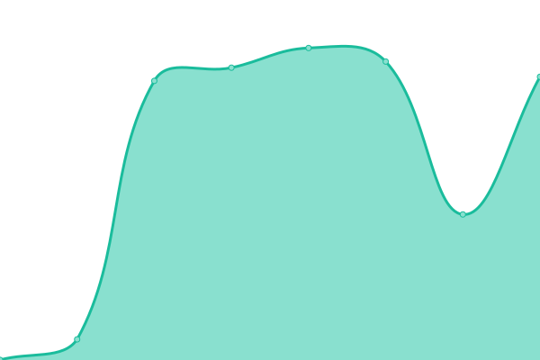 1047ms
     
 | 

<a href="https://status.linkspreed.com/history/helpdesk-linkspreed">94.92%</a>
    

|  [Linkspreed Mails](https://mails.linkspreed.com) | 🟩 Up | [linkspreed-mails.yml](https://github.com/linkspreed/linkspreed_uptime/commits/HEAD/history/linkspreed-mails.yml) | 

 1084ms
     
 | 

<a href="https://status.linkspreed.com/history/linkspreed-mails">100.00%</a>
    

|  [Linkspreed Photos](https://photos.linkspreed.com) | 🟩 Up | [linkspreed-photos.yml](https://github.com/linkspreed/linkspreed_uptime/commits/HEAD/history/linkspreed-photos.yml) | 

 1021ms
     
 | 

<a href="https://status.linkspreed.com/history/linkspreed-photos">100.00%</a>
    

|  [Linkspreed Store](https://store.linkspreed.com) | 🟩 Up | [linkspreed-store.yml](https://github.com/linkspreed/linkspreed_uptime/commits/HEAD/history/linkspreed-store.yml) | 

 575ms
     
 | 

<a href="https://status.linkspreed.com/history/linkspreed-store">100.00%</a>
    

|  [Linkspreed Web](https://web.linkspreed.com) | 🟩 Up | [linkspreed-web.yml](https://github.com/linkspreed/linkspreed_uptime/commits/HEAD/history/linkspreed-web.yml) | 

 668ms
     
 | 

<a href="https://status.linkspreed.com/history/linkspreed-web">100.00%</a>
    

|  [Linkspreed Web4](https://web4.linkspreed.com) | 🟩 Up | [linkspreed-web4.yml](https://github.com/linkspreed/linkspreed_uptime/commits/HEAD/history/linkspreed-web4.yml) | 

 165ms
     
 | 

<a href="https://status.linkspreed.com/history/linkspreed-web4">100.00%</a>
    

|  [LinkLab](https://linklab.ga) | 🟩 Up | [link-lab.yml](https://github.com/linkspreed/linkspreed_uptime/commits/HEAD/history/link-lab.yml) | 

 665ms
     
 | 

<a href="https://status.linkspreed.com/history/link-lab">100.00%</a>
    

|  [LSily](https://lsily.tk) | 🟩 Up | [l-sily.yml](https://github.com/linkspreed/linkspreed_uptime/commits/HEAD/history/l-sily.yml) | 

 1406ms
     
 | 

<a href="https://status.linkspreed.com/history/l-sily">100.00%</a>
    

|  [LSNews](https://lsnews.cf) | 🟩 Up | [ls-news.yml](https://github.com/linkspreed/linkspreed_uptime/commits/HEAD/history/ls-news.yml) | 

 1008ms
     
 | 

<a href="https://status.linkspreed.com/history/ls-news">100.00%</a>
    

|  [Mailspread](https://mailspread.cf) | 🟩 Up | [mailspread.yml](https://github.com/linkspreed/linkspreed_uptime/commits/HEAD/history/mailspread.yml) | 

 610ms
     
 | 

<a href="https://status.linkspreed.com/history/mailspread">100.00%</a>
    

|  [Mapsli](https://mapsli.tk) | 🟩 Up | [mapsli.yml](https://github.com/linkspreed/linkspreed_uptime/commits/HEAD/history/mapsli.yml) | 

 744ms
     
 | 

<a href="https://status.linkspreed.com/history/mapsli">100.00%</a>
    

|  [Memevid](https://memevid.tk) | 🟩 Up | [memevid.yml](https://github.com/linkspreed/linkspreed_uptime/commits/HEAD/history/memevid.yml) | 

 988ms
     
 | 

<a href="https://status.linkspreed.com/history/memevid">100.00%</a>
    

|  [Metabox](https://metabox.ga) | 🟩 Up | [metabox.yml](https://github.com/linkspreed/linkspreed_uptime/commits/HEAD/history/metabox.yml) | 

 1494ms
     
 | 

<a href="https://status.linkspreed.com/history/metabox">100.00%</a>
    

|  [Metaspace](https://metaspace.tk) | 🟩 Up | [metaspace.yml](https://github.com/linkspreed/linkspreed_uptime/commits/HEAD/history/metaspace.yml) | 

 871ms
     
 | 

<a href="https://status.linkspreed.com/history/metaspace">100.00%</a>
    

|  [Musiccloud](https://musiccloud.cf) | 🟩 Up | [musiccloud.yml](https://github.com/linkspreed/linkspreed_uptime/commits/HEAD/history/musiccloud.yml) | 

 1084ms
     
 | 

<a href="https://status.linkspreed.com/history/musiccloud">100.00%</a>
    

|  [MyBuy](https://mybuy.cf) | 🟩 Up | [my-buy.yml](https://github.com/linkspreed/linkspreed_uptime/commits/HEAD/history/my-buy.yml) | 

 989ms
     
 | 

<a href="https://status.linkspreed.com/history/my-buy">100.00%</a>
    

|  [MyDancX](https://mydancx.cf) | 🟩 Up | [my-danc-x.yml](https://github.com/linkspreed/linkspreed_uptime/commits/HEAD/history/my-danc-x.yml) | 

 1124ms
     
 | 

<a href="https://status.linkspreed.com/history/my-danc-x">100.00%</a>
    

|  [Netavark](https://netavark.tk) | 🟩 Up | [netavark.yml](https://github.com/linkspreed/linkspreed_uptime/commits/HEAD/history/netavark.yml) | 

 1283ms
     
 | 

<a href="https://status.linkspreed.com/history/netavark">100.00%</a>
    

|  [NetSky](https://netsky.tk) | 🟩 Up | [net-sky.yml](https://github.com/linkspreed/linkspreed_uptime/commits/HEAD/history/net-sky.yml) | 

 1838ms
     
 | 

<a href="https://status.linkspreed.com/history/net-sky">100.00%</a>
    

|  [NewsNode](https://newsnode.tk) | 🟩 Up | [news-node.yml](https://github.com/linkspreed/linkspreed_uptime/commits/HEAD/history/news-node.yml) | 

 1504ms
     
 | 

<a href="https://status.linkspreed.com/history/news-node">100.00%</a>
    

|  [Niming](https://niming.tk) | 🟩 Up | [niming.yml](https://github.com/linkspreed/linkspreed_uptime/commits/HEAD/history/niming.yml) | 

 1065ms
     
 | 

<a href="https://status.linkspreed.com/history/niming">100.00%</a>
    

|  [Nither](https://nither.tk) | 🟥 Down | [nither.yml](https://github.com/linkspreed/linkspreed_uptime/commits/HEAD/history/nither.yml) | 

 757ms
     
 | 

<a href="https://status.linkspreed.com/history/nither">0.00%</a>
    

|  [NodX](https://nodx.tk) | 🟩 Up | [nod-x.yml](https://github.com/linkspreed/linkspreed_uptime/commits/HEAD/history/nod-x.yml) | 

 1786ms
     
 | 

<a href="https://status.linkspreed.com/history/nod-x">100.00%</a>
    

|  [OnlyPaid](https://onlypaid.tk) | 🟩 Up | [only-paid.yml](https://github.com/linkspreed/linkspreed_uptime/commits/HEAD/history/only-paid.yml) | 

 1190ms
     
 | 

<a href="https://status.linkspreed.com/history/only-paid">100.00%</a>
    

|  [Ondu](https://ondu.tk) | 🟩 Up | [ondu.yml](https://github.com/linkspreed/linkspreed_uptime/commits/HEAD/history/ondu.yml) | 

 1442ms
     
 | 

<a href="https://status.linkspreed.com/history/ondu">100.00%</a>
    

|  [Payback](https://payback.ga) | 🟥 Down | [payback.yml](https://github.com/linkspreed/linkspreed_uptime/commits/HEAD/history/payback.yml) | 

 949ms
     
 | 

<a href="https://status.linkspreed.com/history/payback">0.00%</a>
    

|  [Payback](https://payback.gq) | 🟥 Down | [payback.yml](https://github.com/linkspreed/linkspreed_uptime/commits/HEAD/history/payback.yml) | 

 949ms
     
 | 

<a href="https://status.linkspreed.com/history/payback">0.00%</a>
    

|  [PayCount](https://paycount.cf) | 🟩 Up | [pay-count.yml](https://github.com/linkspreed/linkspreed_uptime/commits/HEAD/history/pay-count.yml) | 

 1631ms
     
 | 

<a href="https://status.linkspreed.com/history/pay-count">100.00%</a>
    

|  [Peek](https://peek.ml) | 🟩 Up | [peek.yml](https://github.com/linkspreed/linkspreed_uptime/commits/HEAD/history/peek.yml) | 

 836ms
     
 | 

<a href="https://status.linkspreed.com/history/peek">100.00%</a>
    

|  [Petabyte](https://petabyte.ml) | 🟩 Up | [petabyte.yml](https://github.com/linkspreed/linkspreed_uptime/commits/HEAD/history/petabyte.yml) | 

 1640ms
     
 | 

<a href="https://status.linkspreed.com/history/petabyte">100.00%</a>
    

|  [PinPix](https://pinpix.cf) | 🟩 Up | [pin-pix.yml](https://github.com/linkspreed/linkspreed_uptime/commits/HEAD/history/pin-pix.yml) | 

 974ms
     
 | 

<a href="https://status.linkspreed.com/history/pin-pix">100.00%</a>
    

|  [PinSec](https://pinsec.tk) | 🟩 Up | [pin-sec.yml](https://github.com/linkspreed/linkspreed_uptime/commits/HEAD/history/pin-sec.yml) | 

 962ms
     
 | 

<a href="https://status.linkspreed.com/history/pin-sec">100.00%</a>
    

|  [Pixly](https://pixly.tk) | 🟩 Up | [pixly.yml](https://github.com/linkspreed/linkspreed_uptime/commits/HEAD/history/pixly.yml) | 

 631ms
     
 | 

<a href="https://status.linkspreed.com/history/pixly">100.00%</a>
    

|  [Ples](https://ples.ml) | 🟩 Up | [ples.yml](https://github.com/linkspreed/linkspreed_uptime/commits/HEAD/history/ples.yml) | 

 1080ms
     
 | 

<a href="https://status.linkspreed.com/history/ples">100.00%</a>
    

|  [Plop](https://plop.tk) | 🟩 Up | [plop.yml](https://github.com/linkspreed/linkspreed_uptime/commits/HEAD/history/plop.yml) | 

 935ms
     
 | 

<a href="https://status.linkspreed.com/history/plop">100.00%</a>
    

|  [Poddy](https://poddy.tk) | 🟩 Up | [poddy.yml](https://github.com/linkspreed/linkspreed_uptime/commits/HEAD/history/poddy.yml) | 

 976ms
     
 | 

<a href="https://status.linkspreed.com/history/poddy">100.00%</a>
    

|  [Profilio](https://www.profilio.cf) | 🟩 Up | [profilio.yml](https://github.com/linkspreed/linkspreed_uptime/commits/HEAD/history/profilio.yml) | 

 1453ms
     
 | 

<a href="https://status.linkspreed.com/history/profilio">100.00%</a>
    

|  [Pubit](https://pubit.tk) | 🟩 Up | [pubit.yml](https://github.com/linkspreed/linkspreed_uptime/commits/HEAD/history/pubit.yml) | 

 1080ms
     
 | 

<a href="https://status.linkspreed.com/history/pubit">94.91%</a>
    

|  [QRMe](https://qrme.cf) | 🟩 Up | [qr-me.yml](https://github.com/linkspreed/linkspreed_uptime/commits/HEAD/history/qr-me.yml) | 

 874ms
     
 | 

<a href="https://status.linkspreed.com/history/qr-me">94.91%</a>
    

|  [Quexy](https://quexy.cf) | 🟩 Up | [quexy.yml](https://github.com/linkspreed/linkspreed_uptime/commits/HEAD/history/quexy.yml) | 

 839ms
     
 | 

<a href="https://status.linkspreed.com/history/quexy">94.91%</a>
    

|  [Rank](https://rank.ga) | 🟩 Up | [rank.yml](https://github.com/linkspreed/linkspreed_uptime/commits/HEAD/history/rank.yml) | 

 1326ms
     
 | 

<a href="https://status.linkspreed.com/history/rank">94.91%</a>
    

|  [RealPin](https://realpin.tk) | 🟩 Up | [real-pin.yml](https://github.com/linkspreed/linkspreed_uptime/commits/HEAD/history/real-pin.yml) | 

 758ms
     
 | 

<a href="https://status.linkspreed.com/history/real-pin">94.91%</a>
    

|  [Reply](https://reply.cf) | 🟩 Up | [reply.yml](https://github.com/linkspreed/linkspreed_uptime/commits/HEAD/history/reply.yml) | 

 765ms
     
 | 

<a href="https://status.linkspreed.com/history/reply">94.91%</a>
    

|  [SeedSpreed](https://seedspreed.cf) | 🟩 Up | [seed-spreed.yml](https://github.com/linkspreed/linkspreed_uptime/commits/HEAD/history/seed-spreed.yml) | 

 576ms
     
 | 

<a href="https://status.linkspreed.com/history/seed-spreed">94.91%</a>
    

|  [Share](https://share.ga) | 🟩 Up | [share.yml](https://github.com/linkspreed/linkspreed_uptime/commits/HEAD/history/share.yml) | 

 947ms
     
 | 

<a href="https://status.linkspreed.com/history/share">94.91%</a>
    

|  [ShareNode](https://sharenode.tk) | 🟩 Up | [share-node.yml](https://github.com/linkspreed/linkspreed_uptime/commits/HEAD/history/share-node.yml) | 

 1796ms
     
 | 

<a href="https://status.linkspreed.com/history/share-node">94.91%</a>
    

|  [Shortcut](https://shortcut.tk) | 🟩 Up | [shortcut.yml](https://github.com/linkspreed/linkspreed_uptime/commits/HEAD/history/shortcut.yml) | 

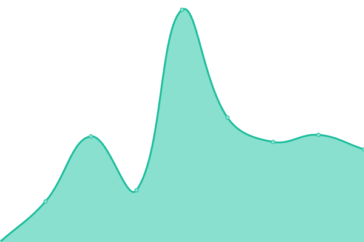 1016ms
     
 | 

<a href="https://status.linkspreed.com/history/shortcut">94.91%</a>
    

|  [Shortrack](https://shortrack.tk) | 🟩 Up | [shortrack.yml](https://github.com/linkspreed/linkspreed_uptime/commits/HEAD/history/shortrack.yml) | 

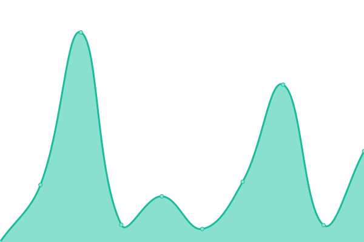 1123ms
     
 | 

<a href="https://status.linkspreed.com/history/shortrack">94.91%</a>
    

|  [Showit](https://showit.tk) | 🟩 Up | [showit.yml](https://github.com/linkspreed/linkspreed_uptime/commits/HEAD/history/showit.yml) | 

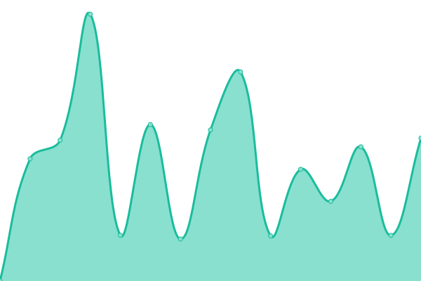 1047ms
     
 | 

<a href="https://status.linkspreed.com/history/showit">94.91%</a>
    

|  [SiteSpace](https://sitespace.tk) | 🟩 Up | [site-space.yml](https://github.com/linkspreed/linkspreed_uptime/commits/HEAD/history/site-space.yml) | 

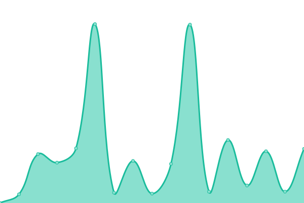 1894ms
     
 | 

<a href="https://status.linkspreed.com/history/site-space">94.91%</a>
    

|  [Slinky](https://slinky.ml) | 🟩 Up | [slinky.yml](https://github.com/linkspreed/linkspreed_uptime/commits/HEAD/history/slinky.yml) | 

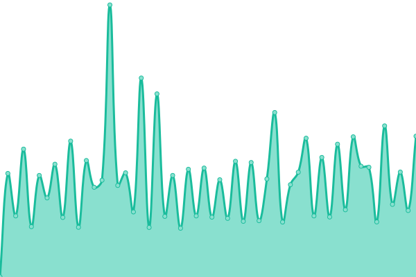 741ms
     
 | 

<a href="https://status.linkspreed.com/history/slinky">94.91%</a>
    

|  [Slurch](https://slurch.tk) | 🟩 Up | [slurch.yml](https://github.com/linkspreed/linkspreed_uptime/commits/HEAD/history/slurch.yml) | 

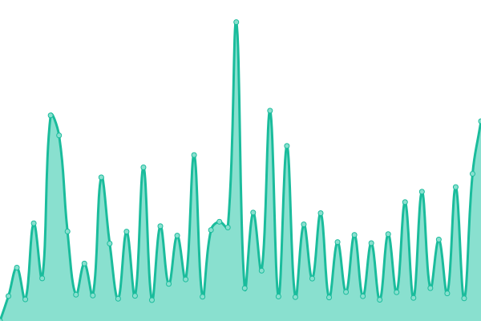 1144ms
     
 | 

<a href="https://status.linkspreed.com/history/slurch">94.91%</a>
    

|  [SmartPix](https://smartpix.cf) | 🟩 Up | [smart-pix.yml](https://github.com/linkspreed/linkspreed_uptime/commits/HEAD/history/smart-pix.yml) | 

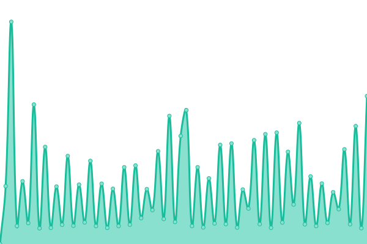 1220ms
     
 | 

<a href="https://status.linkspreed.com/history/smart-pix">94.91%</a>
    

|  [SnapLink](https://snaplink.tk) | 🟩 Up | [snap-link.yml](https://github.com/linkspreed/linkspreed_uptime/commits/HEAD/history/snap-link.yml) | 

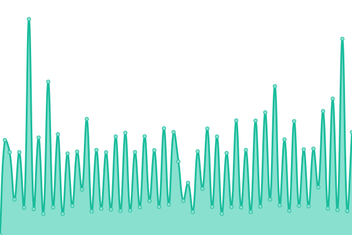 1071ms
     
 | 

<a href="https://status.linkspreed.com/history/snap-link">94.91%</a>
    

|  [Snippite](https://snippite.tk) | 🟩 Up | [snippite.yml](https://github.com/linkspreed/linkspreed_uptime/commits/HEAD/history/snippite.yml) | 

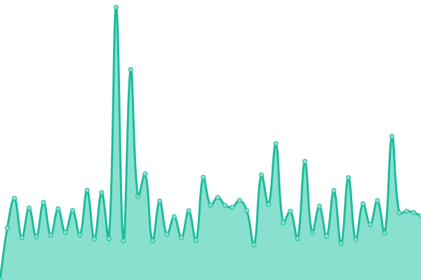 746ms
     
 | 

<a href="https://status.linkspreed.com/history/snippite">94.91%</a>
    

|  [Snoogie](https://snoogie.tk) | 🟩 Up | [snoogie.yml](https://github.com/linkspreed/linkspreed_uptime/commits/HEAD/history/snoogie.yml) | 

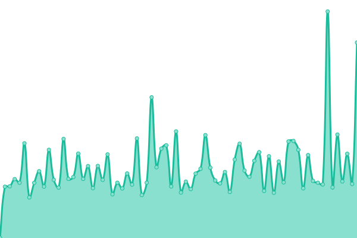 791ms
     
 | 

<a href="https://status.linkspreed.com/history/snoogie">94.91%</a>
    

|  [SoundChest](https://soundchest.cf) | 🟩 Up | [sound-chest.yml](https://github.com/linkspreed/linkspreed_uptime/commits/HEAD/history/sound-chest.yml) | 

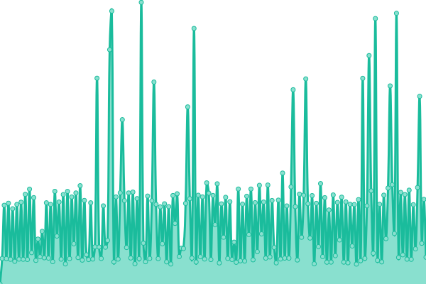 853ms
     
 | 

<a href="https://status.linkspreed.com/history/sound-chest">83.37%</a>
    

|  [Spypy](https://spypy.cf) | 🟩 Up | [spypy.yml](https://github.com/linkspreed/linkspreed_uptime/commits/HEAD/history/spypy.yml) | 

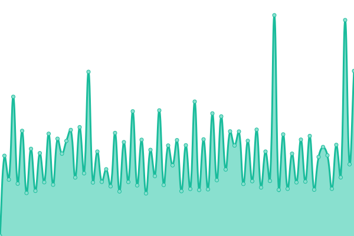 921ms
     
 | 

<a href="https://status.linkspreed.com/history/spypy">39.88%</a>
    

|  [Start2Up](https://start2up.tk) | 🟩 Up | [start2-up.yml](https://github.com/linkspreed/linkspreed_uptime/commits/HEAD/history/start2-up.yml) | 

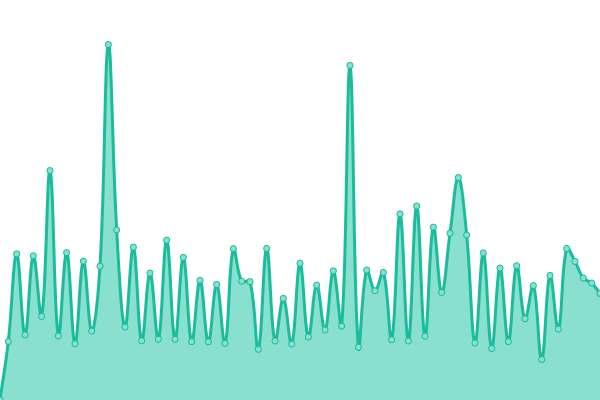 894ms
     
 | 

<a href="https://status.linkspreed.com/history/start2-up">39.80%</a>
    

|  [Stix](https://stix.ga) | 🟩 Up | [stix.yml](https://github.com/linkspreed/linkspreed_uptime/commits/HEAD/history/stix.yml) | 

 1007ms
     
 | 

<a href="https://status.linkspreed.com/history/stix">40.65%</a>
    

|  [Store4Ju](https://store4ju.tk) | 🟩 Up | [store4-ju.yml](https://github.com/linkspreed/linkspreed_uptime/commits/HEAD/history/store4-ju.yml) | 

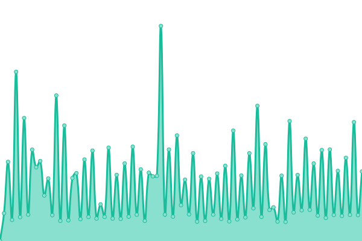 1167ms
     
 | 

<a href="https://status.linkspreed.com/history/store4-ju">57.01%</a>
    

|  [Storee](https://storee.cf) | 🟩 Up | [storee.yml](https://github.com/linkspreed/linkspreed_uptime/commits/HEAD/history/storee.yml) | 

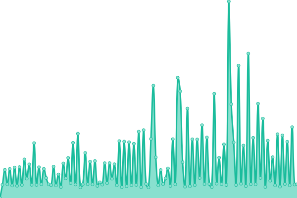 1286ms
     
 | 

<a href="https://status.linkspreed.com/history/storee">57.01%</a>
    

|  [Storpad](https://storpad.tk) | 🟩 Up | [storpad.yml](https://github.com/linkspreed/linkspreed_uptime/commits/HEAD/history/storpad.yml) | 

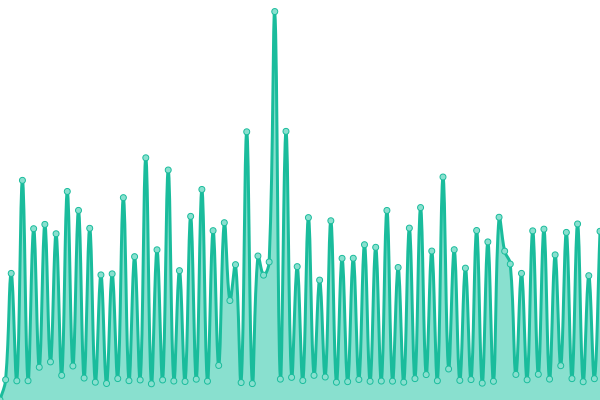 2436ms
     
 | 

<a href="https://status.linkspreed.com/history/storpad">84.10%</a>
    

|  [StreamValley](https://streamvalley.cf) | 🟩 Up | [stream-valley.yml](https://github.com/linkspreed/linkspreed_uptime/commits/HEAD/history/stream-valley.yml) | 

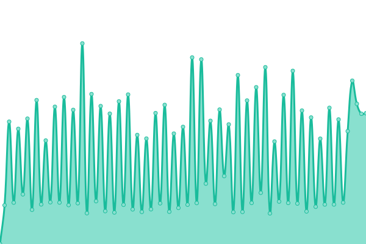 1063ms
     
 | 

<a href="https://status.linkspreed.com/history/stream-valley">84.54%</a>
    

|  [StreamValley API](https://api.streamvalley.cf) | 🟩 Up | [stream-valley-api.yml](https://github.com/linkspreed/linkspreed_uptime/commits/HEAD/history/stream-valley-api.yml) | 

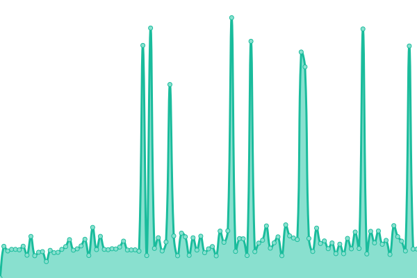 641ms
     
 | 

<a href="https://status.linkspreed.com/history/stream-valley-api">85.31%</a>
    

|  [Tacuu](https://tacuu.tk) | 🟩 Up | [tacuu.yml](https://github.com/linkspreed/linkspreed_uptime/commits/HEAD/history/tacuu.yml) | 

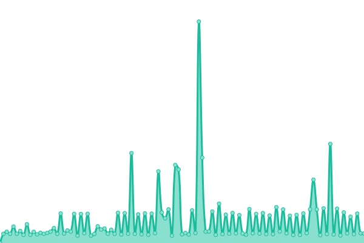 754ms
     
 | 

<a href="https://status.linkspreed.com/history/tacuu">84.22%</a>
    

|  [Takestore](https://takestore.tk) | 🟩 Up | [takestore.yml](https://github.com/linkspreed/linkspreed_uptime/commits/HEAD/history/takestore.yml) | 

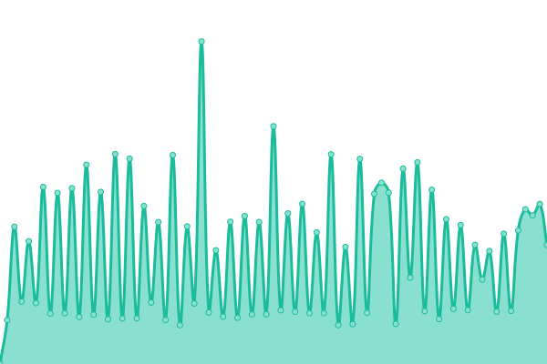 1048ms
     
 | 

<a href="https://status.linkspreed.com/history/takestore">82.97%</a>
    

|  [Tasksboard](https://tasksboard.tk) | 🟩 Up | [tasksboard.yml](https://github.com/linkspreed/linkspreed_uptime/commits/HEAD/history/tasksboard.yml) | 

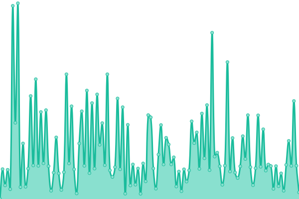 862ms
     
 | 

<a href="https://status.linkspreed.com/history/tasksboard">79.50%</a>
    

|  [Taya](https://taya.cf) | 🟥 Down | [taya.yml](https://github.com/linkspreed/linkspreed_uptime/commits/HEAD/history/taya.yml) | 

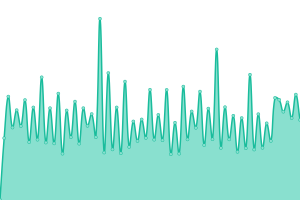 774ms
     
 | 

<a href="https://status.linkspreed.com/history/taya">72.36%</a>
    

|  [Teamix](https://teamix.cf) | 🟥 Down | [teamix.yml](https://github.com/linkspreed/linkspreed_uptime/commits/HEAD/history/teamix.yml) | 

 1378ms
     
 | 

<a href="https://status.linkspreed.com/history/teamix">0.00%</a>
    

|  [Teamslite](https://teamslite.tk) | 🟥 Down | [teamslite.yml](https://github.com/linkspreed/linkspreed_uptime/commits/HEAD/history/teamslite.yml) | 

 1178ms
     
 | 

<a href="https://status.linkspreed.com/history/teamslite">70.21%</a>
    

|  [TeamSpreed](https://teamspreed.cf) | 🟥 Down | [team-spreed.yml](https://github.com/linkspreed/linkspreed_uptime/commits/HEAD/history/team-spreed.yml) | 

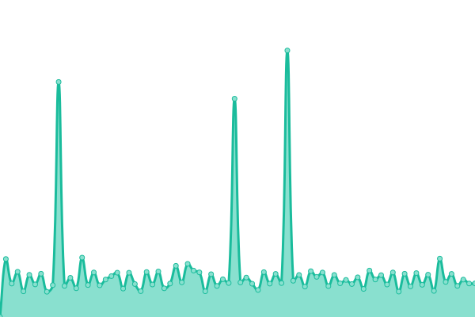 621ms
     
 | 

<a href="https://status.linkspreed.com/history/team-spreed">69.92%</a>
    

|  [Tizza](https://tizza.tk) | 🟥 Down | [tizza.yml](https://github.com/linkspreed/linkspreed_uptime/commits/HEAD/history/tizza.yml) | 

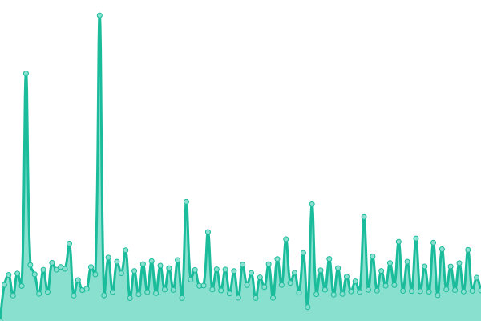 724ms
     
 | 

<a href="https://status.linkspreed.com/history/tizza">66.09%</a>
    

|  [Toolbox](https://toolbox.ga) | 🟥 Down | [toolbox.yml](https://github.com/linkspreed/linkspreed_uptime/commits/HEAD/history/toolbox.yml) | 

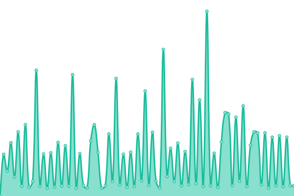 1725ms
     
 | 

<a href="https://status.linkspreed.com/history/toolbox">64.04%</a>
    

|  [Toolkit](https://toolkit.ga) | 🟥 Down | [toolkit.yml](https://github.com/linkspreed/linkspreed_uptime/commits/HEAD/history/toolkit.yml) | 

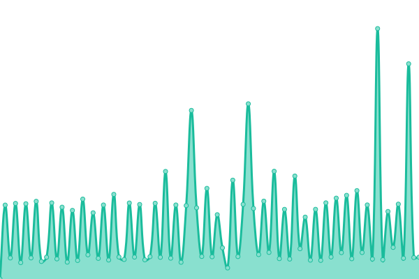 832ms
     
 | 

<a href="https://status.linkspreed.com/history/toolkit">54.78%</a>
    

|  [Tuit](https://tuit.cf) | 🟥 Down | [tuit.yml](https://github.com/linkspreed/linkspreed_uptime/commits/HEAD/history/tuit.yml) | 

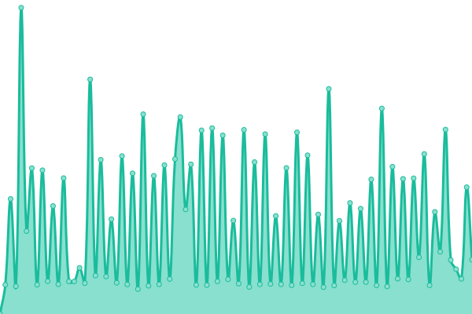 1192ms
     
 | 

<a href="https://status.linkspreed.com/history/tuit">52.41%</a>
    

|  [Tungolino](https://tungolino.tk) | 🟥 Down | [tungolino.yml](https://github.com/linkspreed/linkspreed_uptime/commits/HEAD/history/tungolino.yml) | 

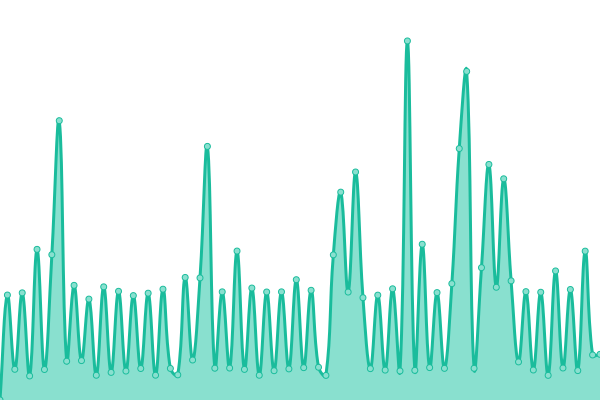 857ms
     
 | 

<a href="https://status.linkspreed.com/history/tungolino">46.24%</a>
    

|  [Tweetch](https://tweetch.cf) | 🟥 Down | [tweetch.yml](https://github.com/linkspreed/linkspreed_uptime/commits/HEAD/history/tweetch.yml) | 

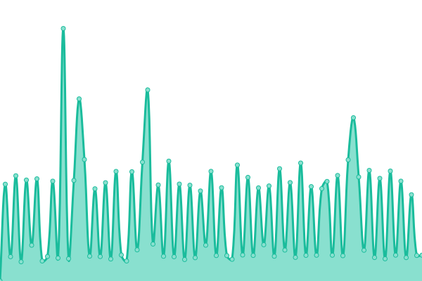 908ms
     
 | 

<a href="https://status.linkspreed.com/history/tweetch">45.20%</a>
    

|  [Twig](https://twig.cf) | 🟥 Down | [twig.yml](https://github.com/linkspreed/linkspreed_uptime/commits/HEAD/history/twig.yml) | 

 792ms
     
 | 

<a href="https://status.linkspreed.com/history/twig">41.66%</a>
    

|  [uCube](https://ucube.cf) | 🟥 Down | [u-cube.yml](https://github.com/linkspreed/linkspreed_uptime/commits/HEAD/history/u-cube.yml) | 

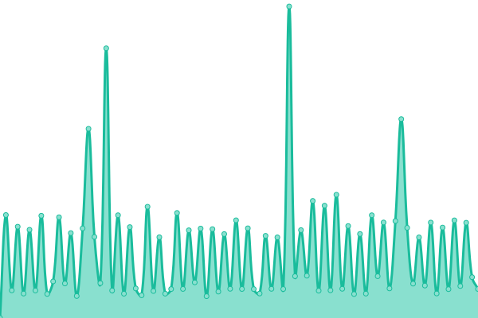 719ms
     
 | 

<a href="https://status.linkspreed.com/history/u-cube">38.03%</a>
    

|  [UltiCloud](https://ulticloud.tk) | 🟥 Down | [ulti-cloud.yml](https://github.com/linkspreed/linkspreed_uptime/commits/HEAD/history/ulti-cloud.yml) | 

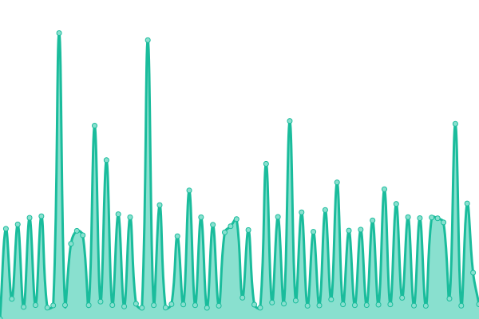 1242ms
     
 | 

<a href="https://status.linkspreed.com/history/ulti-cloud">33.52%</a>
    

|  [Up2Date](https://up2date.tk) | 🟥 Down | [up2-date.yml](https://github.com/linkspreed/linkspreed_uptime/commits/HEAD/history/up2-date.yml) | 

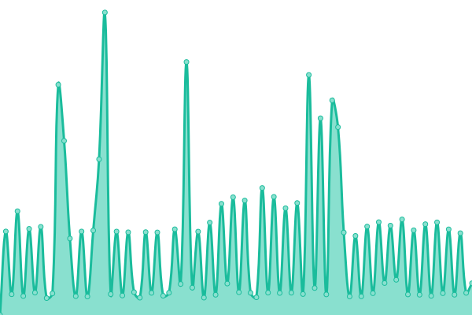 861ms
     
 | 

<a href="https://status.linkspreed.com/history/up2-date">27.84%</a>
    

|  [UpDown](https://updown.ml) | 🟥 Down | [up-down.yml](https://github.com/linkspreed/linkspreed_uptime/commits/HEAD/history/up-down.yml) | 

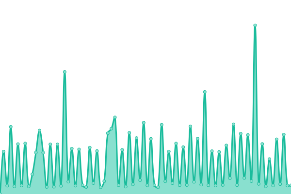 1257ms
     
 | 

<a href="https://status.linkspreed.com/history/up-down">24.23%</a>
    

|  [UpNode](https://upnode.cf) | 🟥 Down | [up-node.yml](https://github.com/linkspreed/linkspreed_uptime/commits/HEAD/history/up-node.yml) | 

 8206ms
     
 | 

<a href="https://status.linkspreed.com/history/up-node">12.97%</a>
    

|  [VoiceClub](https://voiceclub.tk) | 🟩 Up | [voice-club.yml](https://github.com/linkspreed/linkspreed_uptime/commits/HEAD/history/voice-club.yml) | 

 591ms
     
 | 

<a href="https://status.linkspreed.com/history/voice-club">100.00%</a>
    

|  [Web5](https://web5.cf) | 🟥 Down | [web5.yml](https://github.com/linkspreed/linkspreed_uptime/commits/HEAD/history/web5.yml) | 

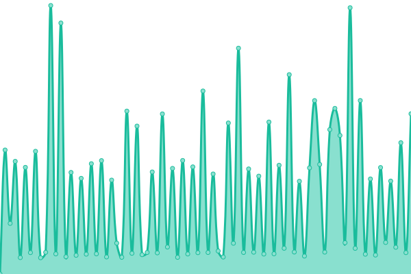 1098ms
     
 | 

<a href="https://status.linkspreed.com/history/web5">9.86%</a>
    

|  [Whatsline](https://whatsline.tk) | 🟥 Down | [whatsline.yml](https://github.com/linkspreed/linkspreed_uptime/commits/HEAD/history/whatsline.yml) | 

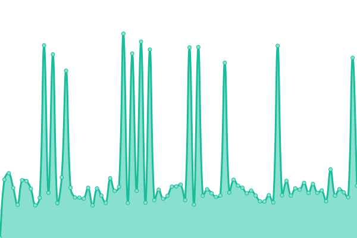 1203ms
     
 | 

<a href="https://status.linkspreed.com/history/whatsline">9.41%</a>
    

|  [Wrap](https://wrap.gq) | 🟥 Down | [wrap.yml](https://github.com/linkspreed/linkspreed_uptime/commits/HEAD/history/wrap.yml) | 

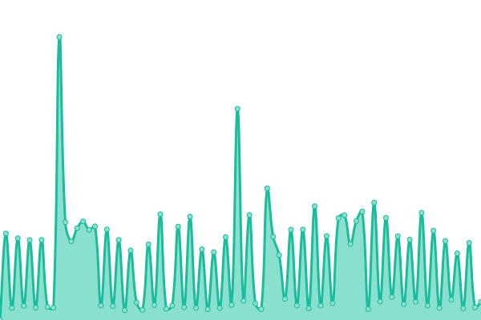 1426ms
     
 | 

<a href="https://status.linkspreed.com/history/wrap">8.99%</a>
    

|  [Write](https://write.cf) | 🟥 Down | [write.yml](https://github.com/linkspreed/linkspreed_uptime/commits/HEAD/history/write.yml) | 

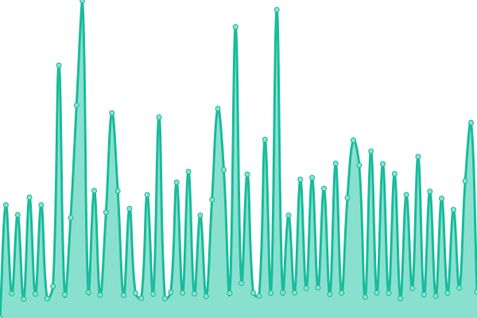 1131ms
     
 | 

<a href="https://status.linkspreed.com/history/write">8.62%</a>
    

|  [Yourpod](https://yourpod.cf) | 🟥 Down | [yourpod.yml](https://github.com/linkspreed/linkspreed_uptime/commits/HEAD/history/yourpod.yml) | 

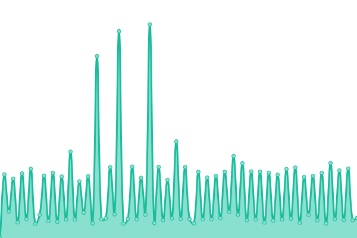 800ms
     
 | 

<a href="https://status.linkspreed.com/history/yourpod">18.18%</a>
    

<!--end: status pages-->

[**Visit our status website →**](https://status.linkspreed.com)

## 📄 License

- Powered by: [Linkspreed](https://www.linkspreed.com)
- Code: [MIT](./LICENSE) © [Linkspreed](https://status.linkspreed.com)
- Data in the `./history` directory: [Open Database License](https://opendatacommons.org/licenses/odbl/1-0/)
