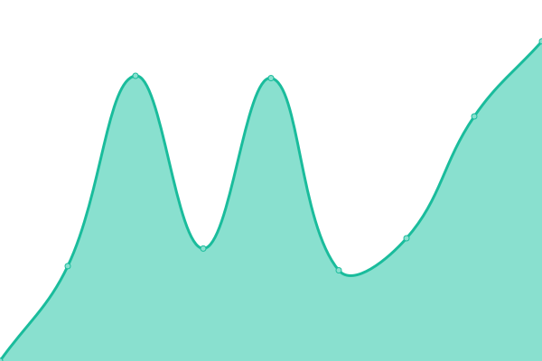
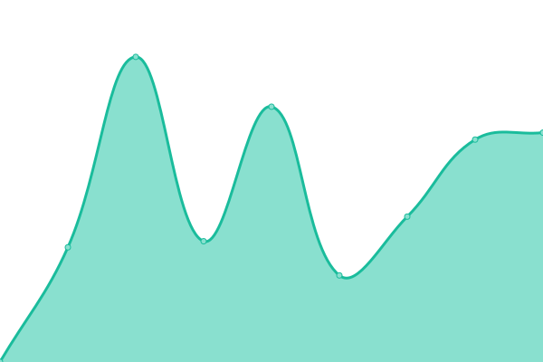
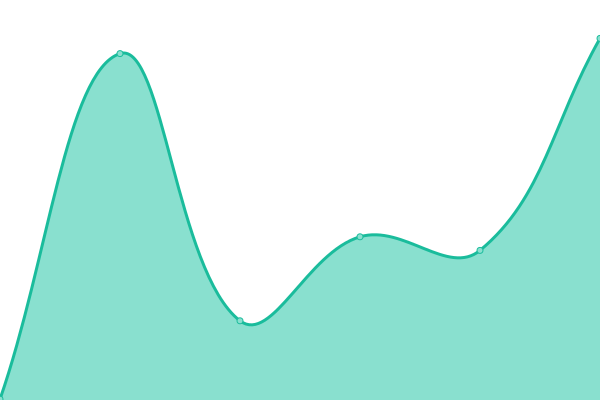
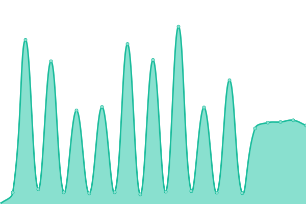
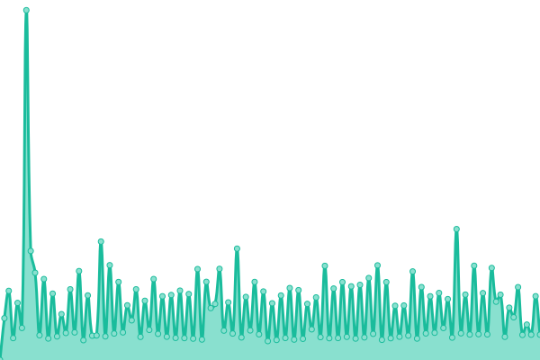
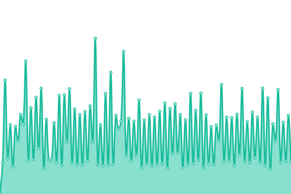
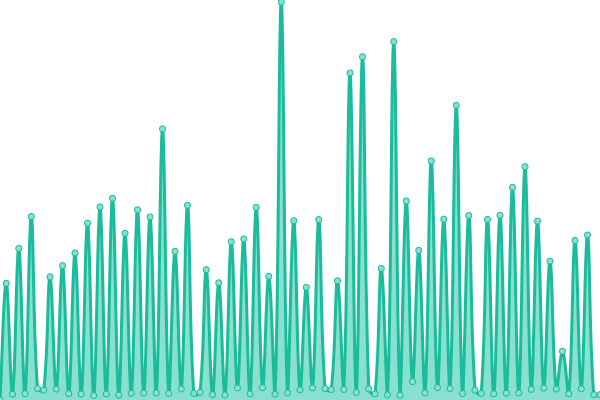

# [📈 Live Status](https://demo.upptime.js.org): <!--live status--> **🟧 Partial outage**

This repository contains the open-source uptime monitor and status page for [Linkspreed](https://linkspreed.com), powered by [Linkspreed](https://github.com/linkspreed).

We use [Issues](https://github.com/linkspreed/linkspreed_uptime/issues) as incident reports, [Actions](https://github.com/linkspreed/linkspreed_uptime/actions) as uptime monitors, and [Pages](https://status.linkspreed.com) for the status page.

<!--start: status pages-->
<!-- This summary is generated by Upptime (https://github.com/upptime/upptime) -->
<!-- Do not edit this manually, your changes will be overwritten -->
<!-- prettier-ignore -->
| URL | Status | History | Response Time | Uptime |
| --- | ------ | ------- | ------------- | ------ |
|  [Adseasy](https://adseasy.linkspreed.com) | 🟩 Up | [adseasy.yml](https://github.com/linkspreed/linkspreed_uptime/commits/HEAD/history/adseasy.yml) | 

 1161ms
     
 | 

<a href="https://status.linkspreed.com/history/adseasy">100.00%</a>
    

|  [Airr](https://airr.linkspreed.com) | 🟩 Up | [airr.yml](https://github.com/linkspreed/linkspreed_uptime/commits/HEAD/history/airr.yml) | 

 1974ms
     
 | 

<a href="https://status.linkspreed.com/history/airr">100.00%</a>
    

|  [Analytix](https://analytix.linkspreed.com) | 🟩 Up | [analytix.yml](https://github.com/linkspreed/linkspreed_uptime/commits/HEAD/history/analytix.yml) | 

 695ms
     
 | 

<a href="https://status.linkspreed.com/history/analytix">100.00%</a>
    

|  [Articly](https://articly.linkspreed.com) | 🟩 Up | [articly.yml](https://github.com/linkspreed/linkspreed_uptime/commits/HEAD/history/articly.yml) | 

 692ms
     
 | 

<a href="https://status.linkspreed.com/history/articly">100.00%</a>
    

|  [Backpay](https://backpay.cf) | 🟥 Down | [backpay.yml](https://github.com/linkspreed/linkspreed_uptime/commits/HEAD/history/backpay.yml) | 

 0ms
     
 | 

<a href="https://status.linkspreed.com/history/backpay">0.00%</a>
    

|  [BeSave](https://besave.linkspreed.com) | 🟩 Up | [be-save.yml](https://github.com/linkspreed/linkspreed_uptime/commits/HEAD/history/be-save.yml) | 

 715ms
     
 | 

<a href="https://status.linkspreed.com/history/be-save">100.00%</a>
    

|  [BeYou](https://beyou.linkspreed.com) | 🟩 Up | [be-you.yml](https://github.com/linkspreed/linkspreed_uptime/commits/HEAD/history/be-you.yml) | 

 1104ms
     
 | 

<a href="https://status.linkspreed.com/history/be-you">100.00%</a>
    

|  [Biospreed](https://biospreed.linkspreed.com) | 🟩 Up | [biospreed.yml](https://github.com/linkspreed/linkspreed_uptime/commits/HEAD/history/biospreed.yml) | 

 472ms
     
 | 

<a href="https://status.linkspreed.com/history/biospreed">100.00%</a>
    

|  [BioX](https://biox.linkspreed.com) | 🟩 Up | [bio-x.yml](https://github.com/linkspreed/linkspreed_uptime/commits/HEAD/history/bio-x.yml) | 

 1965ms
     
 | 

<a href="https://status.linkspreed.com/history/bio-x">100.00%</a>
    

|  [Botchat](https://botchat.linkspreed.com) | 🟩 Up | [botchat.yml](https://github.com/linkspreed/linkspreed_uptime/commits/HEAD/history/botchat.yml) | 

 1378ms
     
 | 

<a href="https://status.linkspreed.com/history/botchat">100.00%</a>
    

|  [CallCloud](https://callcloud.linkspreed.com) | 🟩 Up | [call-cloud.yml](https://github.com/linkspreed/linkspreed_uptime/commits/HEAD/history/call-cloud.yml) | 

 743ms
     
 | 

<a href="https://status.linkspreed.com/history/call-cloud">100.00%</a>
    

|  [Ceal](https://ceal.linkspreed.com) | 🟩 Up | [ceal.yml](https://github.com/linkspreed/linkspreed_uptime/commits/HEAD/history/ceal.yml) | 

 1204ms
     
 | 

<a href="https://status.linkspreed.com/history/ceal">100.00%</a>
    

|  [Cheezz](https://cheezz.linkspreed.com) | 🟩 Up | [cheezz.yml](https://github.com/linkspreed/linkspreed_uptime/commits/HEAD/history/cheezz.yml) | 

 928ms
     
 | 

<a href="https://status.linkspreed.com/history/cheezz">100.00%</a>
    

|  [Chirp](https://chirp.linkspreed.com) | 🟩 Up | [chirp.yml](https://github.com/linkspreed/linkspreed_uptime/commits/HEAD/history/chirp.yml) | 

 1060ms
     
 | 

<a href="https://status.linkspreed.com/history/chirp">100.00%</a>
    

|  [Chitter](https://chitter.linkspreed.com) | 🟩 Up | [chitter.yml](https://github.com/linkspreed/linkspreed_uptime/commits/HEAD/history/chitter.yml) | 

 1118ms
     
 | 

<a href="https://status.linkspreed.com/history/chitter">100.00%</a>
    

|  [Cloud2Go](https://cloud2go.linkspreed.com) | 🟩 Up | [cloud2-go.yml](https://github.com/linkspreed/linkspreed_uptime/commits/HEAD/history/cloud2-go.yml) | 

 1414ms
     
 | 

<a href="https://status.linkspreed.com/history/cloud2-go">100.00%</a>
    

|  [Cloud2Go Share](http://share.cloud2go.tk) | 🟥 Down | [cloud2-go-share.yml](https://github.com/linkspreed/linkspreed_uptime/commits/HEAD/history/cloud2-go-share.yml) | 

 0ms
     
 | 

<a href="https://status.linkspreed.com/history/cloud2-go-share">0.00%</a>
    

|  [Cloud2Share](https://cloud2share.linkspreed.com) | 🟩 Up | [cloud2-share.yml](https://github.com/linkspreed/linkspreed_uptime/commits/HEAD/history/cloud2-share.yml) | 

 779ms
     
 | 

<a href="https://status.linkspreed.com/history/cloud2-share">100.00%</a>
    

|  [CloudSpreed](https://cloudspreed.linkspreed.com) | 🟩 Up | [cloud-spreed.yml](https://github.com/linkspreed/linkspreed_uptime/commits/HEAD/history/cloud-spreed.yml) | 

 1666ms
     
 | 

<a href="https://status.linkspreed.com/history/cloud-spreed">100.00%</a>
    

|  [Connected](https://connected.linkspreed.com) | 🟩 Up | [connected.yml](https://github.com/linkspreed/linkspreed_uptime/commits/HEAD/history/connected.yml) | 

 582ms
     
 | 

<a href="https://status.linkspreed.com/history/connected">100.00%</a>
    

|  [Contribution](https://contribution.linkspreed.com) | 🟩 Up | [contribution.yml](https://github.com/linkspreed/linkspreed_uptime/commits/HEAD/history/contribution.yml) | 

 1347ms
     
 | 

<a href="https://status.linkspreed.com/history/contribution">100.00%</a>
    

|  [Critch](https://critch.linkspreed.com) | 🟩 Up | [critch.yml](https://github.com/linkspreed/linkspreed_uptime/commits/HEAD/history/critch.yml) | 

 1057ms
     
 | 

<a href="https://status.linkspreed.com/history/critch">100.00%</a>
    

|  [CRM Demo](https://crm-demo.linkspreed.com) | 🟩 Up | [crm-demo.yml](https://github.com/linkspreed/linkspreed_uptime/commits/HEAD/history/crm-demo.yml) | 

 1458ms
     
 | 

<a href="https://status.linkspreed.com/history/crm-demo">100.00%</a>
    

|  [CrossQA](https://crossqa.linkspreed.com) | 🟩 Up | [cross-qa.yml](https://github.com/linkspreed/linkspreed_uptime/commits/HEAD/history/cross-qa.yml) | 

 1098ms
     
 | 

<a href="https://status.linkspreed.com/history/cross-qa">100.00%</a>
    

|  [Dash](https://dash.linkspreed.com) | 🟩 Up | [dash.yml](https://github.com/linkspreed/linkspreed_uptime/commits/HEAD/history/dash.yml) | 

 1918ms
     
 | 

<a href="https://status.linkspreed.com/history/dash">100.00%</a>
    

|  [Datify](https://datify.linkspreed.com) | 🟩 Up | [datify.yml](https://github.com/linkspreed/linkspreed_uptime/commits/HEAD/history/datify.yml) | 

 1240ms
     
 | 

<a href="https://status.linkspreed.com/history/datify">100.00%</a>
    

|  [DeePage](https://deepage.linkspreed.com) | 🟩 Up | [dee-page.yml](https://github.com/linkspreed/linkspreed_uptime/commits/HEAD/history/dee-page.yml) | 

 671ms
     
 | 

<a href="https://status.linkspreed.com/history/dee-page">100.00%</a>
    

|  [Discounty](https://discounty.tk) | 🟥 Down | [discounty.yml](https://github.com/linkspreed/linkspreed_uptime/commits/HEAD/history/discounty.yml) | 

 0ms
     
 | 

<a href="https://status.linkspreed.com/history/discounty">0.00%</a>
    

|  [Diskit](https://diskit.linkspreed.com) | 🟩 Up | [diskit.yml](https://github.com/linkspreed/linkspreed_uptime/commits/HEAD/history/diskit.yml) | 

 757ms
     
 | 

<a href="https://status.linkspreed.com/history/diskit">100.00%</a>
    

|  [DNServer](https://dnserver.linkspreed.com) | 🟩 Up | [dn-server.yml](https://github.com/linkspreed/linkspreed_uptime/commits/HEAD/history/dn-server.yml) | 

 1262ms
     
 | 

<a href="https://status.linkspreed.com/history/dn-server">100.00%</a>
    

|  [Downflix](https://downflix.linkspreed.com) | 🟩 Up | [downflix.yml](https://github.com/linkspreed/linkspreed_uptime/commits/HEAD/history/downflix.yml) | 

 750ms
     
 | 

<a href="https://status.linkspreed.com/history/downflix">100.00%</a>
    

|  [Dreambuild](https://dreambuild.linkspreed.com) | 🟩 Up | [dreambuild.yml](https://github.com/linkspreed/linkspreed_uptime/commits/HEAD/history/dreambuild.yml) | 

 1584ms
     
 | 

<a href="https://status.linkspreed.com/history/dreambuild">100.00%</a>
    

|  [Firelaps](https://firelaps.cf) | 🟥 Down | [firelaps.yml](https://github.com/linkspreed/linkspreed_uptime/commits/HEAD/history/firelaps.yml) | 

 0ms
     
 | 

<a href="https://status.linkspreed.com/history/firelaps">0.00%</a>
    

|  [FlipX](https://flipx.linkspreed.com) | 🟩 Up | [flip-x.yml](https://github.com/linkspreed/linkspreed_uptime/commits/HEAD/history/flip-x.yml) | 

 1706ms
     
 | 

<a href="https://status.linkspreed.com/history/flip-x">100.00%</a>
    

|  [ForJu](https://forju.linkspreed.com) | 🟩 Up | [for-ju.yml](https://github.com/linkspreed/linkspreed_uptime/commits/HEAD/history/for-ju.yml) | 

 1517ms
     
 | 

<a href="https://status.linkspreed.com/history/for-ju">100.00%</a>
    

|  [GetPro](https://getpro.linkspreed.com) | 🟩 Up | [get-pro.yml](https://github.com/linkspreed/linkspreed_uptime/commits/HEAD/history/get-pro.yml) | 

 1387ms
     
 | 

<a href="https://status.linkspreed.com/history/get-pro">100.00%</a>
    

|  [Gogola](https://gogola.linkspreed.com) | 🟩 Up | [gogola.yml](https://github.com/linkspreed/linkspreed_uptime/commits/HEAD/history/gogola.yml) | 

 1045ms
     
 | 

<a href="https://status.linkspreed.com/history/gogola">100.00%</a>
    

|  [Grown](https://grown.linkspreed.com) | 🟩 Up | [grown.yml](https://github.com/linkspreed/linkspreed_uptime/commits/HEAD/history/grown.yml) | 

 1636ms
     
 | 

<a href="https://status.linkspreed.com/history/grown">100.00%</a>
    

|  [Guju](https://guju.linkspreed.com) | 🟩 Up | [guju.yml](https://github.com/linkspreed/linkspreed_uptime/commits/HEAD/history/guju.yml) | 

 887ms
     
 | 

<a href="https://status.linkspreed.com/history/guju">100.00%</a>
    

|  [Him4Her](https://him4her.linkspreed.com) | 🟩 Up | [him4-her.yml](https://github.com/linkspreed/linkspreed_uptime/commits/HEAD/history/him4-her.yml) | 

 797ms
     
 | 

<a href="https://status.linkspreed.com/history/him4-her">100.00%</a>
    

|  [Hutty](https://hutty.linkspreed.com) | 🟩 Up | [hutty.yml](https://github.com/linkspreed/linkspreed_uptime/commits/HEAD/history/hutty.yml) | 

 1198ms
     
 | 

<a href="https://status.linkspreed.com/history/hutty">100.00%</a>
    

|  [IceCloud](https://icecloud.linkspreed.com) | 🟩 Up | [ice-cloud.yml](https://github.com/linkspreed/linkspreed_uptime/commits/HEAD/history/ice-cloud.yml) | 

 1532ms
     
 | 

<a href="https://status.linkspreed.com/history/ice-cloud">100.00%</a>
    

|  [Ignyte](https://ignyte.linkspreed.com) | 🟩 Up | [ignyte.yml](https://github.com/linkspreed/linkspreed_uptime/commits/HEAD/history/ignyte.yml) | 

 710ms
     
 | 

<a href="https://status.linkspreed.com/history/ignyte">100.00%</a>
    

|  [Joyn](https://joyn.linkspreed.com) | 🟩 Up | [joyn.yml](https://github.com/linkspreed/linkspreed_uptime/commits/HEAD/history/joyn.yml) | 

 500ms
     
 | 

<a href="https://status.linkspreed.com/history/joyn">100.00%</a>
    

|  [Kisk](https://kisk.linkspreed.com) | 🟩 Up | [kisk.yml](https://github.com/linkspreed/linkspreed_uptime/commits/HEAD/history/kisk.yml) | 

 1338ms
     
 | 

<a href="https://status.linkspreed.com/history/kisk">100.00%</a>
    

|  [KitChat](https://kitchat.linkspreed.com) | 🟩 Up | [kit-chat.yml](https://github.com/linkspreed/linkspreed_uptime/commits/HEAD/history/kit-chat.yml) | 

 683ms
     
 | 

<a href="https://status.linkspreed.com/history/kit-chat">100.00%</a>
    

|  [LaaS](https://laas.linkspreed.com) | 🟩 Up | [laa-s.yml](https://github.com/linkspreed/linkspreed_uptime/commits/HEAD/history/laa-s.yml) | 

 274ms
     
 | 

<a href="https://status.linkspreed.com/history/laa-s">100.00%</a>
    

|  [LaaS Chatbot](https://chatbot.laas.ml) | 🟥 Down | [laa-s-chatbot.yml](https://github.com/linkspreed/linkspreed_uptime/commits/HEAD/history/laa-s-chatbot.yml) | 

 0ms
     
 | 

<a href="https://status.linkspreed.com/history/laa-s-chatbot">0.00%</a>
    

|  [LaaS Cloudchat](https://cloudchat.laas.ml) | 🟥 Down | [laa-s-cloudchat.yml](https://github.com/linkspreed/linkspreed_uptime/commits/HEAD/history/laa-s-cloudchat.yml) | 

 0ms
     
 | 

<a href="https://status.linkspreed.com/history/laa-s-cloudchat">0.00%</a>
    

|  [LaaS Salesy](https://salesy.laas.ml) | 🟥 Down | [laa-s-salesy.yml](https://github.com/linkspreed/linkspreed_uptime/commits/HEAD/history/laa-s-salesy.yml) | 

 0ms
     
 | 

<a href="https://status.linkspreed.com/history/laa-s-salesy">0.00%</a>
    

|  [Shorts](https://shorts.laas.ml) | 🟥 Down | [shorts.yml](https://github.com/linkspreed/linkspreed_uptime/commits/HEAD/history/shorts.yml) | 

 0ms
     
 | 

<a href="https://status.linkspreed.com/history/shorts">0.00%</a>
    

|  [LaaS Tasks](https://tasks.laas.ml) | 🟥 Down | [laa-s-tasks.yml](https://github.com/linkspreed/linkspreed_uptime/commits/HEAD/history/laa-s-tasks.yml) | 

 0ms
     
 | 

<a href="https://status.linkspreed.com/history/laa-s-tasks">0.00%</a>
    

|  [Lime](https://lime.linkspreed.com) | 🟩 Up | [lime.yml](https://github.com/linkspreed/linkspreed_uptime/commits/HEAD/history/lime.yml) | 

 971ms
     
 | 

<a href="https://status.linkspreed.com/history/lime">100.00%</a>
    

|  [LinkCream](https://linkcream.tk) | 🟥 Down | [link-cream.yml](https://github.com/linkspreed/linkspreed_uptime/commits/HEAD/history/link-cream.yml) | 

 0ms
     
 | 

<a href="https://status.linkspreed.com/history/link-cream">0.00%</a>
    

|  [Linkspreed](https://linkspreed.com) | 🟩 Up | [linkspreed.yml](https://github.com/linkspreed/linkspreed_uptime/commits/HEAD/history/linkspreed.yml) | 

 3134ms
     
 | 

<a href="https://status.linkspreed.com/history/linkspreed">36.54%</a>
    

|  [Linkspreed AI](https://ai.linkspreed.com) | 🟩 Up | [linkspreed-ai.yml](https://github.com/linkspreed/linkspreed_uptime/commits/HEAD/history/linkspreed-ai.yml) | 

 1563ms
     
 | 

<a href="https://status.linkspreed.com/history/linkspreed-ai">100.00%</a>
    

|  [Linkspreed AIDA](https://aida.linkspreed.com) | 🟩 Up | [linkspreed-aida.yml](https://github.com/linkspreed/linkspreed_uptime/commits/HEAD/history/linkspreed-aida.yml) | 

 2122ms
     
 | 

<a href="https://status.linkspreed.com/history/linkspreed-aida">100.00%</a>
    

|  [Linkspreed Assistant](https://assistant.linkspreed.com) | 🟩 Up | [linkspreed-assistant.yml](https://github.com/linkspreed/linkspreed_uptime/commits/HEAD/history/linkspreed-assistant.yml) | 

 357ms
     
 | 

<a href="https://status.linkspreed.com/history/linkspreed-assistant">100.00%</a>
    

|  [Linkspreed Analytics](https://analytics.linkspreed.com) | 🟩 Up | [linkspreed-analytics.yml](https://github.com/linkspreed/linkspreed_uptime/commits/HEAD/history/linkspreed-analytics.yml) | 

 413ms
     
 | 

<a href="https://status.linkspreed.com/history/linkspreed-analytics">100.00%</a>
    

|  [Linkspreed Drive](https://drive.linkspreed.com) | 🟩 Up | [linkspreed-drive.yml](https://github.com/linkspreed/linkspreed_uptime/commits/HEAD/history/linkspreed-drive.yml) | 

 2819ms
     
 | 

<a href="https://status.linkspreed.com/history/linkspreed-drive">100.00%</a>
    

|  [Linkspreed Helpdesk](https://helpdesk.linkspreed.com) | 🟩 Up | [linkspreed-helpdesk.yml](https://github.com/linkspreed/linkspreed_uptime/commits/HEAD/history/linkspreed-helpdesk.yml) | 

 2207ms
     
 | 

<a href="https://status.linkspreed.com/history/linkspreed-helpdesk">100.00%</a>
    

|  [Linkspreed Research Lab](https://lab.linkspreed.com) | 🟩 Up | [linkspreed-research-lab.yml](https://github.com/linkspreed/linkspreed_uptime/commits/HEAD/history/linkspreed-research-lab.yml) | 

 231ms
     
 | 

<a href="https://status.linkspreed.com/history/linkspreed-research-lab">100.00%</a>
    

|  [Linkspreed Mails](https://mails.linkspreed.com) | 🟩 Up | [linkspreed-mails.yml](https://github.com/linkspreed/linkspreed_uptime/commits/HEAD/history/linkspreed-mails.yml) | 

 1948ms
     
 | 

<a href="https://status.linkspreed.com/history/linkspreed-mails">100.00%</a>
    

|  [Linkspreed Office](https://office.linkspreed.com) | 🟩 Up | [linkspreed-office.yml](https://github.com/linkspreed/linkspreed_uptime/commits/HEAD/history/linkspreed-office.yml) | 

 954ms
     
 | 

<a href="https://status.linkspreed.com/history/linkspreed-office">100.00%</a>
    

|  [Linkspreed Panel](https://panel.linkspreed.com) | 🟩 Up | [linkspreed-panel.yml](https://github.com/linkspreed/linkspreed_uptime/commits/HEAD/history/linkspreed-panel.yml) | 

 223ms
     
 | 

<a href="https://status.linkspreed.com/history/linkspreed-panel">100.00%</a>
    

|  [Linkspreed Photos](https://photos.linkspreed.com) | 🟩 Up | [linkspreed-photos.yml](https://github.com/linkspreed/linkspreed_uptime/commits/HEAD/history/linkspreed-photos.yml) | 

 2111ms
     
 | 

<a href="https://status.linkspreed.com/history/linkspreed-photos">100.00%</a>
    

|  [Linkspreed Play](https://play.linkspreed.com) | 🟩 Up | [linkspreed-play.yml](https://github.com/linkspreed/linkspreed_uptime/commits/HEAD/history/linkspreed-play.yml) | 

 804ms
     
 | 

<a href="https://status.linkspreed.com/history/linkspreed-play">100.00%</a>
    

|  [Linkspreed Search](https://search.linkspreed.com) | 🟩 Up | [linkspreed-search.yml](https://github.com/linkspreed/linkspreed_uptime/commits/HEAD/history/linkspreed-search.yml) | 

 915ms
     
 | 

<a href="https://status.linkspreed.com/history/linkspreed-search">0.00%</a>
    

|  [Linkspreed Store](https://store.linkspreed.com) | 🟩 Up | [linkspreed-store.yml](https://github.com/linkspreed/linkspreed_uptime/commits/HEAD/history/linkspreed-store.yml) | 

 1420ms
     
 | 

<a href="https://status.linkspreed.com/history/linkspreed-store">0.00%</a>
    

|  [Linkspreed Web](https://web.linkspreed.com) | 🟩 Up | [linkspreed-web.yml](https://github.com/linkspreed/linkspreed_uptime/commits/HEAD/history/linkspreed-web.yml) | 

 1369ms
     
 | 

<a href="https://status.linkspreed.com/history/linkspreed-web">0.00%</a>
    

|  [Linkspreed Web4](https://web4.linkspreed.com) | 🟩 Up | [linkspreed-web4.yml](https://github.com/linkspreed/linkspreed_uptime/commits/HEAD/history/linkspreed-web4.yml) | 

 266ms
     
 | 

<a href="https://status.linkspreed.com/history/linkspreed-web4">100.00%</a>
    

|  [LinkLab](https://linklab.linkspreed.com) | 🟩 Up | [link-lab.yml](https://github.com/linkspreed/linkspreed_uptime/commits/HEAD/history/link-lab.yml) | 

 770ms
     
 | 

<a href="https://status.linkspreed.com/history/link-lab">0.00%</a>
    

|  [LSily](https://lsily.linkspreed.com) | 🟥 Down | [l-sily.yml](https://github.com/linkspreed/linkspreed_uptime/commits/HEAD/history/l-sily.yml) | 

 0ms
     
 | 

<a href="https://status.linkspreed.com/history/l-sily">0.00%</a>
    

|  [LSNews](https://lsnews.linkspreed.com) | 🟩 Up | [ls-news.yml](https://github.com/linkspreed/linkspreed_uptime/commits/HEAD/history/ls-news.yml) | 

 1209ms
     
 | 

<a href="https://status.linkspreed.com/history/ls-news">0.00%</a>
    

|  [Mailspread](https://mailspread.linkspreed.com) | 🟩 Up | [mailspread.yml](https://github.com/linkspreed/linkspreed_uptime/commits/HEAD/history/mailspread.yml) | 

 2271ms
     
 | 

<a href="https://status.linkspreed.com/history/mailspread">0.00%</a>
    

|  [Mapsli](https://mapsli.linkspreed.com) | 🟩 Up | [mapsli.yml](https://github.com/linkspreed/linkspreed_uptime/commits/HEAD/history/mapsli.yml) | 

 328ms
     
 | 

<a href="https://status.linkspreed.com/history/mapsli">0.00%</a>
    

|  [Memevid](https://memevid.linkspreed.com) | 🟩 Up | [memevid.yml](https://github.com/linkspreed/linkspreed_uptime/commits/HEAD/history/memevid.yml) | 

 1166ms
     
 | 

<a href="https://status.linkspreed.com/history/memevid">0.00%</a>
    

|  [Metabox](https://metabox.linkspreed.com) | 🟩 Up | [metabox.yml](https://github.com/linkspreed/linkspreed_uptime/commits/HEAD/history/metabox.yml) | 

 2139ms
     
 | 

<a href="https://status.linkspreed.com/history/metabox">0.00%</a>
    

|  [Metaspace](https://metaspace.linkspreed.com) | 🟩 Up | [metaspace.yml](https://github.com/linkspreed/linkspreed_uptime/commits/HEAD/history/metaspace.yml) | 

 872ms
     
 | 

<a href="https://status.linkspreed.com/history/metaspace">0.00%</a>
    

|  [Musiccloud](https://musiccloud.linkspreed.com) | 🟩 Up | [musiccloud.yml](https://github.com/linkspreed/linkspreed_uptime/commits/HEAD/history/musiccloud.yml) | 

 1075ms
     
 | 

<a href="https://status.linkspreed.com/history/musiccloud">0.00%</a>
    

|  [MyBuy](https://mybuy.linkspreed.com) | 🟩 Up | [my-buy.yml](https://github.com/linkspreed/linkspreed_uptime/commits/HEAD/history/my-buy.yml) | 

 1159ms
     
 | 

<a href="https://status.linkspreed.com/history/my-buy">0.00%</a>
    

|  [MyDancX](https://mydancx.linkspreed.com) | 🟩 Up | [my-danc-x.yml](https://github.com/linkspreed/linkspreed_uptime/commits/HEAD/history/my-danc-x.yml) | 

 1516ms
     
 | 

<a href="https://status.linkspreed.com/history/my-danc-x">0.00%</a>
    

|  [Netavark](https://netavark.linkspreed.com) | 🟩 Up | [netavark.yml](https://github.com/linkspreed/linkspreed_uptime/commits/HEAD/history/netavark.yml) | 

 632ms
     
 | 

<a href="https://status.linkspreed.com/history/netavark">100.00%</a>
    

|  [NetSky](https://netsky.linkspreed.com) | 🟩 Up | [net-sky.yml](https://github.com/linkspreed/linkspreed_uptime/commits/HEAD/history/net-sky.yml) | 

 1881ms
     
 | 

<a href="https://status.linkspreed.com/history/net-sky">0.00%</a>
    

|  [NewsNode](https://newsnode.linkspreed.com) | 🟩 Up | [news-node.yml](https://github.com/linkspreed/linkspreed_uptime/commits/HEAD/history/news-node.yml) | 

 1302ms
     
 | 

<a href="https://status.linkspreed.com/history/news-node">0.00%</a>
    

|  [Niming](https://niming.linkspreed.com) | 🟩 Up | [niming.yml](https://github.com/linkspreed/linkspreed_uptime/commits/HEAD/history/niming.yml) | 

 1278ms
     
 | 

<a href="https://status.linkspreed.com/history/niming">100.00%</a>
    

|  [Nither](https://nither.linkspreed.com) | 🟥 Down | [nither.yml](https://github.com/linkspreed/linkspreed_uptime/commits/HEAD/history/nither.yml) | 

 815ms
     
 | 

<a href="https://status.linkspreed.com/history/nither">0.00%</a>
    

|  [NodX](https://nodx.linkspreed.com) | 🟩 Up | [nod-x.yml](https://github.com/linkspreed/linkspreed_uptime/commits/HEAD/history/nod-x.yml) | 

 2687ms
     
 | 

<a href="https://status.linkspreed.com/history/nod-x">0.00%</a>
    

|  [OnlyPaid](https://onlypaid.linkspreed.com) | 🟩 Up | [only-paid.yml](https://github.com/linkspreed/linkspreed_uptime/commits/HEAD/history/only-paid.yml) | 

 1836ms
     
 | 

<a href="https://status.linkspreed.com/history/only-paid">0.00%</a>
    

|  [Ondu](https://ondu.linkspreed.com) | 🟩 Up | [ondu.yml](https://github.com/linkspreed/linkspreed_uptime/commits/HEAD/history/ondu.yml) | 

 2257ms
     
 | 

<a href="https://status.linkspreed.com/history/ondu">0.00%</a>
    

|  [Payback](https://payback.ga) | 🟥 Down | [payback.yml](https://github.com/linkspreed/linkspreed_uptime/commits/HEAD/history/payback.yml) | 

 0ms
     
 | 

<a href="https://status.linkspreed.com/history/payback">0.00%</a>
    

|  [Payback](https://payback.gq) | 🟥 Down | [payback.yml](https://github.com/linkspreed/linkspreed_uptime/commits/HEAD/history/payback.yml) | 

 0ms
     
 | 

<a href="https://status.linkspreed.com/history/payback">0.00%</a>
    

|  [PayCount](https://paycount.linkspreed.com) | 🟩 Up | [pay-count.yml](https://github.com/linkspreed/linkspreed_uptime/commits/HEAD/history/pay-count.yml) | 

 1469ms
     
 | 

<a href="https://status.linkspreed.com/history/pay-count">100.00%</a>
    

|  [Peek](https://peek.linkspreed.com) | 🟩 Up | [peek.yml](https://github.com/linkspreed/linkspreed_uptime/commits/HEAD/history/peek.yml) | 

 859ms
     
 | 

<a href="https://status.linkspreed.com/history/peek">100.00%</a>
    

|  [Petabyte](https://petabyte.linkspreed.com) | 🟩 Up | [petabyte.yml](https://github.com/linkspreed/linkspreed_uptime/commits/HEAD/history/petabyte.yml) | 

 2418ms
     
 | 

<a href="https://status.linkspreed.com/history/petabyte">100.00%</a>
    

|  [PinPix](https://pinpix.linkspreed.com) | 🟩 Up | [pin-pix.yml](https://github.com/linkspreed/linkspreed_uptime/commits/HEAD/history/pin-pix.yml) | 

 1265ms
     
 | 

<a href="https://status.linkspreed.com/history/pin-pix">100.00%</a>
    

|  [PinSec](https://pinsec.linkspreed.com) | 🟩 Up | [pin-sec.yml](https://github.com/linkspreed/linkspreed_uptime/commits/HEAD/history/pin-sec.yml) | 

 1344ms
     
 | 

<a href="https://status.linkspreed.com/history/pin-sec">100.00%</a>
    

|  [Pixly](https://pixly.linkspreed.com) | 🟩 Up | [pixly.yml](https://github.com/linkspreed/linkspreed_uptime/commits/HEAD/history/pixly.yml) | 

 284ms
     
 | 

<a href="https://status.linkspreed.com/history/pixly">100.00%</a>
    

|  [Ples](https://ples.linkspreed.com) | 🟩 Up | [ples.yml](https://github.com/linkspreed/linkspreed_uptime/commits/HEAD/history/ples.yml) | 

 1439ms
     
 | 

<a href="https://status.linkspreed.com/history/ples">100.00%</a>
    

|  [Plop](https://plop.linkspreed.com) | 🟩 Up | [plop.yml](https://github.com/linkspreed/linkspreed_uptime/commits/HEAD/history/plop.yml) | 

 1109ms
     
 | 

<a href="https://status.linkspreed.com/history/plop">100.00%</a>
    

|  [Poddy](https://poddy.linkspreed.com) | 🟩 Up | [poddy.yml](https://github.com/linkspreed/linkspreed_uptime/commits/HEAD/history/poddy.yml) | 

 1794ms
     
 | 

<a href="https://status.linkspreed.com/history/poddy">100.00%</a>
    

|  [Podhub](https://podhub.linkspreed.com) | 🟩 Up | [podhub.yml](https://github.com/linkspreed/linkspreed_uptime/commits/HEAD/history/podhub.yml) | 

 1875ms
     
 | 

<a href="https://status.linkspreed.com/history/podhub">100.00%</a>
    

|  [Profilio](https://profilio.linkspreed.com) | 🟩 Up | [profilio.yml](https://github.com/linkspreed/linkspreed_uptime/commits/HEAD/history/profilio.yml) | 

 2402ms
     
 | 

<a href="https://status.linkspreed.com/history/profilio">100.00%</a>
    

|  [Pubit](https://pubit.tk) | 🟩 Up | [pubit.yml](https://github.com/linkspreed/linkspreed_uptime/commits/HEAD/history/pubit.yml) | 

 1789ms
     
 | 

<a href="https://status.linkspreed.com/history/pubit">0.00%</a>
    

|  [Qizz](https://qizz.linkspreed.com) | 🟩 Up | [qizz.yml](https://github.com/linkspreed/linkspreed_uptime/commits/HEAD/history/qizz.yml) | 

 1146ms
     
 | 

<a href="https://status.linkspreed.com/history/qizz">100.00%</a>
    

|  [QRMe](https://qrme.linkspreed.com) | 🟩 Up | [qr-me.yml](https://github.com/linkspreed/linkspreed_uptime/commits/HEAD/history/qr-me.yml) | 

 954ms
     
 | 

<a href="https://status.linkspreed.com/history/qr-me">100.00%</a>
    

|  [Quexy](https://quexy.linkspreed.com) | 🟩 Up | [quexy.yml](https://github.com/linkspreed/linkspreed_uptime/commits/HEAD/history/quexy.yml) | 

 775ms
     
 | 

<a href="https://status.linkspreed.com/history/quexy">100.00%</a>
    

|  [Rank](https://rank.linkspreed.com) | 🟩 Up | [rank.yml](https://github.com/linkspreed/linkspreed_uptime/commits/HEAD/history/rank.yml) | 

 1884ms
     
 | 

<a href="https://status.linkspreed.com/history/rank">100.00%</a>
    

|  [RealPin](https://realpin.linkspreed.com) | 🟩 Up | [real-pin.yml](https://github.com/linkspreed/linkspreed_uptime/commits/HEAD/history/real-pin.yml) | 

 884ms
     
 | 

<a href="https://status.linkspreed.com/history/real-pin">100.00%</a>
    

|  [Reply](https://reply.linkspreed.com) | 🟩 Up | [reply.yml](https://github.com/linkspreed/linkspreed_uptime/commits/HEAD/history/reply.yml) | 

 917ms
     
 | 

<a href="https://status.linkspreed.com/history/reply">100.00%</a>
    

|  [SeedSpreed](https://seedspreed.linkspreed.com) | 🟩 Up | [seed-spreed.yml](https://github.com/linkspreed/linkspreed_uptime/commits/HEAD/history/seed-spreed.yml) | 

 1803ms
     
 | 

<a href="https://status.linkspreed.com/history/seed-spreed">100.00%</a>
    

|  [Share](https://share.linkspreed.com) | 🟩 Up | [share.yml](https://github.com/linkspreed/linkspreed_uptime/commits/HEAD/history/share.yml) | 

 1121ms
     
 | 

<a href="https://status.linkspreed.com/history/share">100.00%</a>
    

|  [ShareNode](https://sharenode.linkspreed.com) | 🟩 Up | [share-node.yml](https://github.com/linkspreed/linkspreed_uptime/commits/HEAD/history/share-node.yml) | 

 2153ms
     
 | 

<a href="https://status.linkspreed.com/history/share-node">100.00%</a>
    

|  [Shortcut](https://shortcut.linkspreed.com) | 🟩 Up | [shortcut.yml](https://github.com/linkspreed/linkspreed_uptime/commits/HEAD/history/shortcut.yml) | 

 1666ms
     
 | 

<a href="https://status.linkspreed.com/history/shortcut">100.00%</a>
    

|  [Shortrack](https://shortrack.linkspreed.com) | 🟩 Up | [shortrack.yml](https://github.com/linkspreed/linkspreed_uptime/commits/HEAD/history/shortrack.yml) | 

 1540ms
     
 | 

<a href="https://status.linkspreed.com/history/shortrack">99.58%</a>
    

|  [Showit](https://showit.linkspreed.com) | 🟩 Up | [showit.yml](https://github.com/linkspreed/linkspreed_uptime/commits/HEAD/history/showit.yml) | 

 1099ms
     
 | 

<a href="https://status.linkspreed.com/history/showit">88.15%</a>
    

|  [SiteSpace](https://sitespace.linkspreed.com) | 🟩 Up | [site-space.yml](https://github.com/linkspreed/linkspreed_uptime/commits/HEAD/history/site-space.yml) | 

 1638ms
     
 | 

<a href="https://status.linkspreed.com/history/site-space">87.10%</a>
    

|  [Skyup](https://skyup.linkspreed.com) | 🟩 Up | [skyup.yml](https://github.com/linkspreed/linkspreed_uptime/commits/HEAD/history/skyup.yml) | 

 2509ms
     
 | 

<a href="https://status.linkspreed.com/history/skyup">85.52%</a>
    

|  [Slinky](https://slinky.linkspreed.com) | 🟩 Up | [slinky.yml](https://github.com/linkspreed/linkspreed_uptime/commits/HEAD/history/slinky.yml) | 

 717ms
     
 | 

<a href="https://status.linkspreed.com/history/slinky">56.77%</a>
    

|  [Slurch](https://slurch.linkspreed.com) | 🟩 Up | [slurch.yml](https://github.com/linkspreed/linkspreed_uptime/commits/HEAD/history/slurch.yml) | 

 1185ms
     
 | 

<a href="https://status.linkspreed.com/history/slurch">56.35%</a>
    

|  [SmartPix](https://smartpix.linkspreed.com) | 🟩 Up | [smart-pix.yml](https://github.com/linkspreed/linkspreed_uptime/commits/HEAD/history/smart-pix.yml) | 

 1209ms
     
 | 

<a href="https://status.linkspreed.com/history/smart-pix">54.25%</a>
    

|  [SnapLink](https://snaplink.linkspreed.com) | 🟩 Up | [snap-link.yml](https://github.com/linkspreed/linkspreed_uptime/commits/HEAD/history/snap-link.yml) | 

 1061ms
     
 | 

<a href="https://status.linkspreed.com/history/snap-link">52.30%</a>
    

|  [Snippite](https://snippite.linkspreed.com) | 🟩 Up | [snippite.yml](https://github.com/linkspreed/linkspreed_uptime/commits/HEAD/history/snippite.yml) | 

 613ms
     
 | 

<a href="https://status.linkspreed.com/history/snippite">51.77%</a>
    

|  [Snoogie](https://snoogie.linkspreed.com) | 🟩 Up | [snoogie.yml](https://github.com/linkspreed/linkspreed_uptime/commits/HEAD/history/snoogie.yml) | 

 596ms
     
 | 

<a href="https://status.linkspreed.com/history/snoogie">51.39%</a>
    

|  [SoundChest](https://soundchest.linkspreed.com) | 🟩 Up | [sound-chest.yml](https://github.com/linkspreed/linkspreed_uptime/commits/HEAD/history/sound-chest.yml) | 

 769ms
     
 | 

<a href="https://status.linkspreed.com/history/sound-chest">51.36%</a>
    

|  [Spypy](https://spypy.linkspreed.com) | 🟩 Up | [spypy.yml](https://github.com/linkspreed/linkspreed_uptime/commits/HEAD/history/spypy.yml) | 

 656ms
     
 | 

<a href="https://status.linkspreed.com/history/spypy">51.82%</a>
    

|  [Start2Up](https://start2up.linkspreed.com) | 🟩 Up | [start2-up.yml](https://github.com/linkspreed/linkspreed_uptime/commits/HEAD/history/start2-up.yml) | 

 665ms
     
 | 

<a href="https://status.linkspreed.com/history/start2-up">50.56%</a>
    

|  [Stix](https://stix.linkspreed.com) | 🟩 Up | [stix.yml](https://github.com/linkspreed/linkspreed_uptime/commits/HEAD/history/stix.yml) | 

 897ms
     
 | 

<a href="https://status.linkspreed.com/history/stix">50.23%</a>
    

|  [Store4Ju](https://store4ju.linkspreed.com) | 🟩 Up | [store4-ju.yml](https://github.com/linkspreed/linkspreed_uptime/commits/HEAD/history/store4-ju.yml) | 

 1020ms
     
 | 

<a href="https://status.linkspreed.com/history/store4-ju">43.79%</a>
    

|  [Storee](https://storee.linkspreed.com) | 🟩 Up | [storee.yml](https://github.com/linkspreed/linkspreed_uptime/commits/HEAD/history/storee.yml) | 

 945ms
     
 | 

<a href="https://status.linkspreed.com/history/storee">42.39%</a>
    

|  [Storpad](https://storpad.linkspreed.com) | 🟩 Up | [storpad.yml](https://github.com/linkspreed/linkspreed_uptime/commits/HEAD/history/storpad.yml) | 

 2105ms
     
 | 

<a href="https://status.linkspreed.com/history/storpad">42.03%</a>
    

|  [StreamValley](https://streamvalley.linkspreed.com) | 🟩 Up | [stream-valley.yml](https://github.com/linkspreed/linkspreed_uptime/commits/HEAD/history/stream-valley.yml) | 

 975ms
     
 | 

<a href="https://status.linkspreed.com/history/stream-valley">40.70%</a>
    

|  [StreamValley API](https://api.streamvalley.cf) | 🟩 Up | [stream-valley-api.yml](https://github.com/linkspreed/linkspreed_uptime/commits/HEAD/history/stream-valley-api.yml) | 

 1016ms
     
 | 

<a href="https://status.linkspreed.com/history/stream-valley-api">41.24%</a>
    

|  [Tacuu](https://tacuu.linkspreed.com) | 🟩 Up | [tacuu.yml](https://github.com/linkspreed/linkspreed_uptime/commits/HEAD/history/tacuu.yml) | 

 551ms
     
 | 

<a href="https://status.linkspreed.com/history/tacuu">40.47%</a>
    

|  [Takestore](https://takestore.linkspreed.com) | 🟩 Up | [takestore.yml](https://github.com/linkspreed/linkspreed_uptime/commits/HEAD/history/takestore.yml) | 

 877ms
     
 | 

<a href="https://status.linkspreed.com/history/takestore">39.17%</a>
    

|  [Tasksboard](https://tasksboard.linkspreed.com) | 🟩 Up | [tasksboard.yml](https://github.com/linkspreed/linkspreed_uptime/commits/HEAD/history/tasksboard.yml) | 

 648ms
     
 | 

<a href="https://status.linkspreed.com/history/tasksboard">39.86%</a>
    

|  [Taya](https://taya.linkspreed.com) | 🟩 Up | [taya.yml](https://github.com/linkspreed/linkspreed_uptime/commits/HEAD/history/taya.yml) | 

 583ms
     
 | 

<a href="https://status.linkspreed.com/history/taya">38.04%</a>
    

|  [Teamix](https://teamix.linkspreed.com) | 🟥 Down | [teamix.yml](https://github.com/linkspreed/linkspreed_uptime/commits/HEAD/history/teamix.yml) | 

 1572ms
     
 | 

<a href="https://status.linkspreed.com/history/teamix">0.00%</a>
    

|  [Teamslite](https://teamslite.linkspreed.com) | 🟥 Down | [teamslite.yml](https://github.com/linkspreed/linkspreed_uptime/commits/HEAD/history/teamslite.yml) | 

 894ms
     
 | 

<a href="https://status.linkspreed.com/history/teamslite">0.00%</a>
    

|  [TeamSpreed](https://teamspreed.linkspreed.com) | 🟩 Up | [team-spreed.yml](https://github.com/linkspreed/linkspreed_uptime/commits/HEAD/history/team-spreed.yml) | 

 437ms
     
 | 

<a href="https://status.linkspreed.com/history/team-spreed">35.94%</a>
    

|  [Teamy](https://teamy.linkspreed.com) | 🟩 Up | [teamy.yml](https://github.com/linkspreed/linkspreed_uptime/commits/HEAD/history/teamy.yml) | 

 910ms
     
 | 

<a href="https://status.linkspreed.com/history/teamy">31.32%</a>
    

|  [Textpad](https://textpad.linkspreed.com) | 🟩 Up | [textpad.yml](https://github.com/linkspreed/linkspreed_uptime/commits/HEAD/history/textpad.yml) | 

 813ms
     
 | 

<a href="https://status.linkspreed.com/history/textpad">29.37%</a>
    

|  [Tizza](https://tizza.linkspreed.com) | 🟩 Up | [tizza.yml](https://github.com/linkspreed/linkspreed_uptime/commits/HEAD/history/tizza.yml) | 

 689ms
     
 | 

<a href="https://status.linkspreed.com/history/tizza">25.57%</a>
    

|  [Toolbox](https://toolbox.linkspreed.com) | 🟩 Up | [toolbox.yml](https://github.com/linkspreed/linkspreed_uptime/commits/HEAD/history/toolbox.yml) | 

 1578ms
     
 | 

<a href="https://status.linkspreed.com/history/toolbox">26.15%</a>
    

|  [Toolkit](https://toolkit.linkspreed.com) | 🟩 Up | [toolkit.yml](https://github.com/linkspreed/linkspreed_uptime/commits/HEAD/history/toolkit.yml) | 

 763ms
     
 | 

<a href="https://status.linkspreed.com/history/toolkit">58.58%</a>
    

|  [Tuit](https://tuit.linkspreed.com) | 🟩 Up | [tuit.yml](https://github.com/linkspreed/linkspreed_uptime/commits/HEAD/history/tuit.yml) | 

 1232ms
     
 | 

<a href="https://status.linkspreed.com/history/tuit">57.40%</a>
    

|  [Tungolino](https://tungolino.linkspreed.com) | 🟩 Up | [tungolino.yml](https://github.com/linkspreed/linkspreed_uptime/commits/HEAD/history/tungolino.yml) | 

 698ms
     
 | 

<a href="https://status.linkspreed.com/history/tungolino">58.91%</a>
    

|  [Tweetch](https://tweetch.linkspreed.com) | 🟩 Up | [tweetch.yml](https://github.com/linkspreed/linkspreed_uptime/commits/HEAD/history/tweetch.yml) | 

 905ms
     
 | 

<a href="https://status.linkspreed.com/history/tweetch">55.86%</a>
    

|  [Twig](https://twig.linkspreed.com) | 🟩 Up | [twig.yml](https://github.com/linkspreed/linkspreed_uptime/commits/HEAD/history/twig.yml) | 

 706ms
     
 | 

<a href="https://status.linkspreed.com/history/twig">55.69%</a>
    

|  [uCube](https://ucube.linkspreed.com) | 🟩 Up | [u-cube.yml](https://github.com/linkspreed/linkspreed_uptime/commits/HEAD/history/u-cube.yml) | 

 651ms
     
 | 

<a href="https://status.linkspreed.com/history/u-cube">51.63%</a>
    

|  [UltiCloud](https://ulticloud.linkspreed.com) | 🟩 Up | [ulti-cloud.yml](https://github.com/linkspreed/linkspreed_uptime/commits/HEAD/history/ulti-cloud.yml) | 

 1524ms
     
 | 

<a href="https://status.linkspreed.com/history/ulti-cloud">45.71%</a>
    

|  [Up2Date](https://up2date.linkspreed.com) | 🟩 Up | [up2-date.yml](https://github.com/linkspreed/linkspreed_uptime/commits/HEAD/history/up2-date.yml) | 

 920ms
     
 | 

<a href="https://status.linkspreed.com/history/up2-date">38.54%</a>
    

|  [UpDown](https://updown.linkspreed.com) | 🟩 Up | [up-down.yml](https://github.com/linkspreed/linkspreed_uptime/commits/HEAD/history/up-down.yml) | 

 1517ms
     
 | 

<a href="https://status.linkspreed.com/history/up-down">37.51%</a>
    

|  [UpNode](https://upnode.linkspreed.com#) | 🟩 Up | [up-node.yml](https://github.com/linkspreed/linkspreed_uptime/commits/HEAD/history/up-node.yml) | 

 716ms
     
 | 

<a href="https://status.linkspreed.com/history/up-node">37.08%</a>
    

|  [Uptime](https://uptime.linkspreed.com) | 🟩 Up | [uptime.yml](https://github.com/linkspreed/linkspreed_uptime/commits/HEAD/history/uptime.yml) | 

 597ms
     
 | 

<a href="https://status.linkspreed.com/history/uptime">35.14%</a>
    

|  [VoiceClub](https://voiceclub.tk) | 🟩 Up | [voice-club.yml](https://github.com/linkspreed/linkspreed_uptime/commits/HEAD/history/voice-club.yml) | 

 513ms
     
 | 

<a href="https://status.linkspreed.com/history/voice-club">100.00%</a>
    

|  [Web5](https://web5.linkspreed.com) | 🟩 Up | [web5.yml](https://github.com/linkspreed/linkspreed_uptime/commits/HEAD/history/web5.yml) | 

 1184ms
     
 | 

<a href="https://status.linkspreed.com/history/web5">41.02%</a>
    

|  [Whatsline](https://whatsline.tk) | 🟩 Up | [whatsline.yml](https://github.com/linkspreed/linkspreed_uptime/commits/HEAD/history/whatsline.yml) | 

 1078ms
     
 | 

<a href="https://status.linkspreed.com/history/whatsline">40.91%</a>
    

|  [Workspreed](https://workspreed.linkspreed.com) | 🟩 Up | [workspreed.yml](https://github.com/linkspreed/linkspreed_uptime/commits/HEAD/history/workspreed.yml) | 

 783ms
     
 | 

<a href="https://status.linkspreed.com/history/workspreed">40.45%</a>
    

|  [Wrap](https://wrap.linkspreed.com) | 🟩 Up | [wrap.yml](https://github.com/linkspreed/linkspreed_uptime/commits/HEAD/history/wrap.yml) | 

 2037ms
     
 | 

<a href="https://status.linkspreed.com/history/wrap">40.24%</a>
    

|  [Write](https://write.linkspreed.com) | 🟩 Up | [write.yml](https://github.com/linkspreed/linkspreed_uptime/commits/HEAD/history/write.yml) | 

 1464ms
     
 | 

<a href="https://status.linkspreed.com/history/write">40.15%</a>
    

|  [Yourpod](https://yourpod.linkspreed.com) | 🟩 Up | [yourpod.yml](https://github.com/linkspreed/linkspreed_uptime/commits/HEAD/history/yourpod.yml) | 

 833ms
     
 | 

<a href="https://status.linkspreed.com/history/yourpod">45.20%</a>
    

|  [Zlit](https://zlit.linkspreed.com) | 🟩 Up | [zlit.yml](https://github.com/linkspreed/linkspreed_uptime/commits/HEAD/history/zlit.yml) | 

 1819ms
     
 | 

<a href="https://status.linkspreed.com/history/zlit">45.20%</a>
    

<!--end: status pages-->

[**Visit our status website →**](https://status.linkspreed.com)

## 📄 License

- Powered by: [Linkspreed](https://www.linkspreed.com)
- Code: [MIT](./LICENSE) © [Linkspreed](https://status.linkspreed.com)
- Data in the `./history` directory: [Open Database License](https://opendatacommons.org/licenses/odbl/1-0/)
