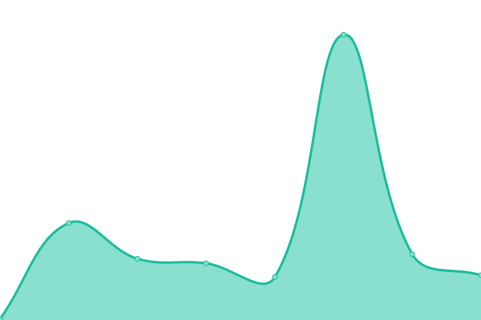

# [📈 Live Status](https://demo.upptime.js.org): <!--live status--> **🟧 Partial outage**

This repository contains the open-source uptime monitor and status page for [Linkspreed](https://linkspreed.com), powered by [Linkspreed](https://github.com/linkspreed).

We use [Issues](https://github.com/linkspreed/linkspreed_uptime/issues) as incident reports, [Actions](https://github.com/linkspreed/linkspreed_uptime/actions) as uptime monitors, and [Pages](https://status.linkspreed.com) for the status page.

<!--start: status pages-->
<!-- This summary is generated by Upptime (https://github.com/upptime/upptime) -->
<!-- Do not edit this manually, your changes will be overwritten -->
<!-- prettier-ignore -->
| URL | Status | History | Response Time | Uptime |
| --- | ------ | ------- | ------------- | ------ |
|  [Adseasy](https://adseasy.tk) | 🟩 Up | [adseasy.yml](https://github.com/linkspreed/linkspreed_uptime/commits/HEAD/history/adseasy.yml) | 

 850ms
     
 | 

<a href="https://status.linkspreed.com/history/adseasy">28.99%</a>
    

|  [Airr](https://airr.tk) | 🟩 Up | [airr.yml](https://github.com/linkspreed/linkspreed_uptime/commits/HEAD/history/airr.yml) | 

 1422ms
     
 | 

<a href="https://status.linkspreed.com/history/airr">36.49%</a>
    

|  [Analytix](https://analytix.tk) | 🟩 Up | [analytix.yml](https://github.com/linkspreed/linkspreed_uptime/commits/HEAD/history/analytix.yml) | 

 822ms
     
 | 

<a href="https://status.linkspreed.com/history/analytix">28.99%</a>
    

|  [Articly](https://articly.tk) | 🟩 Up | [articly.yml](https://github.com/linkspreed/linkspreed_uptime/commits/HEAD/history/articly.yml) | 

 636ms
     
 | 

<a href="https://status.linkspreed.com/history/articly">28.99%</a>
    

|  [Backpay](https://backpay.cf) | 🟩 Up | [backpay.yml](https://github.com/linkspreed/linkspreed_uptime/commits/HEAD/history/backpay.yml) | 

 2043ms
     
 | 

<a href="https://status.linkspreed.com/history/backpay">28.99%</a>
    

|  [BeSave](https://besave.tk) | 🟩 Up | [be-save.yml](https://github.com/linkspreed/linkspreed_uptime/commits/HEAD/history/be-save.yml) | 

 474ms
     
 | 

<a href="https://status.linkspreed.com/history/be-save">36.49%</a>
    

|  [BeYou](https://beyou.cf) | 🟩 Up | [be-you.yml](https://github.com/linkspreed/linkspreed_uptime/commits/HEAD/history/be-you.yml) | 

 2184ms
     
 | 

<a href="https://status.linkspreed.com/history/be-you">28.99%</a>
    

|  [Biospreed](https://biospreed.tk) | 🟩 Up | [biospreed.yml](https://github.com/linkspreed/linkspreed_uptime/commits/HEAD/history/biospreed.yml) | 

 721ms
     
 | 

<a href="https://status.linkspreed.com/history/biospreed">28.99%</a>
    

|  [CallCloud](https://callcloud.cf) | 🟩 Up | [call-cloud.yml](https://github.com/linkspreed/linkspreed_uptime/commits/HEAD/history/call-cloud.yml) | 

 1100ms
     
 | 

<a href="https://status.linkspreed.com/history/call-cloud">28.99%</a>
    

|  [Ceal](https://ceal.ga) | 🟩 Up | [ceal.yml](https://github.com/linkspreed/linkspreed_uptime/commits/HEAD/history/ceal.yml) | 

 2959ms
     
 | 

<a href="https://status.linkspreed.com/history/ceal">35.08%</a>
    

|  [Cheezz](https://cheezz.tk) | 🟩 Up | [cheezz.yml](https://github.com/linkspreed/linkspreed_uptime/commits/HEAD/history/cheezz.yml) | 

 945ms
     
 | 

<a href="https://status.linkspreed.com/history/cheezz">28.98%</a>
    

|  [Chirp](https://chirp.ga) | 🟩 Up | [chirp.yml](https://github.com/linkspreed/linkspreed_uptime/commits/HEAD/history/chirp.yml) | 

 3688ms
     
 | 

<a href="https://status.linkspreed.com/history/chirp">35.08%</a>
    

|  [Chitter](https://chitter.ml) | 🟩 Up | [chitter.yml](https://github.com/linkspreed/linkspreed_uptime/commits/HEAD/history/chitter.yml) | 

 1325ms
     
 | 

<a href="https://status.linkspreed.com/history/chitter">28.98%</a>
    

|  [Cloud2Go](https://cloud2go.tk) | 🟩 Up | [cloud2-go.yml](https://github.com/linkspreed/linkspreed_uptime/commits/HEAD/history/cloud2-go.yml) | 

 657ms
     
 | 

<a href="https://status.linkspreed.com/history/cloud2-go">28.98%</a>
    

|  [Cloud2Go Share](http://share.cloud2go.tk) | 🟩 Up | [cloud2-go-share.yml](https://github.com/linkspreed/linkspreed_uptime/commits/HEAD/history/cloud2-go-share.yml) | 

 270ms
     
 | 

<a href="https://status.linkspreed.com/history/cloud2-go-share">100.00%</a>
    

|  [Cloud2Share](https://cloud2share.tk) | 🟩 Up | [cloud2-share.yml](https://github.com/linkspreed/linkspreed_uptime/commits/HEAD/history/cloud2-share.yml) | 

 742ms
     
 | 

<a href="https://status.linkspreed.com/history/cloud2-share">28.98%</a>
    

|  [CloudSpreed](https://cloudspreed.tk) | 🟩 Up | [cloud-spreed.yml](https://github.com/linkspreed/linkspreed_uptime/commits/HEAD/history/cloud-spreed.yml) | 

 1055ms
     
 | 

<a href="https://status.linkspreed.com/history/cloud-spreed">28.98%</a>
    

|  [Connected](https://connected.tk) | 🟩 Up | [connected.yml](https://github.com/linkspreed/linkspreed_uptime/commits/HEAD/history/connected.yml) | 

 812ms
     
 | 

<a href="https://status.linkspreed.com/history/connected">28.98%</a>
    

|  [Contribution](https://contribution.tk) | 🟩 Up | [contribution.yml](https://github.com/linkspreed/linkspreed_uptime/commits/HEAD/history/contribution.yml) | 

 653ms
     
 | 

<a href="https://status.linkspreed.com/history/contribution">86.76%</a>
    

|  [Critch](https://critch.cf) | 🟩 Up | [critch.yml](https://github.com/linkspreed/linkspreed_uptime/commits/HEAD/history/critch.yml) | 

 1962ms
     
 | 

<a href="https://status.linkspreed.com/history/critch">28.98%</a>
    

|  [CrossQA](https://crossqa.tk) | 🟩 Up | [cross-qa.yml](https://github.com/linkspreed/linkspreed_uptime/commits/HEAD/history/cross-qa.yml) | 

 724ms
     
 | 

<a href="https://status.linkspreed.com/history/cross-qa">28.98%</a>
    

|  [Datify](https://datify.cf) | 🟩 Up | [datify.yml](https://github.com/linkspreed/linkspreed_uptime/commits/HEAD/history/datify.yml) | 

 3129ms
     
 | 

<a href="https://status.linkspreed.com/history/datify">28.98%</a>
    

|  [DeePage](https://deepage.tk) | 🟩 Up | [dee-page.yml](https://github.com/linkspreed/linkspreed_uptime/commits/HEAD/history/dee-page.yml) | 

 807ms
     
 | 

<a href="https://status.linkspreed.com/history/dee-page">28.98%</a>
    

|  [Discounty](https://discounty.tk) | 🟩 Up | [discounty.yml](https://github.com/linkspreed/linkspreed_uptime/commits/HEAD/history/discounty.yml) | 

 822ms
     
 | 

<a href="https://status.linkspreed.com/history/discounty">28.98%</a>
    

|  [Diskit](https://diskit.tk) | 🟩 Up | [diskit.yml](https://github.com/linkspreed/linkspreed_uptime/commits/HEAD/history/diskit.yml) | 

 721ms
     
 | 

<a href="https://status.linkspreed.com/history/diskit">28.98%</a>
    

|  [DNServer](https://dnserver.cf) | 🟥 Down | [dn-server.yml](https://github.com/linkspreed/linkspreed_uptime/commits/HEAD/history/dn-server.yml) | 

 6085ms
     
 | 

<a href="https://status.linkspreed.com/history/dn-server">42.87%</a>
    

|  [Downflix](https://downflix.cf) | 🟩 Up | [downflix.yml](https://github.com/linkspreed/linkspreed_uptime/commits/HEAD/history/downflix.yml) | 

 2050ms
     
 | 

<a href="https://status.linkspreed.com/history/downflix">28.98%</a>
    

|  [Dreambuild](https://dreambuild.tk) | 🟩 Up | [dreambuild.yml](https://github.com/linkspreed/linkspreed_uptime/commits/HEAD/history/dreambuild.yml) | 

 592ms
     
 | 

<a href="https://status.linkspreed.com/history/dreambuild">28.98%</a>
    

|  [Firelaps](https://firelaps.cf) | 🟩 Up | [firelaps.yml](https://github.com/linkspreed/linkspreed_uptime/commits/HEAD/history/firelaps.yml) | 

 1582ms
     
 | 

<a href="https://status.linkspreed.com/history/firelaps">29.07%</a>
    

|  [FlipX](https://flipx.tk) | 🟩 Up | [flip-x.yml](https://github.com/linkspreed/linkspreed_uptime/commits/HEAD/history/flip-x.yml) | 

 1367ms
     
 | 

<a href="https://status.linkspreed.com/history/flip-x">36.49%</a>
    

|  [ForJu](https://forju.tk) | 🟩 Up | [for-ju.yml](https://github.com/linkspreed/linkspreed_uptime/commits/HEAD/history/for-ju.yml) | 

 841ms
     
 | 

<a href="https://status.linkspreed.com/history/for-ju">28.98%</a>
    

|  [GetPro](https://getpro.gq/) | 🟩 Up | [get-pro.yml](https://github.com/linkspreed/linkspreed_uptime/commits/HEAD/history/get-pro.yml) | 

 2136ms
     
 | 

<a href="https://status.linkspreed.com/history/get-pro">29.07%</a>
    

|  [Gogola](https://gogola.ga) | 🟥 Down | [gogola.yml](https://github.com/linkspreed/linkspreed_uptime/commits/HEAD/history/gogola.yml) | 

 27000ms
     
 | 

<a href="https://status.linkspreed.com/history/gogola">53.27%</a>
    

|  [Grown](https://grown.tk) | 🟩 Up | [grown.yml](https://github.com/linkspreed/linkspreed_uptime/commits/HEAD/history/grown.yml) | 

 900ms
     
 | 

<a href="https://status.linkspreed.com/history/grown">28.94%</a>
    

|  [Guju](https://guju.tk) | 🟩 Up | [guju.yml](https://github.com/linkspreed/linkspreed_uptime/commits/HEAD/history/guju.yml) | 

 650ms
     
 | 

<a href="https://status.linkspreed.com/history/guju">28.94%</a>
    

|  [Him4Her](https://him4her.tk) | 🟩 Up | [him4-her.yml](https://github.com/linkspreed/linkspreed_uptime/commits/HEAD/history/him4-her.yml) | 

 754ms
     
 | 

<a href="https://status.linkspreed.com/history/him4-her">28.94%</a>
    

|  [Hutty](https://hutty.tk) | 🟥 Down | [hutty.yml](https://github.com/linkspreed/linkspreed_uptime/commits/HEAD/history/hutty.yml) | 

 1534ms
     
 | 

<a href="https://status.linkspreed.com/history/hutty">29.04%</a>
    

|  [IceCloud](https://icecloud.cf) | 🟩 Up | [ice-cloud.yml](https://github.com/linkspreed/linkspreed_uptime/commits/HEAD/history/ice-cloud.yml) | 

 3035ms
     
 | 

<a href="https://status.linkspreed.com/history/ice-cloud">29.04%</a>
    

|  [Ignyte](https://ignyte.tk) | 🟩 Up | [ignyte.yml](https://github.com/linkspreed/linkspreed_uptime/commits/HEAD/history/ignyte.yml) | 

 723ms
     
 | 

<a href="https://status.linkspreed.com/history/ignyte">29.04%</a>
    

|  [Joyn](https://joyn.tk) | 🟩 Up | [joyn.yml](https://github.com/linkspreed/linkspreed_uptime/commits/HEAD/history/joyn.yml) | 

 594ms
     
 | 

<a href="https://status.linkspreed.com/history/joyn">29.04%</a>
    

|  [Kisk](https://kisk.tk) | 🟩 Up | [kisk.yml](https://github.com/linkspreed/linkspreed_uptime/commits/HEAD/history/kisk.yml) | 

 837ms
     
 | 

<a href="https://status.linkspreed.com/history/kisk">29.04%</a>
    

|  [KitChat](https://kitchat.tk) | 🟩 Up | [kit-chat.yml](https://github.com/linkspreed/linkspreed_uptime/commits/HEAD/history/kit-chat.yml) | 

 816ms
     
 | 

<a href="https://status.linkspreed.com/history/kit-chat">29.04%</a>
    

|  [LaaS](https://laas.ml) | 🟩 Up | [laa-s.yml](https://github.com/linkspreed/linkspreed_uptime/commits/HEAD/history/laa-s.yml) | 

 2189ms
     
 | 

<a href="https://status.linkspreed.com/history/laa-s">29.04%</a>
    

|  [Lime](https://lime.gq) | 🟩 Up | [lime.yml](https://github.com/linkspreed/linkspreed_uptime/commits/HEAD/history/lime.yml) | 

 1337ms
     
 | 

<a href="https://status.linkspreed.com/history/lime">29.04%</a>
    

|  [LinkCream](https://linkcream.tk) | 🟩 Up | [link-cream.yml](https://github.com/linkspreed/linkspreed_uptime/commits/HEAD/history/link-cream.yml) | 

 723ms
     
 | 

<a href="https://status.linkspreed.com/history/link-cream">29.04%</a>
    

|  [Linkspreed](https://linkspreed.com) | 🟩 Up | [linkspreed.yml](https://github.com/linkspreed/linkspreed_uptime/commits/HEAD/history/linkspreed.yml) | 

 906ms
     
 | 

<a href="https://status.linkspreed.com/history/linkspreed">59.60%</a>
    

|  [Linkspreed Analytics](https://analytics.linkspreed.com) | 🟩 Up | [linkspreed-analytics.yml](https://github.com/linkspreed/linkspreed_uptime/commits/HEAD/history/linkspreed-analytics.yml) | 

 575ms
     
 | 

<a href="https://status.linkspreed.com/history/linkspreed-analytics">29.04%</a>
    

|  [Linkspreed Drive](https://drive.linkspreed.com) | 🟩 Up | [linkspreed-drive.yml](https://github.com/linkspreed/linkspreed_uptime/commits/HEAD/history/linkspreed-drive.yml) | 

 649ms
     
 | 

<a href="https://status.linkspreed.com/history/linkspreed-drive">29.04%</a>
    

|  [Helpdesk Linkspreed](https://helpdesk.linkspreed.com/) | 🟩 Up | [helpdesk-linkspreed.yml](https://github.com/linkspreed/linkspreed_uptime/commits/HEAD/history/helpdesk-linkspreed.yml) | 

 530ms
     
 | 

<a href="https://status.linkspreed.com/history/helpdesk-linkspreed">29.04%</a>
    

|  [Linkspreed Mails](https://mails.linkspreed.com) | 🟩 Up | [linkspreed-mails.yml](https://github.com/linkspreed/linkspreed_uptime/commits/HEAD/history/linkspreed-mails.yml) | 

 724ms
     
 | 

<a href="https://status.linkspreed.com/history/linkspreed-mails">29.04%</a>
    

|  [Linkspreed Photos](https://photos.linkspreed.com) | 🟩 Up | [linkspreed-photos.yml](https://github.com/linkspreed/linkspreed_uptime/commits/HEAD/history/linkspreed-photos.yml) | 

 618ms
     
 | 

<a href="https://status.linkspreed.com/history/linkspreed-photos">29.04%</a>
    

|  [Linkspreed Store](https://store.linkspreed.com) | 🟩 Up | [linkspreed-store.yml](https://github.com/linkspreed/linkspreed_uptime/commits/HEAD/history/linkspreed-store.yml) | 

 394ms
     
 | 

<a href="https://status.linkspreed.com/history/linkspreed-store">29.04%</a>
    

|  [Linkspreed Web](https://web.linkspreed.com) | 🟩 Up | [linkspreed-web.yml](https://github.com/linkspreed/linkspreed_uptime/commits/HEAD/history/linkspreed-web.yml) | 

 398ms
     
 | 

<a href="https://status.linkspreed.com/history/linkspreed-web">36.57%</a>
    

|  [Linkspreed Web4](https://web4.linkspreed.com) | 🟩 Up | [linkspreed-web4.yml](https://github.com/linkspreed/linkspreed_uptime/commits/HEAD/history/linkspreed-web4.yml) | 

 149ms
     
 | 

<a href="https://status.linkspreed.com/history/linkspreed-web4">36.57%</a>
    

|  [LinkLab](https://linklab.ga) | 🟩 Up | [link-lab.yml](https://github.com/linkspreed/linkspreed_uptime/commits/HEAD/history/link-lab.yml) | 

 3448ms
     
 | 

<a href="https://status.linkspreed.com/history/link-lab">35.16%</a>
    

|  [LSily](https://lsily.tk) | 🟩 Up | [l-sily.yml](https://github.com/linkspreed/linkspreed_uptime/commits/HEAD/history/l-sily.yml) | 

 3614ms
     
 | 

<a href="https://status.linkspreed.com/history/l-sily">33.25%</a>
    

|  [LSNews](https://lsnews.cf) | 🟩 Up | [ls-news.yml](https://github.com/linkspreed/linkspreed_uptime/commits/HEAD/history/ls-news.yml) | 

 2652ms
     
 | 

<a href="https://status.linkspreed.com/history/ls-news">29.04%</a>
    

|  [Mailspread](https://mailspread.cf) | 🟩 Up | [mailspread.yml](https://github.com/linkspreed/linkspreed_uptime/commits/HEAD/history/mailspread.yml) | 

 2444ms
     
 | 

<a href="https://status.linkspreed.com/history/mailspread">29.04%</a>
    

|  [Mapsli](https://mapsli.tk) | 🟩 Up | [mapsli.yml](https://github.com/linkspreed/linkspreed_uptime/commits/HEAD/history/mapsli.yml) | 

 651ms
     
 | 

<a href="https://status.linkspreed.com/history/mapsli">29.04%</a>
    

|  [Memevid](https://memevid.tk) | 🟩 Up | [memevid.yml](https://github.com/linkspreed/linkspreed_uptime/commits/HEAD/history/memevid.yml) | 

 1039ms
     
 | 

<a href="https://status.linkspreed.com/history/memevid">29.04%</a>
    

|  [Metabox](https://metabox.ga) | 🟩 Up | [metabox.yml](https://github.com/linkspreed/linkspreed_uptime/commits/HEAD/history/metabox.yml) | 

 4072ms
     
 | 

<a href="https://status.linkspreed.com/history/metabox">35.17%</a>
    

|  [Metaspace](https://metaspace.tk) | 🟩 Up | [metaspace.yml](https://github.com/linkspreed/linkspreed_uptime/commits/HEAD/history/metaspace.yml) | 

 851ms
     
 | 

<a href="https://status.linkspreed.com/history/metaspace">29.04%</a>
    

|  [Musiccloud](https://musiccloud.cf) | 🟩 Up | [musiccloud.yml](https://github.com/linkspreed/linkspreed_uptime/commits/HEAD/history/musiccloud.yml) | 

 2468ms
     
 | 

<a href="https://status.linkspreed.com/history/musiccloud">29.04%</a>
    

|  [MyBuy](https://mybuy.cf) | 🟩 Up | [my-buy.yml](https://github.com/linkspreed/linkspreed_uptime/commits/HEAD/history/my-buy.yml) | 

 2951ms
     
 | 

<a href="https://status.linkspreed.com/history/my-buy">29.04%</a>
    

|  [MyDancX](https://mydancx.cf) | 🟩 Up | [my-danc-x.yml](https://github.com/linkspreed/linkspreed_uptime/commits/HEAD/history/my-danc-x.yml) | 

 4717ms
     
 | 

<a href="https://status.linkspreed.com/history/my-danc-x">29.04%</a>
    

|  [Netavark](https://netavark.tk) | 🟩 Up | [netavark.yml](https://github.com/linkspreed/linkspreed_uptime/commits/HEAD/history/netavark.yml) | 

 830ms
     
 | 

<a href="https://status.linkspreed.com/history/netavark">29.04%</a>
    

|  [NetSky](https://netsky.tk) | 🟩 Up | [net-sky.yml](https://github.com/linkspreed/linkspreed_uptime/commits/HEAD/history/net-sky.yml) | 

 1044ms
     
 | 

<a href="https://status.linkspreed.com/history/net-sky">29.04%</a>
    

|  [NewsNode](https://newsnode.tk) | 🟩 Up | [news-node.yml](https://github.com/linkspreed/linkspreed_uptime/commits/HEAD/history/news-node.yml) | 

 919ms
     
 | 

<a href="https://status.linkspreed.com/history/news-node">29.04%</a>
    

|  [Niming](https://niming.tk) | 🟩 Up | [niming.yml](https://github.com/linkspreed/linkspreed_uptime/commits/HEAD/history/niming.yml) | 

 738ms
     
 | 

<a href="https://status.linkspreed.com/history/niming">29.04%</a>
    

|  [Nither](https://nither.tk) | 🟩 Up | [nither.yml](https://github.com/linkspreed/linkspreed_uptime/commits/HEAD/history/nither.yml) | 

 1089ms
     
 | 

<a href="https://status.linkspreed.com/history/nither">29.04%</a>
    

|  [NodX](https://nodx.tk) | 🟩 Up | [nod-x.yml](https://github.com/linkspreed/linkspreed_uptime/commits/HEAD/history/nod-x.yml) | 

 1381ms
     
 | 

<a href="https://status.linkspreed.com/history/nod-x">29.04%</a>
    

|  [OnlyPaid](https://onlypaid.tk) | 🟩 Up | [only-paid.yml](https://github.com/linkspreed/linkspreed_uptime/commits/HEAD/history/only-paid.yml) | 

 956ms
     
 | 

<a href="https://status.linkspreed.com/history/only-paid">29.04%</a>
    

|  [Ondu](https://ondu.tk) | 🟩 Up | [ondu.yml](https://github.com/linkspreed/linkspreed_uptime/commits/HEAD/history/ondu.yml) | 

 1026ms
     
 | 

<a href="https://status.linkspreed.com/history/ondu">29.04%</a>
    

|  [Payback](https://payback.ga) | 🟩 Up | [payback.yml](https://github.com/linkspreed/linkspreed_uptime/commits/HEAD/history/payback.yml) | 

 2307ms
     
 | 

<a href="https://status.linkspreed.com/history/payback">36.58%</a>
    

|  [Payback](https://payback.gq) | 🟩 Up | [payback.yml](https://github.com/linkspreed/linkspreed_uptime/commits/HEAD/history/payback.yml) | 

 2307ms
     
 | 

<a href="https://status.linkspreed.com/history/payback">36.58%</a>
    

|  [PayCount](https://paycount.cf) | 🟩 Up | [pay-count.yml](https://github.com/linkspreed/linkspreed_uptime/commits/HEAD/history/pay-count.yml) | 

 3122ms
     
 | 

<a href="https://status.linkspreed.com/history/pay-count">29.04%</a>
    

|  [Peek](https://peek.ml) | 🟩 Up | [peek.yml](https://github.com/linkspreed/linkspreed_uptime/commits/HEAD/history/peek.yml) | 

 2397ms
     
 | 

<a href="https://status.linkspreed.com/history/peek">29.04%</a>
    

|  [Petabyte](https://petabyte.ml) | 🟩 Up | [petabyte.yml](https://github.com/linkspreed/linkspreed_uptime/commits/HEAD/history/petabyte.yml) | 

 1981ms
     
 | 

<a href="https://status.linkspreed.com/history/petabyte">29.04%</a>
    

|  [PinPix](https://pinpix.cf) | 🟩 Up | [pin-pix.yml](https://github.com/linkspreed/linkspreed_uptime/commits/HEAD/history/pin-pix.yml) | 

 2133ms
     
 | 

<a href="https://status.linkspreed.com/history/pin-pix">29.04%</a>
    

|  [PinSec](https://pinsec.tk) | 🟩 Up | [pin-sec.yml](https://github.com/linkspreed/linkspreed_uptime/commits/HEAD/history/pin-sec.yml) | 

 937ms
     
 | 

<a href="https://status.linkspreed.com/history/pin-sec">29.04%</a>
    

|  [Pixly](https://pixly.tk) | 🟩 Up | [pixly.yml](https://github.com/linkspreed/linkspreed_uptime/commits/HEAD/history/pixly.yml) | 

 566ms
     
 | 

<a href="https://status.linkspreed.com/history/pixly">29.04%</a>
    

|  [Ples](https://ples.ml) | 🟩 Up | [ples.yml](https://github.com/linkspreed/linkspreed_uptime/commits/HEAD/history/ples.yml) | 

 2022ms
     
 | 

<a href="https://status.linkspreed.com/history/ples">29.04%</a>
    

|  [Plop](https://plop.tk) | 🟩 Up | [plop.yml](https://github.com/linkspreed/linkspreed_uptime/commits/HEAD/history/plop.yml) | 

 734ms
     
 | 

<a href="https://status.linkspreed.com/history/plop">28.77%</a>
    

|  [Poddy](https://poddy.tk) | 🟩 Up | [poddy.yml](https://github.com/linkspreed/linkspreed_uptime/commits/HEAD/history/poddy.yml) | 

 781ms
     
 | 

<a href="https://status.linkspreed.com/history/poddy">29.04%</a>
    

|  [Profilio](https://www.profilio.cf) | 🟩 Up | [profilio.yml](https://github.com/linkspreed/linkspreed_uptime/commits/HEAD/history/profilio.yml) | 

 2052ms
     
 | 

<a href="https://status.linkspreed.com/history/profilio">29.04%</a>
    

|  [Pubit](https://pubit.tk) | 🟩 Up | [pubit.yml](https://github.com/linkspreed/linkspreed_uptime/commits/HEAD/history/pubit.yml) | 

 920ms
     
 | 

<a href="https://status.linkspreed.com/history/pubit">29.04%</a>
    

|  [QRMe](https://qrme.cf) | 🟩 Up | [qr-me.yml](https://github.com/linkspreed/linkspreed_uptime/commits/HEAD/history/qr-me.yml) | 

 1933ms
     
 | 

<a href="https://status.linkspreed.com/history/qr-me">29.04%</a>
    

|  [Quexy](https://quexy.cf) | 🟩 Up | [quexy.yml](https://github.com/linkspreed/linkspreed_uptime/commits/HEAD/history/quexy.yml) | 

 2162ms
     
 | 

<a href="https://status.linkspreed.com/history/quexy">29.04%</a>
    

|  [Rank](https://rank.ga) | 🟩 Up | [rank.yml](https://github.com/linkspreed/linkspreed_uptime/commits/HEAD/history/rank.yml) | 

 3730ms
     
 | 

<a href="https://status.linkspreed.com/history/rank">35.19%</a>
    

|  [RealPin](https://realpin.tk) | 🟩 Up | [real-pin.yml](https://github.com/linkspreed/linkspreed_uptime/commits/HEAD/history/real-pin.yml) | 

 879ms
     
 | 

<a href="https://status.linkspreed.com/history/real-pin">29.04%</a>
    

|  [Reply](https://reply.cf) | 🟩 Up | [reply.yml](https://github.com/linkspreed/linkspreed_uptime/commits/HEAD/history/reply.yml) | 

 1909ms
     
 | 

<a href="https://status.linkspreed.com/history/reply">29.04%</a>
    

|  [SeedSpreed](https://seedspreed.cf) | 🟩 Up | [seed-spreed.yml](https://github.com/linkspreed/linkspreed_uptime/commits/HEAD/history/seed-spreed.yml) | 

 1575ms
     
 | 

<a href="https://status.linkspreed.com/history/seed-spreed">29.04%</a>
    

|  [Share](https://share.ga) | 🟩 Up | [share.yml](https://github.com/linkspreed/linkspreed_uptime/commits/HEAD/history/share.yml) | 

 2715ms
     
 | 

<a href="https://status.linkspreed.com/history/share">35.19%</a>
    

|  [ShareNode](https://sharenode.tk) | 🟩 Up | [share-node.yml](https://github.com/linkspreed/linkspreed_uptime/commits/HEAD/history/share-node.yml) | 

 1775ms
     
 | 

<a href="https://status.linkspreed.com/history/share-node">29.04%</a>
    

|  [Shortcut](https://shortcut.tk) | 🟩 Up | [shortcut.yml](https://github.com/linkspreed/linkspreed_uptime/commits/HEAD/history/shortcut.yml) | 

 852ms
     
 | 

<a href="https://status.linkspreed.com/history/shortcut">29.04%</a>
    

|  [Shortrack](https://shortrack.tk) | 🟩 Up | [shortrack.yml](https://github.com/linkspreed/linkspreed_uptime/commits/HEAD/history/shortrack.yml) | 

 970ms
     
 | 

<a href="https://status.linkspreed.com/history/shortrack">29.04%</a>
    

|  [Showit](https://showit.tk) | 🟩 Up | [showit.yml](https://github.com/linkspreed/linkspreed_uptime/commits/HEAD/history/showit.yml) | 

 932ms
     
 | 

<a href="https://status.linkspreed.com/history/showit">29.04%</a>
    

|  [SiteSpace](https://sitespace.tk) | 🟩 Up | [site-space.yml](https://github.com/linkspreed/linkspreed_uptime/commits/HEAD/history/site-space.yml) | 

 1760ms
     
 | 

<a href="https://status.linkspreed.com/history/site-space">29.04%</a>
    

|  [Slinky](https://slinky.ml) | 🟩 Up | [slinky.yml](https://github.com/linkspreed/linkspreed_uptime/commits/HEAD/history/slinky.yml) | 

 2833ms
     
 | 

<a href="https://status.linkspreed.com/history/slinky">29.04%</a>
    

|  [Slurch](https://slurch.tk) | 🟩 Up | [slurch.yml](https://github.com/linkspreed/linkspreed_uptime/commits/HEAD/history/slurch.yml) | 

 778ms
     
 | 

<a href="https://status.linkspreed.com/history/slurch">29.04%</a>
    

|  [SmartPix](https://smartpix.cf) | 🟩 Up | [smart-pix.yml](https://github.com/linkspreed/linkspreed_uptime/commits/HEAD/history/smart-pix.yml) | 

 2139ms
     
 | 

<a href="https://status.linkspreed.com/history/smart-pix">29.04%</a>
    

|  [SnapLink](https://snaplink.tk) | 🟩 Up | [snap-link.yml](https://github.com/linkspreed/linkspreed_uptime/commits/HEAD/history/snap-link.yml) | 

 997ms
     
 | 

<a href="https://status.linkspreed.com/history/snap-link">29.04%</a>
    

|  [Snippite](https://snippite.tk) | 🟩 Up | [snippite.yml](https://github.com/linkspreed/linkspreed_uptime/commits/HEAD/history/snippite.yml) | 

 732ms
     
 | 

<a href="https://status.linkspreed.com/history/snippite">36.59%</a>
    

|  [Snoogie](https://snoogie.tk) | 🟩 Up | [snoogie.yml](https://github.com/linkspreed/linkspreed_uptime/commits/HEAD/history/snoogie.yml) | 

 651ms
     
 | 

<a href="https://status.linkspreed.com/history/snoogie">36.59%</a>
    

|  [SoundChest](https://soundchest.cf) | 🟩 Up | [sound-chest.yml](https://github.com/linkspreed/linkspreed_uptime/commits/HEAD/history/sound-chest.yml) | 

 2954ms
     
 | 

<a href="https://status.linkspreed.com/history/sound-chest">82.23%</a>
    

|  [Spypy](https://spypy.cf) | 🟩 Up | [spypy.yml](https://github.com/linkspreed/linkspreed_uptime/commits/HEAD/history/spypy.yml) | 

 2320ms
     
 | 

<a href="https://status.linkspreed.com/history/spypy">75.80%</a>
    

|  [Start2Up](https://start2up.tk) | 🟩 Up | [start2-up.yml](https://github.com/linkspreed/linkspreed_uptime/commits/HEAD/history/start2-up.yml) | 

 926ms
     
 | 

<a href="https://status.linkspreed.com/history/start2-up">67.15%</a>
    

|  [Stix](https://stix.ga) | 🟩 Up | [stix.yml](https://github.com/linkspreed/linkspreed_uptime/commits/HEAD/history/stix.yml) | 

 2606ms
     
 | 

<a href="https://status.linkspreed.com/history/stix">73.10%</a>
    

|  [Store4Ju](https://store4ju.tk) | 🟩 Up | [store4-ju.yml](https://github.com/linkspreed/linkspreed_uptime/commits/HEAD/history/store4-ju.yml) | 

 860ms
     
 | 

<a href="https://status.linkspreed.com/history/store4-ju">78.33%</a>
    

|  [Storee](https://storee.cf) | 🟩 Up | [storee.yml](https://github.com/linkspreed/linkspreed_uptime/commits/HEAD/history/storee.yml) | 

 2520ms
     
 | 

<a href="https://status.linkspreed.com/history/storee">79.19%</a>
    

|  [Storpad](https://storpad.tk) | 🟩 Up | [storpad.yml](https://github.com/linkspreed/linkspreed_uptime/commits/HEAD/history/storpad.yml) | 

 1650ms
     
 | 

<a href="https://status.linkspreed.com/history/storpad">72.83%</a>
    

|  [StreamValley](https://streamvalley.cf) | 🟩 Up | [stream-valley.yml](https://github.com/linkspreed/linkspreed_uptime/commits/HEAD/history/stream-valley.yml) | 

 2510ms
     
 | 

<a href="https://status.linkspreed.com/history/stream-valley">74.60%</a>
    

|  [StreamValley API](https://api.streamvalley.cf) | 🟥 Down | [stream-valley-api.yml](https://github.com/linkspreed/linkspreed_uptime/commits/HEAD/history/stream-valley-api.yml) | 

 1866ms
     
 | 

<a href="https://status.linkspreed.com/history/stream-valley-api">71.02%</a>
    

|  [Tacuu](https://tacuu.tk) | 🟥 Down | [tacuu.yml](https://github.com/linkspreed/linkspreed_uptime/commits/HEAD/history/tacuu.yml) | 

 719ms
     
 | 

<a href="https://status.linkspreed.com/history/tacuu">69.35%</a>
    

|  [Takestore](https://takestore.tk) | 🟥 Down | [takestore.yml](https://github.com/linkspreed/linkspreed_uptime/commits/HEAD/history/takestore.yml) | 

 841ms
     
 | 

<a href="https://status.linkspreed.com/history/takestore">69.38%</a>
    

|  [Tasksboard](https://tasksboard.tk) | 🟥 Down | [tasksboard.yml](https://github.com/linkspreed/linkspreed_uptime/commits/HEAD/history/tasksboard.yml) | 

 865ms
     
 | 

<a href="https://status.linkspreed.com/history/tasksboard">67.01%</a>
    

|  [Taya](https://taya.cf) | 🟥 Down | [taya.yml](https://github.com/linkspreed/linkspreed_uptime/commits/HEAD/history/taya.yml) | 

 1872ms
     
 | 

<a href="https://status.linkspreed.com/history/taya">65.30%</a>
    

|  [Teamix](https://teamix.cf) | 🟥 Down | [teamix.yml](https://github.com/linkspreed/linkspreed_uptime/commits/HEAD/history/teamix.yml) | 

 2460ms
     
 | 

<a href="https://status.linkspreed.com/history/teamix">62.22%</a>
    

|  [Teamslite](https://teamslite.tk) | 🟥 Down | [teamslite.yml](https://github.com/linkspreed/linkspreed_uptime/commits/HEAD/history/teamslite.yml) | 

 822ms
     
 | 

<a href="https://status.linkspreed.com/history/teamslite">60.39%</a>
    

|  [TeamSpreed](https://teamspreed.cf) | 🟥 Down | [team-spreed.yml](https://github.com/linkspreed/linkspreed_uptime/commits/HEAD/history/team-spreed.yml) | 

 1700ms
     
 | 

<a href="https://status.linkspreed.com/history/team-spreed">57.79%</a>
    

|  [Tizza](https://tizza.tk) | 🟥 Down | [tizza.yml](https://github.com/linkspreed/linkspreed_uptime/commits/HEAD/history/tizza.yml) | 

 714ms
     
 | 

<a href="https://status.linkspreed.com/history/tizza">57.54%</a>
    

|  [Toolbox](https://toolbox.ga) | 🟥 Down | [toolbox.yml](https://github.com/linkspreed/linkspreed_uptime/commits/HEAD/history/toolbox.yml) | 

 3369ms
     
 | 

<a href="https://status.linkspreed.com/history/toolbox">53.36%</a>
    

|  [Toolkit](https://toolkit.ga) | 🟥 Down | [toolkit.yml](https://github.com/linkspreed/linkspreed_uptime/commits/HEAD/history/toolkit.yml) | 

 2791ms
     
 | 

<a href="https://status.linkspreed.com/history/toolkit">49.80%</a>
    

|  [Tuit](https://tuit.cf) | 🟥 Down | [tuit.yml](https://github.com/linkspreed/linkspreed_uptime/commits/HEAD/history/tuit.yml) | 

 1856ms
     
 | 

<a href="https://status.linkspreed.com/history/tuit">47.95%</a>
    

|  [Tungolino](https://tungolino.tk) | 🟥 Down | [tungolino.yml](https://github.com/linkspreed/linkspreed_uptime/commits/HEAD/history/tungolino.yml) | 

 861ms
     
 | 

<a href="https://status.linkspreed.com/history/tungolino">45.83%</a>
    

|  [Tweetch](https://tweetch.cf) | 🟥 Down | [tweetch.yml](https://github.com/linkspreed/linkspreed_uptime/commits/HEAD/history/tweetch.yml) | 

 1727ms
     
 | 

<a href="https://status.linkspreed.com/history/tweetch">39.43%</a>
    

|  [Twig](https://twig.cf) | 🟥 Down | [twig.yml](https://github.com/linkspreed/linkspreed_uptime/commits/HEAD/history/twig.yml) | 

 1620ms
     
 | 

<a href="https://status.linkspreed.com/history/twig">36.50%</a>
    

|  [uCube](https://ucube.cf) | 🟥 Down | [u-cube.yml](https://github.com/linkspreed/linkspreed_uptime/commits/HEAD/history/u-cube.yml) | 

 1601ms
     
 | 

<a href="https://status.linkspreed.com/history/u-cube">36.78%</a>
    

|  [UltiCloud](https://ulticloud.tk) | 🟥 Down | [ulti-cloud.yml](https://github.com/linkspreed/linkspreed_uptime/commits/HEAD/history/ulti-cloud.yml) | 

 1142ms
     
 | 

<a href="https://status.linkspreed.com/history/ulti-cloud">34.08%</a>
    

|  [Up2Date](https://up2date.tk) | 🟥 Down | [up2-date.yml](https://github.com/linkspreed/linkspreed_uptime/commits/HEAD/history/up2-date.yml) | 

 834ms
     
 | 

<a href="https://status.linkspreed.com/history/up2-date">36.56%</a>
    

|  [UpDown](https://updown.ml) | 🟥 Down | [up-down.yml](https://github.com/linkspreed/linkspreed_uptime/commits/HEAD/history/up-down.yml) | 

 2168ms
     
 | 

<a href="https://status.linkspreed.com/history/up-down">32.90%</a>
    

|  [UpNode](https://upnode.cf) | 🟥 Down | [up-node.yml](https://github.com/linkspreed/linkspreed_uptime/commits/HEAD/history/up-node.yml) | 

 2620ms
     
 | 

<a href="https://status.linkspreed.com/history/up-node">30.92%</a>
    

|  [VoiceClub](https://voiceclub.tk) | 🟩 Up | [voice-club.yml](https://github.com/linkspreed/linkspreed_uptime/commits/HEAD/history/voice-club.yml) | 

 551ms
     
 | 

<a href="https://status.linkspreed.com/history/voice-club">100.00%</a>
    

|  [Web5](https://web5.cf) | 🟥 Down | [web5.yml](https://github.com/linkspreed/linkspreed_uptime/commits/HEAD/history/web5.yml) | 

 2023ms
     
 | 

<a href="https://status.linkspreed.com/history/web5">33.24%</a>
    

|  [Whatsline](https://whatsline.tk) | 🟥 Down | [whatsline.yml](https://github.com/linkspreed/linkspreed_uptime/commits/HEAD/history/whatsline.yml) | 

 1226ms
     
 | 

<a href="https://status.linkspreed.com/history/whatsline">37.94%</a>
    

|  [Wrap](https://wrap.gq) | 🟥 Down | [wrap.yml](https://github.com/linkspreed/linkspreed_uptime/commits/HEAD/history/wrap.yml) | 

 2516ms
     
 | 

<a href="https://status.linkspreed.com/history/wrap">35.44%</a>
    

|  [Write](https://write.cf) | 🟥 Down | [write.yml](https://github.com/linkspreed/linkspreed_uptime/commits/HEAD/history/write.yml) | 

 1911ms
     
 | 

<a href="https://status.linkspreed.com/history/write">33.67%</a>
    

|  [Yourpod](https://yourpod.cf) | 🟥 Down | [yourpod.yml](https://github.com/linkspreed/linkspreed_uptime/commits/HEAD/history/yourpod.yml) | 

 1896ms
     
 | 

<a href="https://status.linkspreed.com/history/yourpod">32.40%</a>
    

<!--end: status pages-->

[**Visit our status website →**](https://status.linkspreed.com)

## 📄 License

- Powered by: [Linkspreed](https://www.linkspreed.com)
- Code: [MIT](./LICENSE) © [Linkspreed](https://status.linkspreed.com)
- Data in the `./history` directory: [Open Database License](https://opendatacommons.org/licenses/odbl/1-0/)
