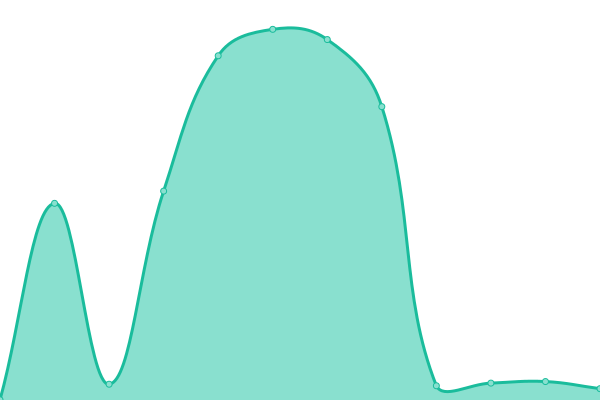

# [📈 Live Status](https://demo.upptime.js.org): <!--live status--> **🟧 Partial outage**

This repository contains the open-source uptime monitor and status page for [Linkspreed](https://linkspreed.com), powered by [Linkspreed](https://github.com/linkspreed).

We use [Issues](https://github.com/linkspreed/linkspreed_uptime/issues) as incident reports, [Actions](https://github.com/linkspreed/linkspreed_uptime/actions) as uptime monitors, and [Pages](https://status.linkspreed.com) for the status page.

<!--start: status pages-->
<!-- This summary is generated by Upptime (https://github.com/upptime/upptime) -->
<!-- Do not edit this manually, your changes will be overwritten -->
<!-- prettier-ignore -->
| URL | Status | History | Response Time | Uptime |
| --- | ------ | ------- | ------------- | ------ |
|  [Adseasy](https://adseasy.linkspreed.com) | 🟥 Down | [adseasy.yml](https://github.com/linkspreed/linkspreed_uptime/commits/HEAD/history/adseasy.yml) | 

 0ms
     
 | 

<a href="https://status.linkspreed.com/history/adseasy">0.00%</a>
    

|  [Airr](https://airr.linkspreed.com) | 🟥 Down | [airr.yml](https://github.com/linkspreed/linkspreed_uptime/commits/HEAD/history/airr.yml) | 

 15599ms
     
 | 

<a href="https://status.linkspreed.com/history/airr">0.00%</a>
    

|  [Analytix](https://analytix.linkspreed.com) | 🟥 Down | [analytix.yml](https://github.com/linkspreed/linkspreed_uptime/commits/HEAD/history/analytix.yml) | 

 15767ms
     
 | 

<a href="https://status.linkspreed.com/history/analytix">0.00%</a>
    

|  [Articly](https://articly.linkspreed.com) | 🟥 Down | [articly.yml](https://github.com/linkspreed/linkspreed_uptime/commits/HEAD/history/articly.yml) | 

 15730ms
     
 | 

<a href="https://status.linkspreed.com/history/articly">0.00%</a>
    

|  [Backpay](https://backpay.cf) | 🟥 Down | [backpay.yml](https://github.com/linkspreed/linkspreed_uptime/commits/HEAD/history/backpay.yml) | 

 0ms
     
 | 

<a href="https://status.linkspreed.com/history/backpay">0.00%</a>
    

|  [BeSave](https://besave.linkspreed.com) | 🟥 Down | [be-save.yml](https://github.com/linkspreed/linkspreed_uptime/commits/HEAD/history/be-save.yml) | 

 15641ms
     
 | 

<a href="https://status.linkspreed.com/history/be-save">0.00%</a>
    

|  [BeYou](https://beyou.linkspreed.com) | 🟥 Down | [be-you.yml](https://github.com/linkspreed/linkspreed_uptime/commits/HEAD/history/be-you.yml) | 

 15682ms
     
 | 

<a href="https://status.linkspreed.com/history/be-you">0.00%</a>
    

|  [Biospreed](https://biospreed.linkspreed.com) | 🟥 Down | [biospreed.yml](https://github.com/linkspreed/linkspreed_uptime/commits/HEAD/history/biospreed.yml) | 

 15470ms
     
 | 

<a href="https://status.linkspreed.com/history/biospreed">0.00%</a>
    

|  [BioX](https://biox.linkspreed.com) | 🟥 Down | [bio-x.yml](https://github.com/linkspreed/linkspreed_uptime/commits/HEAD/history/bio-x.yml) | 

 15784ms
     
 | 

<a href="https://status.linkspreed.com/history/bio-x">0.00%</a>
    

|  [Botchat](https://botchat.linkspreed.com) | 🟥 Down | [botchat.yml](https://github.com/linkspreed/linkspreed_uptime/commits/HEAD/history/botchat.yml) | 

 15729ms
     
 | 

<a href="https://status.linkspreed.com/history/botchat">0.00%</a>
    

|  [CallCloud](https://callcloud.linkspreed.com) | 🟥 Down | [call-cloud.yml](https://github.com/linkspreed/linkspreed_uptime/commits/HEAD/history/call-cloud.yml) | 

 0ms
     
 | 

<a href="https://status.linkspreed.com/history/call-cloud">0.00%</a>
    

|  [Ceal](https://ceal.linkspreed.com) | 🟥 Down | [ceal.yml](https://github.com/linkspreed/linkspreed_uptime/commits/HEAD/history/ceal.yml) | 

 0ms
     
 | 

<a href="https://status.linkspreed.com/history/ceal">0.00%</a>
    

|  [Cheezz](https://cheezz.linkspreed.com) | 🟥 Down | [cheezz.yml](https://github.com/linkspreed/linkspreed_uptime/commits/HEAD/history/cheezz.yml) | 

 0ms
     
 | 

<a href="https://status.linkspreed.com/history/cheezz">0.00%</a>
    

|  [Chirp](https://chirp.linkspreed.com) | 🟥 Down | [chirp.yml](https://github.com/linkspreed/linkspreed_uptime/commits/HEAD/history/chirp.yml) | 

 15640ms
     
 | 

<a href="https://status.linkspreed.com/history/chirp">0.00%</a>
    

|  [Chitter](https://chitter.linkspreed.com) | 🟥 Down | [chitter.yml](https://github.com/linkspreed/linkspreed_uptime/commits/HEAD/history/chitter.yml) | 

 15471ms
     
 | 

<a href="https://status.linkspreed.com/history/chitter">0.00%</a>
    

|  [Cloud2Go](https://cloud2go.linkspreed.com) | 🟥 Down | [cloud2-go.yml](https://github.com/linkspreed/linkspreed_uptime/commits/HEAD/history/cloud2-go.yml) | 

 15674ms
     
 | 

<a href="https://status.linkspreed.com/history/cloud2-go">0.00%</a>
    

|  [Cloud2Go Share](http://share.cloud2go.tk) | 🟥 Down | [cloud2-go-share.yml](https://github.com/linkspreed/linkspreed_uptime/commits/HEAD/history/cloud2-go-share.yml) | 

 0ms
     
 | 

<a href="https://status.linkspreed.com/history/cloud2-go-share">0.00%</a>
    

|  [Cloud2Share](https://cloud2share.linkspreed.com) | 🟥 Down | [cloud2-share.yml](https://github.com/linkspreed/linkspreed_uptime/commits/HEAD/history/cloud2-share.yml) | 

 15619ms
     
 | 

<a href="https://status.linkspreed.com/history/cloud2-share">0.00%</a>
    

|  [CloudSpreed](https://cloudspreed.linkspreed.com) | 🟥 Down | [cloud-spreed.yml](https://github.com/linkspreed/linkspreed_uptime/commits/HEAD/history/cloud-spreed.yml) | 

 15837ms
     
 | 

<a href="https://status.linkspreed.com/history/cloud-spreed">0.00%</a>
    

|  [Connected](https://connected.linkspreed.com) | 🟩 Up | [connected.yml](https://github.com/linkspreed/linkspreed_uptime/commits/HEAD/history/connected.yml) | 

 535ms
     
 | 

<a href="https://status.linkspreed.com/history/connected">100.00%</a>
    

|  [Contribution](https://contribution.linkspreed.com) | 🟥 Down | [contribution.yml](https://github.com/linkspreed/linkspreed_uptime/commits/HEAD/history/contribution.yml) | 

 15629ms
     
 | 

<a href="https://status.linkspreed.com/history/contribution">0.00%</a>
    

|  [Critch](https://critch.linkspreed.com) | 🟥 Down | [critch.yml](https://github.com/linkspreed/linkspreed_uptime/commits/HEAD/history/critch.yml) | 

 15496ms
     
 | 

<a href="https://status.linkspreed.com/history/critch">0.00%</a>
    

|  [CRM Demo](https://crm-demo.linkspreed.com) | 🟥 Down | [crm-demo.yml](https://github.com/linkspreed/linkspreed_uptime/commits/HEAD/history/crm-demo.yml) | 

 15722ms
     
 | 

<a href="https://status.linkspreed.com/history/crm-demo">0.00%</a>
    

|  [CrossQA](https://crossqa.linkspreed.com) | 🟥 Down | [cross-qa.yml](https://github.com/linkspreed/linkspreed_uptime/commits/HEAD/history/cross-qa.yml) | 

 15711ms
     
 | 

<a href="https://status.linkspreed.com/history/cross-qa">0.00%</a>
    

|  [Dash](https://dash.linkspreed.com) | 🟥 Down | [dash.yml](https://github.com/linkspreed/linkspreed_uptime/commits/HEAD/history/dash.yml) | 

 15628ms
     
 | 

<a href="https://status.linkspreed.com/history/dash">0.00%</a>
    

|  [Datify](https://datify.linkspreed.com) | 🟥 Down | [datify.yml](https://github.com/linkspreed/linkspreed_uptime/commits/HEAD/history/datify.yml) | 

 15495ms
     
 | 

<a href="https://status.linkspreed.com/history/datify">0.00%</a>
    

|  [DeePage](https://deepage.linkspreed.com) | 🟥 Down | [dee-page.yml](https://github.com/linkspreed/linkspreed_uptime/commits/HEAD/history/dee-page.yml) | 

 15886ms
     
 | 

<a href="https://status.linkspreed.com/history/dee-page">0.00%</a>
    

|  [Discounty](https://discounty.tk) | 🟥 Down | [discounty.yml](https://github.com/linkspreed/linkspreed_uptime/commits/HEAD/history/discounty.yml) | 

 0ms
     
 | 

<a href="https://status.linkspreed.com/history/discounty">0.00%</a>
    

|  [Diskit](https://diskit.linkspreed.com) | 🟥 Down | [diskit.yml](https://github.com/linkspreed/linkspreed_uptime/commits/HEAD/history/diskit.yml) | 

 15421ms
     
 | 

<a href="https://status.linkspreed.com/history/diskit">0.00%</a>
    

|  [DNServer](https://dnserver.linkspreed.com) | 🟥 Down | [dn-server.yml](https://github.com/linkspreed/linkspreed_uptime/commits/HEAD/history/dn-server.yml) | 

 15607ms
     
 | 

<a href="https://status.linkspreed.com/history/dn-server">0.00%</a>
    

|  [Downflix](https://downflix.linkspreed.com) | 🟥 Down | [downflix.yml](https://github.com/linkspreed/linkspreed_uptime/commits/HEAD/history/downflix.yml) | 

 15785ms
     
 | 

<a href="https://status.linkspreed.com/history/downflix">0.00%</a>
    

|  [Dreambuild](https://dreambuild.linkspreed.com) | 🟥 Down | [dreambuild.yml](https://github.com/linkspreed/linkspreed_uptime/commits/HEAD/history/dreambuild.yml) | 

 15447ms
     
 | 

<a href="https://status.linkspreed.com/history/dreambuild">0.00%</a>
    

|  [Firelaps](https://firelaps.cf) | 🟥 Down | [firelaps.yml](https://github.com/linkspreed/linkspreed_uptime/commits/HEAD/history/firelaps.yml) | 

 0ms
     
 | 

<a href="https://status.linkspreed.com/history/firelaps">0.00%</a>
    

|  [FlipX](https://flipx.linkspreed.com) | 🟥 Down | [flip-x.yml](https://github.com/linkspreed/linkspreed_uptime/commits/HEAD/history/flip-x.yml) | 

 15662ms
     
 | 

<a href="https://status.linkspreed.com/history/flip-x">0.00%</a>
    

|  [ForJu](https://forju.linkspreed.com) | 🟥 Down | [for-ju.yml](https://github.com/linkspreed/linkspreed_uptime/commits/HEAD/history/for-ju.yml) | 

 15484ms
     
 | 

<a href="https://status.linkspreed.com/history/for-ju">0.00%</a>
    

|  [GetPro](https://getpro.linkspreed.com) | 🟥 Down | [get-pro.yml](https://github.com/linkspreed/linkspreed_uptime/commits/HEAD/history/get-pro.yml) | 

 0ms
     
 | 

<a href="https://status.linkspreed.com/history/get-pro">0.00%</a>
    

|  [Gogola](https://gogola.linkspreed.com) | 🟥 Down | [gogola.yml](https://github.com/linkspreed/linkspreed_uptime/commits/HEAD/history/gogola.yml) | 

 0ms
     
 | 

<a href="https://status.linkspreed.com/history/gogola">0.00%</a>
    

|  [Grown](https://grown.linkspreed.com) | 🟥 Down | [grown.yml](https://github.com/linkspreed/linkspreed_uptime/commits/HEAD/history/grown.yml) | 

 15641ms
     
 | 

<a href="https://status.linkspreed.com/history/grown">0.00%</a>
    

|  [Guju](https://guju.linkspreed.com) | 🟥 Down | [guju.yml](https://github.com/linkspreed/linkspreed_uptime/commits/HEAD/history/guju.yml) | 

 0ms
     
 | 

<a href="https://status.linkspreed.com/history/guju">0.00%</a>
    

|  [Him4Her](https://him4her.linkspreed.com) | 🟥 Down | [him4-her.yml](https://github.com/linkspreed/linkspreed_uptime/commits/HEAD/history/him4-her.yml) | 

 15553ms
     
 | 

<a href="https://status.linkspreed.com/history/him4-her">0.00%</a>
    

|  [Hutty](https://hutty.linkspreed.com) | 🟥 Down | [hutty.yml](https://github.com/linkspreed/linkspreed_uptime/commits/HEAD/history/hutty.yml) | 

 15671ms
     
 | 

<a href="https://status.linkspreed.com/history/hutty">0.00%</a>
    

|  [IceCloud](https://icecloud.linkspreed.com) | 🟥 Down | [ice-cloud.yml](https://github.com/linkspreed/linkspreed_uptime/commits/HEAD/history/ice-cloud.yml) | 

 15569ms
     
 | 

<a href="https://status.linkspreed.com/history/ice-cloud">0.00%</a>
    

|  [Ignyte](https://ignyte.linkspreed.com) | 🟥 Down | [ignyte.yml](https://github.com/linkspreed/linkspreed_uptime/commits/HEAD/history/ignyte.yml) | 

 15677ms
     
 | 

<a href="https://status.linkspreed.com/history/ignyte">0.00%</a>
    

|  [Joyn](https://joyn.linkspreed.com) | 🟥 Down | [joyn.yml](https://github.com/linkspreed/linkspreed_uptime/commits/HEAD/history/joyn.yml) | 

 15497ms
     
 | 

<a href="https://status.linkspreed.com/history/joyn">0.00%</a>
    

|  [Kisk](https://kisk.linkspreed.com) | 🟥 Down | [kisk.yml](https://github.com/linkspreed/linkspreed_uptime/commits/HEAD/history/kisk.yml) | 

 15733ms
     
 | 

<a href="https://status.linkspreed.com/history/kisk">0.00%</a>
    

|  [KitChat](https://kitchat.linkspreed.com) | 🟥 Down | [kit-chat.yml](https://github.com/linkspreed/linkspreed_uptime/commits/HEAD/history/kit-chat.yml) | 

 15573ms
     
 | 

<a href="https://status.linkspreed.com/history/kit-chat">0.00%</a>
    

|  [LaaS](https://laas.linkspreed.com) | 🟥 Down | [laa-s.yml](https://github.com/linkspreed/linkspreed_uptime/commits/HEAD/history/laa-s.yml) | 

 15465ms
     
 | 

<a href="https://status.linkspreed.com/history/laa-s">0.00%</a>
    

|  [LaaS Chatbot](https://chatbot.laas.ml) | 🟥 Down | [laa-s-chatbot.yml](https://github.com/linkspreed/linkspreed_uptime/commits/HEAD/history/laa-s-chatbot.yml) | 

 0ms
     
 | 

<a href="https://status.linkspreed.com/history/laa-s-chatbot">0.00%</a>
    

|  [LaaS Cloudchat](https://cloudchat.laas.ml) | 🟥 Down | [laa-s-cloudchat.yml](https://github.com/linkspreed/linkspreed_uptime/commits/HEAD/history/laa-s-cloudchat.yml) | 

 0ms
     
 | 

<a href="https://status.linkspreed.com/history/laa-s-cloudchat">0.00%</a>
    

|  [LaaS Salesy](https://salesy.laas.ml) | 🟥 Down | [laa-s-salesy.yml](https://github.com/linkspreed/linkspreed_uptime/commits/HEAD/history/laa-s-salesy.yml) | 

 0ms
     
 | 

<a href="https://status.linkspreed.com/history/laa-s-salesy">0.00%</a>
    

|  [Shorts](https://shorts.laas.ml) | 🟥 Down | [shorts.yml](https://github.com/linkspreed/linkspreed_uptime/commits/HEAD/history/shorts.yml) | 

 0ms
     
 | 

<a href="https://status.linkspreed.com/history/shorts">0.00%</a>
    

|  [LaaS Tasks](https://tasks.laas.ml) | 🟥 Down | [laa-s-tasks.yml](https://github.com/linkspreed/linkspreed_uptime/commits/HEAD/history/laa-s-tasks.yml) | 

 0ms
     
 | 

<a href="https://status.linkspreed.com/history/laa-s-tasks">0.00%</a>
    

|  [Lime](https://lime.linkspreed.com) | 🟥 Down | [lime.yml](https://github.com/linkspreed/linkspreed_uptime/commits/HEAD/history/lime.yml) | 

 0ms
     
 | 

<a href="https://status.linkspreed.com/history/lime">0.00%</a>
    

|  [LinkCream](https://linkcream.tk) | 🟥 Down | [link-cream.yml](https://github.com/linkspreed/linkspreed_uptime/commits/HEAD/history/link-cream.yml) | 

 0ms
     
 | 

<a href="https://status.linkspreed.com/history/link-cream">0.00%</a>
    

|  [Linkspreed](https://linkspreed.com) | 🟩 Up | [linkspreed.yml](https://github.com/linkspreed/linkspreed_uptime/commits/HEAD/history/linkspreed.yml) | 

 71ms
     
 | 

<a href="https://status.linkspreed.com/history/linkspreed">100.00%</a>
    

|  [Linkspreed AI](https://ai.linkspreed.com) | 🟩 Up | [linkspreed-ai.yml](https://github.com/linkspreed/linkspreed_uptime/commits/HEAD/history/linkspreed-ai.yml) | 

 1266ms
     
 | 

<a href="https://status.linkspreed.com/history/linkspreed-ai">100.00%</a>
    

|  [Linkspreed AIDA](https://aida.linkspreed.com) | 🟥 Down | [linkspreed-aida.yml](https://github.com/linkspreed/linkspreed_uptime/commits/HEAD/history/linkspreed-aida.yml) | 

 15577ms
     
 | 

<a href="https://status.linkspreed.com/history/linkspreed-aida">0.00%</a>
    

|  [Linkspreed Assistant](https://assistant.linkspreed.com) | 🟩 Up | [linkspreed-assistant.yml](https://github.com/linkspreed/linkspreed_uptime/commits/HEAD/history/linkspreed-assistant.yml) | 

 371ms
     
 | 

<a href="https://status.linkspreed.com/history/linkspreed-assistant">100.00%</a>
    

|  [Linkspreed Analytics](https://analytics.linkspreed.com) | 🟥 Down | [linkspreed-analytics.yml](https://github.com/linkspreed/linkspreed_uptime/commits/HEAD/history/linkspreed-analytics.yml) | 

 15657ms
     
 | 

<a href="https://status.linkspreed.com/history/linkspreed-analytics">0.00%</a>
    

|  [Linkspreed Drive](https://drive.linkspreed.com) | 🟥 Down | [linkspreed-drive.yml](https://github.com/linkspreed/linkspreed_uptime/commits/HEAD/history/linkspreed-drive.yml) | 

 15659ms
     
 | 

<a href="https://status.linkspreed.com/history/linkspreed-drive">0.00%</a>
    

|  [Linkspreed Helpdesk](https://helpdesk.linkspreed.com) | 🟩 Up | [linkspreed-helpdesk.yml](https://github.com/linkspreed/linkspreed_uptime/commits/HEAD/history/linkspreed-helpdesk.yml) | 

 2070ms
     
 | 

<a href="https://status.linkspreed.com/history/linkspreed-helpdesk">100.00%</a>
    

|  [Linkspreed Research Lab](https://lab.linkspreed.com) | 🟥 Down | [linkspreed-research-lab.yml](https://github.com/linkspreed/linkspreed_uptime/commits/HEAD/history/linkspreed-research-lab.yml) | 

 15656ms
     
 | 

<a href="https://status.linkspreed.com/history/linkspreed-research-lab">0.00%</a>
    

|  [Linkspreed Mails](https://mails.linkspreed.com) | 🟥 Down | [linkspreed-mails.yml](https://github.com/linkspreed/linkspreed_uptime/commits/HEAD/history/linkspreed-mails.yml) | 

 15780ms
     
 | 

<a href="https://status.linkspreed.com/history/linkspreed-mails">0.00%</a>
    

|  [Linkspreed Office](https://office.linkspreed.com) | 🟩 Up | [linkspreed-office.yml](https://github.com/linkspreed/linkspreed_uptime/commits/HEAD/history/linkspreed-office.yml) | 

 1004ms
     
 | 

<a href="https://status.linkspreed.com/history/linkspreed-office">100.00%</a>
    

|  [Linkspreed Panel](https://panel.linkspreed.com) | 🟥 Down | [linkspreed-panel.yml](https://github.com/linkspreed/linkspreed_uptime/commits/HEAD/history/linkspreed-panel.yml) | 

 15716ms
     
 | 

<a href="https://status.linkspreed.com/history/linkspreed-panel">0.00%</a>
    

|  [Linkspreed Photos](https://photos.linkspreed.com) | 🟥 Down | [linkspreed-photos.yml](https://github.com/linkspreed/linkspreed_uptime/commits/HEAD/history/linkspreed-photos.yml) | 

 15750ms
     
 | 

<a href="https://status.linkspreed.com/history/linkspreed-photos">0.00%</a>
    

|  [Linkspreed Play](https://play.linkspreed.com) | 🟥 Down | [linkspreed-play.yml](https://github.com/linkspreed/linkspreed_uptime/commits/HEAD/history/linkspreed-play.yml) | 

 15654ms
     
 | 

<a href="https://status.linkspreed.com/history/linkspreed-play">0.00%</a>
    

|  [Linkspreed Search](https://search.linkspreed.com) | 🟩 Up | [linkspreed-search.yml](https://github.com/linkspreed/linkspreed_uptime/commits/HEAD/history/linkspreed-search.yml) | 

 834ms
     
 | 

<a href="https://status.linkspreed.com/history/linkspreed-search">0.00%</a>
    

|  [Linkspreed Store](https://store.linkspreed.com) | 🟥 Down | [linkspreed-store.yml](https://github.com/linkspreed/linkspreed_uptime/commits/HEAD/history/linkspreed-store.yml) | 

 15472ms
     
 | 

<a href="https://status.linkspreed.com/history/linkspreed-store">0.00%</a>
    

|  [Linkspreed Web](https://web.linkspreed.com) | 🟥 Down | [linkspreed-web.yml](https://github.com/linkspreed/linkspreed_uptime/commits/HEAD/history/linkspreed-web.yml) | 

 0ms
     
 | 

<a href="https://status.linkspreed.com/history/linkspreed-web">0.00%</a>
    

|  [Linkspreed Web4](https://web4.linkspreed.com) | 🟩 Up | [linkspreed-web4.yml](https://github.com/linkspreed/linkspreed_uptime/commits/HEAD/history/linkspreed-web4.yml) | 

 1480ms
     
 | 

<a href="https://status.linkspreed.com/history/linkspreed-web4">100.00%</a>
    

|  [LinkLab](https://linklab.linkspreed.com) | 🟩 Up | [link-lab.yml](https://github.com/linkspreed/linkspreed_uptime/commits/HEAD/history/link-lab.yml) | 

 720ms
     
 | 

<a href="https://status.linkspreed.com/history/link-lab">0.00%</a>
    

|  [LSily](https://lsily.linkspreed.com) | 🟥 Down | [l-sily.yml](https://github.com/linkspreed/linkspreed_uptime/commits/HEAD/history/l-sily.yml) | 

 0ms
     
 | 

<a href="https://status.linkspreed.com/history/l-sily">0.00%</a>
    

|  [LSNews](https://lsnews.linkspreed.com) | 🟥 Down | [ls-news.yml](https://github.com/linkspreed/linkspreed_uptime/commits/HEAD/history/ls-news.yml) | 

 15695ms
     
 | 

<a href="https://status.linkspreed.com/history/ls-news">0.00%</a>
    

|  [Mailspread](https://mailspread.linkspreed.com) | 🟥 Down | [mailspread.yml](https://github.com/linkspreed/linkspreed_uptime/commits/HEAD/history/mailspread.yml) | 

 15673ms
     
 | 

<a href="https://status.linkspreed.com/history/mailspread">0.00%</a>
    

|  [Mapsli](https://mapsli.linkspreed.com) | 🟥 Down | [mapsli.yml](https://github.com/linkspreed/linkspreed_uptime/commits/HEAD/history/mapsli.yml) | 

 15795ms
     
 | 

<a href="https://status.linkspreed.com/history/mapsli">0.00%</a>
    

|  [Memevid](https://memevid.linkspreed.com) | 🟥 Down | [memevid.yml](https://github.com/linkspreed/linkspreed_uptime/commits/HEAD/history/memevid.yml) | 

 15528ms
     
 | 

<a href="https://status.linkspreed.com/history/memevid">0.00%</a>
    

|  [Metabox](https://metabox.linkspreed.com) | 🟥 Down | [metabox.yml](https://github.com/linkspreed/linkspreed_uptime/commits/HEAD/history/metabox.yml) | 

 15884ms
     
 | 

<a href="https://status.linkspreed.com/history/metabox">0.00%</a>
    

|  [Metaspace](https://metaspace.linkspreed.com) | 🟥 Down | [metaspace.yml](https://github.com/linkspreed/linkspreed_uptime/commits/HEAD/history/metaspace.yml) | 

 15697ms
     
 | 

<a href="https://status.linkspreed.com/history/metaspace">0.00%</a>
    

|  [Musiccloud](https://musiccloud.linkspreed.com) | 🟥 Down | [musiccloud.yml](https://github.com/linkspreed/linkspreed_uptime/commits/HEAD/history/musiccloud.yml) | 

 15524ms
     
 | 

<a href="https://status.linkspreed.com/history/musiccloud">0.00%</a>
    

|  [MyBuy](https://mybuy.linkspreed.com) | 🟥 Down | [my-buy.yml](https://github.com/linkspreed/linkspreed_uptime/commits/HEAD/history/my-buy.yml) | 

 15588ms
     
 | 

<a href="https://status.linkspreed.com/history/my-buy">0.00%</a>
    

|  [MyDancX](https://mydancx.linkspreed.com) | 🟥 Down | [my-danc-x.yml](https://github.com/linkspreed/linkspreed_uptime/commits/HEAD/history/my-danc-x.yml) | 

 15602ms
     
 | 

<a href="https://status.linkspreed.com/history/my-danc-x">0.00%</a>
    

|  [Netavark](https://netavark.linkspreed.com) | 🟥 Down | [netavark.yml](https://github.com/linkspreed/linkspreed_uptime/commits/HEAD/history/netavark.yml) | 

 15933ms
     
 | 

<a href="https://status.linkspreed.com/history/netavark">0.00%</a>
    

|  [NetSky](https://netsky.linkspreed.com) | 🟥 Down | [net-sky.yml](https://github.com/linkspreed/linkspreed_uptime/commits/HEAD/history/net-sky.yml) | 

 15568ms
     
 | 

<a href="https://status.linkspreed.com/history/net-sky">0.00%</a>
    

|  [NewsNode](https://newsnode.linkspreed.com) | 🟥 Down | [news-node.yml](https://github.com/linkspreed/linkspreed_uptime/commits/HEAD/history/news-node.yml) | 

 15720ms
     
 | 

<a href="https://status.linkspreed.com/history/news-node">0.00%</a>
    

|  [Niming](https://niming.linkspreed.com) | 🟥 Down | [niming.yml](https://github.com/linkspreed/linkspreed_uptime/commits/HEAD/history/niming.yml) | 

 15476ms
     
 | 

<a href="https://status.linkspreed.com/history/niming">0.00%</a>
    

|  [Nither](https://nither.linkspreed.com) | 🟥 Down | [nither.yml](https://github.com/linkspreed/linkspreed_uptime/commits/HEAD/history/nither.yml) | 

 15698ms
     
 | 

<a href="https://status.linkspreed.com/history/nither">0.00%</a>
    

|  [NodX](https://nodx.linkspreed.com) | 🟥 Down | [nod-x.yml](https://github.com/linkspreed/linkspreed_uptime/commits/HEAD/history/nod-x.yml) | 

 15742ms
     
 | 

<a href="https://status.linkspreed.com/history/nod-x">0.00%</a>
    

|  [OnlyPaid](https://onlypaid.linkspreed.com) | 🟥 Down | [only-paid.yml](https://github.com/linkspreed/linkspreed_uptime/commits/HEAD/history/only-paid.yml) | 

 15726ms
     
 | 

<a href="https://status.linkspreed.com/history/only-paid">0.00%</a>
    

|  [Ondu](https://ondu.linkspreed.com) | 🟥 Down | [ondu.yml](https://github.com/linkspreed/linkspreed_uptime/commits/HEAD/history/ondu.yml) | 

 15650ms
     
 | 

<a href="https://status.linkspreed.com/history/ondu">0.00%</a>
    

|  [Payback](https://payback.ga) | 🟥 Down | [payback.yml](https://github.com/linkspreed/linkspreed_uptime/commits/HEAD/history/payback.yml) | 

 0ms
     
 | 

<a href="https://status.linkspreed.com/history/payback">0.00%</a>
    

|  [Payback](https://payback.gq) | 🟥 Down | [payback.yml](https://github.com/linkspreed/linkspreed_uptime/commits/HEAD/history/payback.yml) | 

 0ms
     
 | 

<a href="https://status.linkspreed.com/history/payback">0.00%</a>
    

|  [PayCount](https://paycount.linkspreed.com) | 🟥 Down | [pay-count.yml](https://github.com/linkspreed/linkspreed_uptime/commits/HEAD/history/pay-count.yml) | 

 15531ms
     
 | 

<a href="https://status.linkspreed.com/history/pay-count">0.00%</a>
    

|  [Peek](https://peek.linkspreed.com) | 🟥 Down | [peek.yml](https://github.com/linkspreed/linkspreed_uptime/commits/HEAD/history/peek.yml) | 

 15756ms
     
 | 

<a href="https://status.linkspreed.com/history/peek">0.00%</a>
    

|  [Petabyte](https://petabyte.linkspreed.com) | 🟥 Down | [petabyte.yml](https://github.com/linkspreed/linkspreed_uptime/commits/HEAD/history/petabyte.yml) | 

 15610ms
     
 | 

<a href="https://status.linkspreed.com/history/petabyte">0.00%</a>
    

|  [PinPix](https://pinpix.linkspreed.com) | 🟥 Down | [pin-pix.yml](https://github.com/linkspreed/linkspreed_uptime/commits/HEAD/history/pin-pix.yml) | 

 15818ms
     
 | 

<a href="https://status.linkspreed.com/history/pin-pix">0.00%</a>
    

|  [PinSec](https://pinsec.linkspreed.com) | 🟥 Down | [pin-sec.yml](https://github.com/linkspreed/linkspreed_uptime/commits/HEAD/history/pin-sec.yml) | 

 15744ms
     
 | 

<a href="https://status.linkspreed.com/history/pin-sec">0.00%</a>
    

|  [Pixly](https://pixly.linkspreed.com) | 🟥 Down | [pixly.yml](https://github.com/linkspreed/linkspreed_uptime/commits/HEAD/history/pixly.yml) | 

 15383ms
     
 | 

<a href="https://status.linkspreed.com/history/pixly">0.00%</a>
    

|  [Ples](https://ples.linkspreed.com) | 🟥 Down | [ples.yml](https://github.com/linkspreed/linkspreed_uptime/commits/HEAD/history/ples.yml) | 

 15599ms
     
 | 

<a href="https://status.linkspreed.com/history/ples">0.00%</a>
    

|  [Plop](https://plop.linkspreed.com) | 🟥 Down | [plop.yml](https://github.com/linkspreed/linkspreed_uptime/commits/HEAD/history/plop.yml) | 

 15583ms
     
 | 

<a href="https://status.linkspreed.com/history/plop">0.00%</a>
    

|  [Poddy](https://poddy.linkspreed.com) | 🟥 Down | [poddy.yml](https://github.com/linkspreed/linkspreed_uptime/commits/HEAD/history/poddy.yml) | 

 15646ms
     
 | 

<a href="https://status.linkspreed.com/history/poddy">0.00%</a>
    

|  [Podhub](https://podhub.linkspreed.com) | 🟥 Down | [podhub.yml](https://github.com/linkspreed/linkspreed_uptime/commits/HEAD/history/podhub.yml) | 

 15756ms
     
 | 

<a href="https://status.linkspreed.com/history/podhub">0.00%</a>
    

|  [Profilio](https://profilio.linkspreed.com) | 🟥 Down | [profilio.yml](https://github.com/linkspreed/linkspreed_uptime/commits/HEAD/history/profilio.yml) | 

 15485ms
     
 | 

<a href="https://status.linkspreed.com/history/profilio">0.00%</a>
    

|  [Pubit](https://pubit.tk) | 🟥 Down | [pubit.yml](https://github.com/linkspreed/linkspreed_uptime/commits/HEAD/history/pubit.yml) | 

 0ms
     
 | 

<a href="https://status.linkspreed.com/history/pubit">0.00%</a>
    

|  [Qizz](https://qizz.linkspreed.com) | 🟥 Down | [qizz.yml](https://github.com/linkspreed/linkspreed_uptime/commits/HEAD/history/qizz.yml) | 

 15667ms
     
 | 

<a href="https://status.linkspreed.com/history/qizz">0.00%</a>
    

|  [QRMe](https://qrme.linkspreed.com) | 🟥 Down | [qr-me.yml](https://github.com/linkspreed/linkspreed_uptime/commits/HEAD/history/qr-me.yml) | 

 15881ms
     
 | 

<a href="https://status.linkspreed.com/history/qr-me">0.00%</a>
    

|  [Quexy](https://quexy.linkspreed.com) | 🟥 Down | [quexy.yml](https://github.com/linkspreed/linkspreed_uptime/commits/HEAD/history/quexy.yml) | 

 15613ms
     
 | 

<a href="https://status.linkspreed.com/history/quexy">0.00%</a>
    

|  [Rank](https://rank.linkspreed.com) | 🟥 Down | [rank.yml](https://github.com/linkspreed/linkspreed_uptime/commits/HEAD/history/rank.yml) | 

 15620ms
     
 | 

<a href="https://status.linkspreed.com/history/rank">0.00%</a>
    

|  [RealPin](https://realpin.linkspreed.com) | 🟥 Down | [real-pin.yml](https://github.com/linkspreed/linkspreed_uptime/commits/HEAD/history/real-pin.yml) | 

 15461ms
     
 | 

<a href="https://status.linkspreed.com/history/real-pin">0.00%</a>
    

|  [Reply](https://reply.linkspreed.com) | 🟥 Down | [reply.yml](https://github.com/linkspreed/linkspreed_uptime/commits/HEAD/history/reply.yml) | 

 15460ms
     
 | 

<a href="https://status.linkspreed.com/history/reply">0.00%</a>
    

|  [SeedSpreed](https://seedspreed.linkspreed.com) | 🟥 Down | [seed-spreed.yml](https://github.com/linkspreed/linkspreed_uptime/commits/HEAD/history/seed-spreed.yml) | 

 15512ms
     
 | 

<a href="https://status.linkspreed.com/history/seed-spreed">0.00%</a>
    

|  [Share](https://share.linkspreed.com) | 🟥 Down | [share.yml](https://github.com/linkspreed/linkspreed_uptime/commits/HEAD/history/share.yml) | 

 15767ms
     
 | 

<a href="https://status.linkspreed.com/history/share">0.00%</a>
    

|  [ShareNode](https://sharenode.linkspreed.com) | 🟥 Down | [share-node.yml](https://github.com/linkspreed/linkspreed_uptime/commits/HEAD/history/share-node.yml) | 

 15536ms
     
 | 

<a href="https://status.linkspreed.com/history/share-node">0.00%</a>
    

|  [Shortcut](https://shortcut.linkspreed.com) | 🟥 Down | [shortcut.yml](https://github.com/linkspreed/linkspreed_uptime/commits/HEAD/history/shortcut.yml) | 

 15537ms
     
 | 

<a href="https://status.linkspreed.com/history/shortcut">0.00%</a>
    

|  [Shortrack](https://shortrack.linkspreed.com) | 🟥 Down | [shortrack.yml](https://github.com/linkspreed/linkspreed_uptime/commits/HEAD/history/shortrack.yml) | 

 16886ms
     
 | 

<a href="https://status.linkspreed.com/history/shortrack">0.00%</a>
    

|  [Showit](https://showit.linkspreed.com) | 🟥 Down | [showit.yml](https://github.com/linkspreed/linkspreed_uptime/commits/HEAD/history/showit.yml) | 

 15701ms
     
 | 

<a href="https://status.linkspreed.com/history/showit">0.00%</a>
    

|  [SiteSpace](https://sitespace.linkspreed.com) | 🟥 Down | [site-space.yml](https://github.com/linkspreed/linkspreed_uptime/commits/HEAD/history/site-space.yml) | 

 15651ms
     
 | 

<a href="https://status.linkspreed.com/history/site-space">0.00%</a>
    

|  [Skyup](https://skyup.linkspreed.com) | 🟥 Down | [skyup.yml](https://github.com/linkspreed/linkspreed_uptime/commits/HEAD/history/skyup.yml) | 

 15733ms
     
 | 

<a href="https://status.linkspreed.com/history/skyup">0.00%</a>
    

|  [Slinky](https://slinky.linkspreed.com) | 🟥 Down | [slinky.yml](https://github.com/linkspreed/linkspreed_uptime/commits/HEAD/history/slinky.yml) | 

 15773ms
     
 | 

<a href="https://status.linkspreed.com/history/slinky">0.00%</a>
    

|  [Slurch](https://slurch.linkspreed.com) | 🟥 Down | [slurch.yml](https://github.com/linkspreed/linkspreed_uptime/commits/HEAD/history/slurch.yml) | 

 15793ms
     
 | 

<a href="https://status.linkspreed.com/history/slurch">0.00%</a>
    

|  [SmartPix](https://smartpix.linkspreed.com) | 🟥 Down | [smart-pix.yml](https://github.com/linkspreed/linkspreed_uptime/commits/HEAD/history/smart-pix.yml) | 

 15673ms
     
 | 

<a href="https://status.linkspreed.com/history/smart-pix">0.00%</a>
    

|  [SnapLink](https://snaplink.linkspreed.com) | 🟥 Down | [snap-link.yml](https://github.com/linkspreed/linkspreed_uptime/commits/HEAD/history/snap-link.yml) | 

 15424ms
     
 | 

<a href="https://status.linkspreed.com/history/snap-link">0.00%</a>
    

|  [Snippite](https://snippite.linkspreed.com) | 🟥 Down | [snippite.yml](https://github.com/linkspreed/linkspreed_uptime/commits/HEAD/history/snippite.yml) | 

 15563ms
     
 | 

<a href="https://status.linkspreed.com/history/snippite">0.00%</a>
    

|  [Snoogie](https://snoogie.linkspreed.com) | 🟥 Down | [snoogie.yml](https://github.com/linkspreed/linkspreed_uptime/commits/HEAD/history/snoogie.yml) | 

 15462ms
     
 | 

<a href="https://status.linkspreed.com/history/snoogie">0.00%</a>
    

|  [SoundChest](https://soundchest.linkspreed.com) | 🟥 Down | [sound-chest.yml](https://github.com/linkspreed/linkspreed_uptime/commits/HEAD/history/sound-chest.yml) | 

 15677ms
     
 | 

<a href="https://status.linkspreed.com/history/sound-chest">0.00%</a>
    

|  [Spypy](https://spypy.linkspreed.com) | 🟥 Down | [spypy.yml](https://github.com/linkspreed/linkspreed_uptime/commits/HEAD/history/spypy.yml) | 

 15549ms
     
 | 

<a href="https://status.linkspreed.com/history/spypy">0.00%</a>
    

|  [Start2Up](https://start2up.linkspreed.com) | 🟥 Down | [start2-up.yml](https://github.com/linkspreed/linkspreed_uptime/commits/HEAD/history/start2-up.yml) | 

 15690ms
     
 | 

<a href="https://status.linkspreed.com/history/start2-up">0.00%</a>
    

|  [Stix](https://stix.linkspreed.com) | 🟥 Down | [stix.yml](https://github.com/linkspreed/linkspreed_uptime/commits/HEAD/history/stix.yml) | 

 15604ms
     
 | 

<a href="https://status.linkspreed.com/history/stix">0.00%</a>
    

|  [Store4Ju](https://store4ju.linkspreed.com) | 🟥 Down | [store4-ju.yml](https://github.com/linkspreed/linkspreed_uptime/commits/HEAD/history/store4-ju.yml) | 

 15496ms
     
 | 

<a href="https://status.linkspreed.com/history/store4-ju">0.00%</a>
    

|  [Storee](https://storee.linkspreed.com) | 🟥 Down | [storee.yml](https://github.com/linkspreed/linkspreed_uptime/commits/HEAD/history/storee.yml) | 

 15778ms
     
 | 

<a href="https://status.linkspreed.com/history/storee">0.00%</a>
    

|  [Storpad](https://storpad.linkspreed.com) | 🟥 Down | [storpad.yml](https://github.com/linkspreed/linkspreed_uptime/commits/HEAD/history/storpad.yml) | 

 15524ms
     
 | 

<a href="https://status.linkspreed.com/history/storpad">0.00%</a>
    

|  [StreamValley](https://streamvalley.linkspreed.com) | 🟥 Down | [stream-valley.yml](https://github.com/linkspreed/linkspreed_uptime/commits/HEAD/history/stream-valley.yml) | 

 15859ms
     
 | 

<a href="https://status.linkspreed.com/history/stream-valley">0.00%</a>
    

|  [StreamValley API](https://api.streamvalley.cf) | 🟥 Down | [stream-valley-api.yml](https://github.com/linkspreed/linkspreed_uptime/commits/HEAD/history/stream-valley-api.yml) | 

 0ms
     
 | 

<a href="https://status.linkspreed.com/history/stream-valley-api">0.00%</a>
    

|  [Tacuu](https://tacuu.linkspreed.com) | 🟥 Down | [tacuu.yml](https://github.com/linkspreed/linkspreed_uptime/commits/HEAD/history/tacuu.yml) | 

 15669ms
     
 | 

<a href="https://status.linkspreed.com/history/tacuu">100.00%</a>
    

|  [Takestore](https://takestore.linkspreed.com) | 🟥 Down | [takestore.yml](https://github.com/linkspreed/linkspreed_uptime/commits/HEAD/history/takestore.yml) | 

 15468ms
     
 | 

<a href="https://status.linkspreed.com/history/takestore">0.00%</a>
    

|  [Tasksboard](https://tasksboard.linkspreed.com) | 🟥 Down | [tasksboard.yml](https://github.com/linkspreed/linkspreed_uptime/commits/HEAD/history/tasksboard.yml) | 

 15943ms
     
 | 

<a href="https://status.linkspreed.com/history/tasksboard">0.00%</a>
    

|  [Taya](https://taya.linkspreed.com) | 🟥 Down | [taya.yml](https://github.com/linkspreed/linkspreed_uptime/commits/HEAD/history/taya.yml) | 

 15675ms
     
 | 

<a href="https://status.linkspreed.com/history/taya">0.00%</a>
    

|  [Teamix](https://teamix.linkspreed.com) | 🟥 Down | [teamix.yml](https://github.com/linkspreed/linkspreed_uptime/commits/HEAD/history/teamix.yml) | 

 15494ms
     
 | 

<a href="https://status.linkspreed.com/history/teamix">0.00%</a>
    

|  [Teamslite](https://teamslite.linkspreed.com) | 🟥 Down | [teamslite.yml](https://github.com/linkspreed/linkspreed_uptime/commits/HEAD/history/teamslite.yml) | 

 15600ms
     
 | 

<a href="https://status.linkspreed.com/history/teamslite">0.00%</a>
    

|  [TeamSpreed](https://teamspreed.linkspreed.com) | 🟥 Down | [team-spreed.yml](https://github.com/linkspreed/linkspreed_uptime/commits/HEAD/history/team-spreed.yml) | 

 15645ms
     
 | 

<a href="https://status.linkspreed.com/history/team-spreed">0.00%</a>
    

|  [Teamy](https://teamy.linkspreed.com) | 🟥 Down | [teamy.yml](https://github.com/linkspreed/linkspreed_uptime/commits/HEAD/history/teamy.yml) | 

 15388ms
     
 | 

<a href="https://status.linkspreed.com/history/teamy">0.00%</a>
    

|  [Textpad](https://textpad.linkspreed.com) | 🟥 Down | [textpad.yml](https://github.com/linkspreed/linkspreed_uptime/commits/HEAD/history/textpad.yml) | 

 15794ms
     
 | 

<a href="https://status.linkspreed.com/history/textpad">0.00%</a>
    

|  [Tizza](https://tizza.linkspreed.com) | 🟥 Down | [tizza.yml](https://github.com/linkspreed/linkspreed_uptime/commits/HEAD/history/tizza.yml) | 

 15601ms
     
 | 

<a href="https://status.linkspreed.com/history/tizza">0.00%</a>
    

|  [Toolbox](https://toolbox.linkspreed.com) | 🟥 Down | [toolbox.yml](https://github.com/linkspreed/linkspreed_uptime/commits/HEAD/history/toolbox.yml) | 

 15638ms
     
 | 

<a href="https://status.linkspreed.com/history/toolbox">0.00%</a>
    

|  [Toolkit](https://toolkit.linkspreed.com) | 🟥 Down | [toolkit.yml](https://github.com/linkspreed/linkspreed_uptime/commits/HEAD/history/toolkit.yml) | 

 15437ms
     
 | 

<a href="https://status.linkspreed.com/history/toolkit">0.00%</a>
    

|  [Tuit](https://tuit.linkspreed.com) | 🟥 Down | [tuit.yml](https://github.com/linkspreed/linkspreed_uptime/commits/HEAD/history/tuit.yml) | 

 15667ms
     
 | 

<a href="https://status.linkspreed.com/history/tuit">0.00%</a>
    

|  [Tungolino](https://tungolino.linkspreed.com) | 🟥 Down | [tungolino.yml](https://github.com/linkspreed/linkspreed_uptime/commits/HEAD/history/tungolino.yml) | 

 15608ms
     
 | 

<a href="https://status.linkspreed.com/history/tungolino">0.00%</a>
    

|  [Tweetch](https://tweetch.linkspreed.com) | 🟥 Down | [tweetch.yml](https://github.com/linkspreed/linkspreed_uptime/commits/HEAD/history/tweetch.yml) | 

 0ms
     
 | 

<a href="https://status.linkspreed.com/history/tweetch">0.00%</a>
    

|  [Twig](https://twig.linkspreed.com) | 🟥 Down | [twig.yml](https://github.com/linkspreed/linkspreed_uptime/commits/HEAD/history/twig.yml) | 

 15711ms
     
 | 

<a href="https://status.linkspreed.com/history/twig">0.00%</a>
    

|  [uCube](https://ucube.linkspreed.com) | 🟥 Down | [u-cube.yml](https://github.com/linkspreed/linkspreed_uptime/commits/HEAD/history/u-cube.yml) | 

 15682ms
     
 | 

<a href="https://status.linkspreed.com/history/u-cube">0.00%</a>
    

|  [UltiCloud](https://ulticloud.linkspreed.com) | 🟥 Down | [ulti-cloud.yml](https://github.com/linkspreed/linkspreed_uptime/commits/HEAD/history/ulti-cloud.yml) | 

 15648ms
     
 | 

<a href="https://status.linkspreed.com/history/ulti-cloud">0.00%</a>
    

|  [Up2Date](https://up2date.linkspreed.com) | 🟥 Down | [up2-date.yml](https://github.com/linkspreed/linkspreed_uptime/commits/HEAD/history/up2-date.yml) | 

 15726ms
     
 | 

<a href="https://status.linkspreed.com/history/up2-date">0.00%</a>
    

|  [UpDown](https://updown.linkspreed.com) | 🟥 Down | [up-down.yml](https://github.com/linkspreed/linkspreed_uptime/commits/HEAD/history/up-down.yml) | 

 15698ms
     
 | 

<a href="https://status.linkspreed.com/history/up-down">0.00%</a>
    

|  [UpNode](https://upnode.linkspreed.com#) | 🟥 Down | [up-node.yml](https://github.com/linkspreed/linkspreed_uptime/commits/HEAD/history/up-node.yml) | 

 15524ms
     
 | 

<a href="https://status.linkspreed.com/history/up-node">0.00%</a>
    

|  [Uptime](https://uptime.linkspreed.com) | 🟩 Up | [uptime.yml](https://github.com/linkspreed/linkspreed_uptime/commits/HEAD/history/uptime.yml) | 

 1822ms
     
 | 

<a href="https://status.linkspreed.com/history/uptime">100.00%</a>
    

|  [VoiceClub](https://voiceclub.tk) | 🟥 Down | [voice-club.yml](https://github.com/linkspreed/linkspreed_uptime/commits/HEAD/history/voice-club.yml) | 

 0ms
     
 | 

<a href="https://status.linkspreed.com/history/voice-club">0.00%</a>
    

|  [Web5](https://web5.linkspreed.com) | 🟥 Down | [web5.yml](https://github.com/linkspreed/linkspreed_uptime/commits/HEAD/history/web5.yml) | 

 15618ms
     
 | 

<a href="https://status.linkspreed.com/history/web5">0.00%</a>
    

|  [Whatsline](https://whatsline.tk) | 🟥 Down | [whatsline.yml](https://github.com/linkspreed/linkspreed_uptime/commits/HEAD/history/whatsline.yml) | 

 0ms
     
 | 

<a href="https://status.linkspreed.com/history/whatsline">0.00%</a>
    

|  [Workspreed](https://workspreed.linkspreed.com) | 🟥 Down | [workspreed.yml](https://github.com/linkspreed/linkspreed_uptime/commits/HEAD/history/workspreed.yml) | 

 15826ms
     
 | 

<a href="https://status.linkspreed.com/history/workspreed">0.00%</a>
    

|  [Wrap](https://wrap.linkspreed.com) | 🟥 Down | [wrap.yml](https://github.com/linkspreed/linkspreed_uptime/commits/HEAD/history/wrap.yml) | 

 15637ms
     
 | 

<a href="https://status.linkspreed.com/history/wrap">0.00%</a>
    

|  [Write](https://write.linkspreed.com) | 🟥 Down | [write.yml](https://github.com/linkspreed/linkspreed_uptime/commits/HEAD/history/write.yml) | 

 15641ms
     
 | 

<a href="https://status.linkspreed.com/history/write">0.00%</a>
    

|  [Yourpod](https://yourpod.linkspreed.com) | 🟩 Up | [yourpod.yml](https://github.com/linkspreed/linkspreed_uptime/commits/HEAD/history/yourpod.yml) | 

 948ms
     
 | 

<a href="https://status.linkspreed.com/history/yourpod">100.00%</a>
    

|  [Zlit](https://zlit.linkspreed.com) | 🟥 Down | [zlit.yml](https://github.com/linkspreed/linkspreed_uptime/commits/HEAD/history/zlit.yml) | 

 0ms
     
 | 

<a href="https://status.linkspreed.com/history/zlit">0.00%</a>
    

<!--end: status pages-->

[**Visit our status website →**](https://status.linkspreed.com)

## 📄 License

- Powered by: [Linkspreed](https://www.linkspreed.com)
- Code: [MIT](./LICENSE) © [Linkspreed](https://status.linkspreed.com)
- Data in the `./history` directory: [Open Database License](https://opendatacommons.org/licenses/odbl/1-0/)
