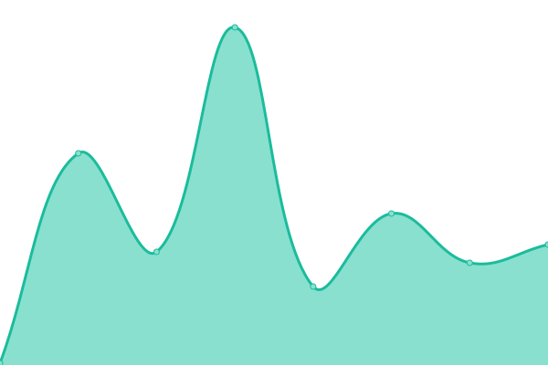

# [📈 Live Status](https://demo.upptime.js.org): <!--live status--> **🟧 Partial outage**

This repository contains the open-source uptime monitor and status page for [Linkspreed](https://linkspreed.com), powered by [Linkspreed](https://github.com/linkspreed).

We use [Issues](https://github.com/linkspreed/linkspreed_uptime/issues) as incident reports, [Actions](https://github.com/linkspreed/linkspreed_uptime/actions) as uptime monitors, and [Pages](https://status.linkspreed.com) for the status page.

<!--start: status pages-->
<!-- This summary is generated by Upptime (https://github.com/upptime/upptime) -->
<!-- Do not edit this manually, your changes will be overwritten -->
<!-- prettier-ignore -->
| URL | Status | History | Response Time | Uptime |
| --- | ------ | ------- | ------------- | ------ |
|  [Adseasy](https://adseasy.tk) | 🟩 Up | [adseasy.yml](https://github.com/linkspreed/linkspreed_uptime/commits/HEAD/history/adseasy.yml) | 

 1092ms
     
 | 

<a href="https://status.linkspreed.com/history/adseasy">99.75%</a>
    

|  [Airr](https://airr.tk) | 🟩 Up | [airr.yml](https://github.com/linkspreed/linkspreed_uptime/commits/HEAD/history/airr.yml) | 

 1666ms
     
 | 

<a href="https://status.linkspreed.com/history/airr">99.75%</a>
    

|  [Analytix](https://analytix.tk) | 🟩 Up | [analytix.yml](https://github.com/linkspreed/linkspreed_uptime/commits/HEAD/history/analytix.yml) | 

 893ms
     
 | 

<a href="https://status.linkspreed.com/history/analytix">99.75%</a>
    

|  [Articly](https://articly.tk) | 🟩 Up | [articly.yml](https://github.com/linkspreed/linkspreed_uptime/commits/HEAD/history/articly.yml) | 

 818ms
     
 | 

<a href="https://status.linkspreed.com/history/articly">99.75%</a>
    

|  [Backpay](https://backpay.cf) | 🟥 Down | [backpay.yml](https://github.com/linkspreed/linkspreed_uptime/commits/HEAD/history/backpay.yml) | 

 0ms
     
 | 

<a href="https://status.linkspreed.com/history/backpay">0.00%</a>
    

|  [BeSave](https://besave.tk) | 🟩 Up | [be-save.yml](https://github.com/linkspreed/linkspreed_uptime/commits/HEAD/history/be-save.yml) | 

 593ms
     
 | 

<a href="https://status.linkspreed.com/history/be-save">99.75%</a>
    

|  [BeYou](https://beyou.cf) | 🟩 Up | [be-you.yml](https://github.com/linkspreed/linkspreed_uptime/commits/HEAD/history/be-you.yml) | 

 1077ms
     
 | 

<a href="https://status.linkspreed.com/history/be-you">99.75%</a>
    

|  [Biospreed](https://biospreed.tk) | 🟩 Up | [biospreed.yml](https://github.com/linkspreed/linkspreed_uptime/commits/HEAD/history/biospreed.yml) | 

 729ms
     
 | 

<a href="https://status.linkspreed.com/history/biospreed">99.45%</a>
    

|  [BioX](https://biox.ga) | 🟩 Up | [bio-x.yml](https://github.com/linkspreed/linkspreed_uptime/commits/HEAD/history/bio-x.yml) | 

 1734ms
     
 | 

<a href="https://status.linkspreed.com/history/bio-x">99.75%</a>
    

|  [CallCloud](https://callcloud.cf) | 🟩 Up | [call-cloud.yml](https://github.com/linkspreed/linkspreed_uptime/commits/HEAD/history/call-cloud.yml) | 

 854ms
     
 | 

<a href="https://status.linkspreed.com/history/call-cloud">99.75%</a>
    

|  [Ceal](https://ceal.ga) | 🟩 Up | [ceal.yml](https://github.com/linkspreed/linkspreed_uptime/commits/HEAD/history/ceal.yml) | 

 863ms
     
 | 

<a href="https://status.linkspreed.com/history/ceal">99.75%</a>
    

|  [Cheezz](https://cheezz.tk) | 🟩 Up | [cheezz.yml](https://github.com/linkspreed/linkspreed_uptime/commits/HEAD/history/cheezz.yml) | 

 944ms
     
 | 

<a href="https://status.linkspreed.com/history/cheezz">99.75%</a>
    

|  [Chirp](https://chirp.ga) | 🟩 Up | [chirp.yml](https://github.com/linkspreed/linkspreed_uptime/commits/HEAD/history/chirp.yml) | 

 891ms
     
 | 

<a href="https://status.linkspreed.com/history/chirp">99.75%</a>
    

|  [Chitter](https://chitter.ml) | 🟩 Up | [chitter.yml](https://github.com/linkspreed/linkspreed_uptime/commits/HEAD/history/chitter.yml) | 

 969ms
     
 | 

<a href="https://status.linkspreed.com/history/chitter">94.69%</a>
    

|  [Cloud2Go](https://cloud2go.tk) | 🟩 Up | [cloud2-go.yml](https://github.com/linkspreed/linkspreed_uptime/commits/HEAD/history/cloud2-go.yml) | 

 1483ms
     
 | 

<a href="https://status.linkspreed.com/history/cloud2-go">99.75%</a>
    

|  [Cloud2Go Share](http://share.cloud2go.tk) | 🟩 Up | [cloud2-go-share.yml](https://github.com/linkspreed/linkspreed_uptime/commits/HEAD/history/cloud2-go-share.yml) | 

 1311ms
     
 | 

<a href="https://status.linkspreed.com/history/cloud2-go-share">99.75%</a>
    

|  [Cloud2Share](https://cloud2share.tk) | 🟩 Up | [cloud2-share.yml](https://github.com/linkspreed/linkspreed_uptime/commits/HEAD/history/cloud2-share.yml) | 

 405ms
     
 | 

<a href="https://status.linkspreed.com/history/cloud2-share">99.75%</a>
    

|  [CloudSpreed](https://cloudspreed.tk) | 🟩 Up | [cloud-spreed.yml](https://github.com/linkspreed/linkspreed_uptime/commits/HEAD/history/cloud-spreed.yml) | 

 1071ms
     
 | 

<a href="https://status.linkspreed.com/history/cloud-spreed">99.75%</a>
    

|  [Connected](https://connected.tk) | 🟩 Up | [connected.yml](https://github.com/linkspreed/linkspreed_uptime/commits/HEAD/history/connected.yml) | 

 742ms
     
 | 

<a href="https://status.linkspreed.com/history/connected">99.75%</a>
    

|  [Contribution](https://contribution.tk) | 🟩 Up | [contribution.yml](https://github.com/linkspreed/linkspreed_uptime/commits/HEAD/history/contribution.yml) | 

 824ms
     
 | 

<a href="https://status.linkspreed.com/history/contribution">99.91%</a>
    

|  [Critch](https://critch.cf) | 🟩 Up | [critch.yml](https://github.com/linkspreed/linkspreed_uptime/commits/HEAD/history/critch.yml) | 

 862ms
     
 | 

<a href="https://status.linkspreed.com/history/critch">99.75%</a>
    

|  [CrossQA](https://crossqa.tk) | 🟩 Up | [cross-qa.yml](https://github.com/linkspreed/linkspreed_uptime/commits/HEAD/history/cross-qa.yml) | 

 730ms
     
 | 

<a href="https://status.linkspreed.com/history/cross-qa">99.84%</a>
    

|  [Datify](https://datify.cf) | 🟩 Up | [datify.yml](https://github.com/linkspreed/linkspreed_uptime/commits/HEAD/history/datify.yml) | 

 1156ms
     
 | 

<a href="https://status.linkspreed.com/history/datify">99.84%</a>
    

|  [DeePage](https://deepage.tk) | 🟩 Up | [dee-page.yml](https://github.com/linkspreed/linkspreed_uptime/commits/HEAD/history/dee-page.yml) | 

 801ms
     
 | 

<a href="https://status.linkspreed.com/history/dee-page">99.84%</a>
    

|  [Discounty](https://discounty.tk) | 🟥 Down | [discounty.yml](https://github.com/linkspreed/linkspreed_uptime/commits/HEAD/history/discounty.yml) | 

 844ms
     
 | 

<a href="https://status.linkspreed.com/history/discounty">0.00%</a>
    

|  [Diskit](https://diskit.tk) | 🟩 Up | [diskit.yml](https://github.com/linkspreed/linkspreed_uptime/commits/HEAD/history/diskit.yml) | 

 771ms
     
 | 

<a href="https://status.linkspreed.com/history/diskit">99.84%</a>
    

|  [DNServer](https://dnserver.cf) | 🟩 Up | [dn-server.yml](https://github.com/linkspreed/linkspreed_uptime/commits/HEAD/history/dn-server.yml) | 

 1222ms
     
 | 

<a href="https://status.linkspreed.com/history/dn-server">99.84%</a>
    

|  [Downflix](https://downflix.cf) | 🟩 Up | [downflix.yml](https://github.com/linkspreed/linkspreed_uptime/commits/HEAD/history/downflix.yml) | 

 850ms
     
 | 

<a href="https://status.linkspreed.com/history/downflix">99.84%</a>
    

|  [Dreambuild](https://dreambuild.tk) | 🟩 Up | [dreambuild.yml](https://github.com/linkspreed/linkspreed_uptime/commits/HEAD/history/dreambuild.yml) | 

 1433ms
     
 | 

<a href="https://status.linkspreed.com/history/dreambuild">99.84%</a>
    

|  [Firelaps](https://firelaps.cf) | 🟥 Down | [firelaps.yml](https://github.com/linkspreed/linkspreed_uptime/commits/HEAD/history/firelaps.yml) | 

 749ms
     
 | 

<a href="https://status.linkspreed.com/history/firelaps">0.00%</a>
    

|  [FlipX](https://flipx.tk) | 🟩 Up | [flip-x.yml](https://github.com/linkspreed/linkspreed_uptime/commits/HEAD/history/flip-x.yml) | 

 1557ms
     
 | 

<a href="https://status.linkspreed.com/history/flip-x">99.84%</a>
    

|  [ForJu](https://forju.tk) | 🟩 Up | [for-ju.yml](https://github.com/linkspreed/linkspreed_uptime/commits/HEAD/history/for-ju.yml) | 

 912ms
     
 | 

<a href="https://status.linkspreed.com/history/for-ju">99.84%</a>
    

|  [GetPro](https://getpro.gq/) | 🟩 Up | [get-pro.yml](https://github.com/linkspreed/linkspreed_uptime/commits/HEAD/history/get-pro.yml) | 

 1336ms
     
 | 

<a href="https://status.linkspreed.com/history/get-pro">99.84%</a>
    

|  [Gogola](https://gogola.ga) | 🟥 Down | [gogola.yml](https://github.com/linkspreed/linkspreed_uptime/commits/HEAD/history/gogola.yml) | 

 22224ms
     
 | 

<a href="https://status.linkspreed.com/history/gogola">6.89%</a>
    

|  [Grown](https://grown.tk) | 🟩 Up | [grown.yml](https://github.com/linkspreed/linkspreed_uptime/commits/HEAD/history/grown.yml) | 

 1108ms
     
 | 

<a href="https://status.linkspreed.com/history/grown">99.72%</a>
    

|  [Guju](https://guju.tk) | 🟩 Up | [guju.yml](https://github.com/linkspreed/linkspreed_uptime/commits/HEAD/history/guju.yml) | 

 926ms
     
 | 

<a href="https://status.linkspreed.com/history/guju">99.72%</a>
    

|  [Him4Her](https://him4her.tk) | 🟩 Up | [him4-her.yml](https://github.com/linkspreed/linkspreed_uptime/commits/HEAD/history/him4-her.yml) | 

 868ms
     
 | 

<a href="https://status.linkspreed.com/history/him4-her">99.72%</a>
    

|  [Hutty](https://hutty.tk) | 🟥 Down | [hutty.yml](https://github.com/linkspreed/linkspreed_uptime/commits/HEAD/history/hutty.yml) | 

 1236ms
     
 | 

<a href="https://status.linkspreed.com/history/hutty">0.00%</a>
    

|  [IceCloud](https://icecloud.cf) | 🟩 Up | [ice-cloud.yml](https://github.com/linkspreed/linkspreed_uptime/commits/HEAD/history/ice-cloud.yml) | 

 1328ms
     
 | 

<a href="https://status.linkspreed.com/history/ice-cloud">99.72%</a>
    

|  [Ignyte](https://ignyte.tk) | 🟩 Up | [ignyte.yml](https://github.com/linkspreed/linkspreed_uptime/commits/HEAD/history/ignyte.yml) | 

 784ms
     
 | 

<a href="https://status.linkspreed.com/history/ignyte">99.72%</a>
    

|  [Joyn](https://joyn.tk) | 🟩 Up | [joyn.yml](https://github.com/linkspreed/linkspreed_uptime/commits/HEAD/history/joyn.yml) | 

 675ms
     
 | 

<a href="https://status.linkspreed.com/history/joyn">99.90%</a>
    

|  [Kisk](https://kisk.tk) | 🟩 Up | [kisk.yml](https://github.com/linkspreed/linkspreed_uptime/commits/HEAD/history/kisk.yml) | 

 1309ms
     
 | 

<a href="https://status.linkspreed.com/history/kisk">99.90%</a>
    

|  [KitChat](https://kitchat.tk) | 🟩 Up | [kit-chat.yml](https://github.com/linkspreed/linkspreed_uptime/commits/HEAD/history/kit-chat.yml) | 

 787ms
     
 | 

<a href="https://status.linkspreed.com/history/kit-chat">99.90%</a>
    

|  [LaaS](https://laas.ml) | 🟩 Up | [laa-s.yml](https://github.com/linkspreed/linkspreed_uptime/commits/HEAD/history/laa-s.yml) | 

 1093ms
     
 | 

<a href="https://status.linkspreed.com/history/laa-s">99.90%</a>
    

|  [Lime](https://lime.gq) | 🟩 Up | [lime.yml](https://github.com/linkspreed/linkspreed_uptime/commits/HEAD/history/lime.yml) | 

 922ms
     
 | 

<a href="https://status.linkspreed.com/history/lime">99.90%</a>
    

|  [LinkCream](https://linkcream.tk) | 🟥 Down | [link-cream.yml](https://github.com/linkspreed/linkspreed_uptime/commits/HEAD/history/link-cream.yml) | 

 788ms
     
 | 

<a href="https://status.linkspreed.com/history/link-cream">0.00%</a>
    

|  [Linkspreed](https://linkspreed.com) | 🟩 Up | [linkspreed.yml](https://github.com/linkspreed/linkspreed_uptime/commits/HEAD/history/linkspreed.yml) | 

 3553ms
     
 | 

<a href="https://status.linkspreed.com/history/linkspreed">99.61%</a>
    

|  [Linkspreed Analytics](https://analytics.linkspreed.com) | 🟩 Up | [linkspreed-analytics.yml](https://github.com/linkspreed/linkspreed_uptime/commits/HEAD/history/linkspreed-analytics.yml) | 

 811ms
     
 | 

<a href="https://status.linkspreed.com/history/linkspreed-analytics">99.90%</a>
    

|  [Linkspreed Drive](https://drive.linkspreed.com) | 🟩 Up | [linkspreed-drive.yml](https://github.com/linkspreed/linkspreed_uptime/commits/HEAD/history/linkspreed-drive.yml) | 

 1040ms
     
 | 

<a href="https://status.linkspreed.com/history/linkspreed-drive">99.90%</a>
    

|  [Helpdesk Linkspreed](https://helpdesk.linkspreed.com/) | 🟩 Up | [helpdesk-linkspreed.yml](https://github.com/linkspreed/linkspreed_uptime/commits/HEAD/history/helpdesk-linkspreed.yml) | 

 1026ms
     
 | 

<a href="https://status.linkspreed.com/history/helpdesk-linkspreed">94.81%</a>
    

|  [Linkspreed Mails](https://mails.linkspreed.com) | 🟩 Up | [linkspreed-mails.yml](https://github.com/linkspreed/linkspreed_uptime/commits/HEAD/history/linkspreed-mails.yml) | 

 1083ms
     
 | 

<a href="https://status.linkspreed.com/history/linkspreed-mails">99.89%</a>
    

|  [Linkspreed Photos](https://photos.linkspreed.com) | 🟩 Up | [linkspreed-photos.yml](https://github.com/linkspreed/linkspreed_uptime/commits/HEAD/history/linkspreed-photos.yml) | 

 927ms
     
 | 

<a href="https://status.linkspreed.com/history/linkspreed-photos">99.89%</a>
    

|  [Linkspreed Store](https://store.linkspreed.com) | 🟩 Up | [linkspreed-store.yml](https://github.com/linkspreed/linkspreed_uptime/commits/HEAD/history/linkspreed-store.yml) | 

 588ms
     
 | 

<a href="https://status.linkspreed.com/history/linkspreed-store">99.89%</a>
    

|  [Linkspreed Web](https://web.linkspreed.com) | 🟩 Up | [linkspreed-web.yml](https://github.com/linkspreed/linkspreed_uptime/commits/HEAD/history/linkspreed-web.yml) | 

 647ms
     
 | 

<a href="https://status.linkspreed.com/history/linkspreed-web">99.89%</a>
    

|  [Linkspreed Web4](https://web4.linkspreed.com) | 🟩 Up | [linkspreed-web4.yml](https://github.com/linkspreed/linkspreed_uptime/commits/HEAD/history/linkspreed-web4.yml) | 

 188ms
     
 | 

<a href="https://status.linkspreed.com/history/linkspreed-web4">99.89%</a>
    

|  [LinkLab](https://linklab.ga) | 🟩 Up | [link-lab.yml](https://github.com/linkspreed/linkspreed_uptime/commits/HEAD/history/link-lab.yml) | 

 611ms
     
 | 

<a href="https://status.linkspreed.com/history/link-lab">99.89%</a>
    

|  [LSily](https://lsily.tk) | 🟩 Up | [l-sily.yml](https://github.com/linkspreed/linkspreed_uptime/commits/HEAD/history/l-sily.yml) | 

 1092ms
     
 | 

<a href="https://status.linkspreed.com/history/l-sily">99.89%</a>
    

|  [LSNews](https://lsnews.cf) | 🟩 Up | [ls-news.yml](https://github.com/linkspreed/linkspreed_uptime/commits/HEAD/history/ls-news.yml) | 

 961ms
     
 | 

<a href="https://status.linkspreed.com/history/ls-news">99.89%</a>
    

|  [Mailspread](https://mailspread.cf) | 🟩 Up | [mailspread.yml](https://github.com/linkspreed/linkspreed_uptime/commits/HEAD/history/mailspread.yml) | 

 654ms
     
 | 

<a href="https://status.linkspreed.com/history/mailspread">99.89%</a>
    

|  [Mapsli](https://mapsli.tk) | 🟩 Up | [mapsli.yml](https://github.com/linkspreed/linkspreed_uptime/commits/HEAD/history/mapsli.yml) | 

 756ms
     
 | 

<a href="https://status.linkspreed.com/history/mapsli">99.89%</a>
    

|  [Memevid](https://memevid.tk) | 🟩 Up | [memevid.yml](https://github.com/linkspreed/linkspreed_uptime/commits/HEAD/history/memevid.yml) | 

 969ms
     
 | 

<a href="https://status.linkspreed.com/history/memevid">99.89%</a>
    

|  [Metabox](https://metabox.ga) | 🟩 Up | [metabox.yml](https://github.com/linkspreed/linkspreed_uptime/commits/HEAD/history/metabox.yml) | 

 1287ms
     
 | 

<a href="https://status.linkspreed.com/history/metabox">99.89%</a>
    

|  [Metaspace](https://metaspace.tk) | 🟩 Up | [metaspace.yml](https://github.com/linkspreed/linkspreed_uptime/commits/HEAD/history/metaspace.yml) | 

 866ms
     
 | 

<a href="https://status.linkspreed.com/history/metaspace">99.89%</a>
    

|  [Musiccloud](https://musiccloud.cf) | 🟩 Up | [musiccloud.yml](https://github.com/linkspreed/linkspreed_uptime/commits/HEAD/history/musiccloud.yml) | 

 930ms
     
 | 

<a href="https://status.linkspreed.com/history/musiccloud">99.89%</a>
    

|  [MyBuy](https://mybuy.cf) | 🟩 Up | [my-buy.yml](https://github.com/linkspreed/linkspreed_uptime/commits/HEAD/history/my-buy.yml) | 

 1017ms
     
 | 

<a href="https://status.linkspreed.com/history/my-buy">99.89%</a>
    

|  [MyDancX](https://mydancx.cf) | 🟩 Up | [my-danc-x.yml](https://github.com/linkspreed/linkspreed_uptime/commits/HEAD/history/my-danc-x.yml) | 

 1098ms
     
 | 

<a href="https://status.linkspreed.com/history/my-danc-x">99.89%</a>
    

|  [Netavark](https://netavark.tk) | 🟩 Up | [netavark.yml](https://github.com/linkspreed/linkspreed_uptime/commits/HEAD/history/netavark.yml) | 

 1187ms
     
 | 

<a href="https://status.linkspreed.com/history/netavark">99.89%</a>
    

|  [NetSky](https://netsky.tk) | 🟩 Up | [net-sky.yml](https://github.com/linkspreed/linkspreed_uptime/commits/HEAD/history/net-sky.yml) | 

 1763ms
     
 | 

<a href="https://status.linkspreed.com/history/net-sky">99.89%</a>
    

|  [NewsNode](https://newsnode.tk) | 🟩 Up | [news-node.yml](https://github.com/linkspreed/linkspreed_uptime/commits/HEAD/history/news-node.yml) | 

 1361ms
     
 | 

<a href="https://status.linkspreed.com/history/news-node">99.89%</a>
    

|  [Niming](https://niming.tk) | 🟩 Up | [niming.yml](https://github.com/linkspreed/linkspreed_uptime/commits/HEAD/history/niming.yml) | 

 1088ms
     
 | 

<a href="https://status.linkspreed.com/history/niming">99.89%</a>
    

|  [Nither](https://nither.tk) | 🟥 Down | [nither.yml](https://github.com/linkspreed/linkspreed_uptime/commits/HEAD/history/nither.yml) | 

 851ms
     
 | 

<a href="https://status.linkspreed.com/history/nither">0.00%</a>
    

|  [NodX](https://nodx.tk) | 🟩 Up | [nod-x.yml](https://github.com/linkspreed/linkspreed_uptime/commits/HEAD/history/nod-x.yml) | 

 1699ms
     
 | 

<a href="https://status.linkspreed.com/history/nod-x">99.89%</a>
    

|  [OnlyPaid](https://onlypaid.tk) | 🟩 Up | [only-paid.yml](https://github.com/linkspreed/linkspreed_uptime/commits/HEAD/history/only-paid.yml) | 

 1289ms
     
 | 

<a href="https://status.linkspreed.com/history/only-paid">99.89%</a>
    

|  [Ondu](https://ondu.tk) | 🟩 Up | [ondu.yml](https://github.com/linkspreed/linkspreed_uptime/commits/HEAD/history/ondu.yml) | 

 1547ms
     
 | 

<a href="https://status.linkspreed.com/history/ondu">99.89%</a>
    

|  [Payback](https://payback.ga) | 🟥 Down | [payback.yml](https://github.com/linkspreed/linkspreed_uptime/commits/HEAD/history/payback.yml) | 

 1269ms
     
 | 

<a href="https://status.linkspreed.com/history/payback">0.00%</a>
    

|  [Payback](https://payback.gq) | 🟥 Down | [payback.yml](https://github.com/linkspreed/linkspreed_uptime/commits/HEAD/history/payback.yml) | 

 1269ms
     
 | 

<a href="https://status.linkspreed.com/history/payback">0.00%</a>
    

|  [PayCount](https://paycount.cf) | 🟩 Up | [pay-count.yml](https://github.com/linkspreed/linkspreed_uptime/commits/HEAD/history/pay-count.yml) | 

 1710ms
     
 | 

<a href="https://status.linkspreed.com/history/pay-count">99.89%</a>
    

|  [Peek](https://peek.ml) | 🟩 Up | [peek.yml](https://github.com/linkspreed/linkspreed_uptime/commits/HEAD/history/peek.yml) | 

 825ms
     
 | 

<a href="https://status.linkspreed.com/history/peek">99.89%</a>
    

|  [Petabyte](https://petabyte.ml) | 🟩 Up | [petabyte.yml](https://github.com/linkspreed/linkspreed_uptime/commits/HEAD/history/petabyte.yml) | 

 1593ms
     
 | 

<a href="https://status.linkspreed.com/history/petabyte">99.89%</a>
    

|  [PinPix](https://pinpix.cf) | 🟩 Up | [pin-pix.yml](https://github.com/linkspreed/linkspreed_uptime/commits/HEAD/history/pin-pix.yml) | 

 973ms
     
 | 

<a href="https://status.linkspreed.com/history/pin-pix">99.89%</a>
    

|  [PinSec](https://pinsec.tk) | 🟩 Up | [pin-sec.yml](https://github.com/linkspreed/linkspreed_uptime/commits/HEAD/history/pin-sec.yml) | 

 928ms
     
 | 

<a href="https://status.linkspreed.com/history/pin-sec">99.71%</a>
    

|  [Pixly](https://pixly.tk) | 🟩 Up | [pixly.yml](https://github.com/linkspreed/linkspreed_uptime/commits/HEAD/history/pixly.yml) | 

 686ms
     
 | 

<a href="https://status.linkspreed.com/history/pixly">99.71%</a>
    

|  [Ples](https://ples.ml) | 🟩 Up | [ples.yml](https://github.com/linkspreed/linkspreed_uptime/commits/HEAD/history/ples.yml) | 

 1041ms
     
 | 

<a href="https://status.linkspreed.com/history/ples">99.71%</a>
    

|  [Plop](https://plop.tk) | 🟩 Up | [plop.yml](https://github.com/linkspreed/linkspreed_uptime/commits/HEAD/history/plop.yml) | 

 838ms
     
 | 

<a href="https://status.linkspreed.com/history/plop">99.71%</a>
    

|  [Poddy](https://poddy.tk) | 🟩 Up | [poddy.yml](https://github.com/linkspreed/linkspreed_uptime/commits/HEAD/history/poddy.yml) | 

 989ms
     
 | 

<a href="https://status.linkspreed.com/history/poddy">99.71%</a>
    

|  [Profilio](https://www.profilio.cf) | 🟩 Up | [profilio.yml](https://github.com/linkspreed/linkspreed_uptime/commits/HEAD/history/profilio.yml) | 

 1429ms
     
 | 

<a href="https://status.linkspreed.com/history/profilio">99.71%</a>
    

|  [Pubit](https://pubit.tk) | 🟩 Up | [pubit.yml](https://github.com/linkspreed/linkspreed_uptime/commits/HEAD/history/pubit.yml) | 

 1070ms
     
 | 

<a href="https://status.linkspreed.com/history/pubit">94.62%</a>
    

|  [QRMe](https://qrme.cf) | 🟩 Up | [qr-me.yml](https://github.com/linkspreed/linkspreed_uptime/commits/HEAD/history/qr-me.yml) | 

 838ms
     
 | 

<a href="https://status.linkspreed.com/history/qr-me">94.62%</a>
    

|  [Quexy](https://quexy.cf) | 🟩 Up | [quexy.yml](https://github.com/linkspreed/linkspreed_uptime/commits/HEAD/history/quexy.yml) | 

 828ms
     
 | 

<a href="https://status.linkspreed.com/history/quexy">94.62%</a>
    

|  [Rank](https://rank.ga) | 🟩 Up | [rank.yml](https://github.com/linkspreed/linkspreed_uptime/commits/HEAD/history/rank.yml) | 

 1335ms
     
 | 

<a href="https://status.linkspreed.com/history/rank">94.62%</a>
    

|  [RealPin](https://realpin.tk) | 🟩 Up | [real-pin.yml](https://github.com/linkspreed/linkspreed_uptime/commits/HEAD/history/real-pin.yml) | 

 827ms
     
 | 

<a href="https://status.linkspreed.com/history/real-pin">94.62%</a>
    

|  [Reply](https://reply.cf) | 🟩 Up | [reply.yml](https://github.com/linkspreed/linkspreed_uptime/commits/HEAD/history/reply.yml) | 

 788ms
     
 | 

<a href="https://status.linkspreed.com/history/reply">94.62%</a>
    

|  [SeedSpreed](https://seedspreed.cf) | 🟩 Up | [seed-spreed.yml](https://github.com/linkspreed/linkspreed_uptime/commits/HEAD/history/seed-spreed.yml) | 

 660ms
     
 | 

<a href="https://status.linkspreed.com/history/seed-spreed">94.62%</a>
    

|  [Share](https://share.ga) | 🟩 Up | [share.yml](https://github.com/linkspreed/linkspreed_uptime/commits/HEAD/history/share.yml) | 

 881ms
     
 | 

<a href="https://status.linkspreed.com/history/share">94.62%</a>
    

|  [ShareNode](https://sharenode.tk) | 🟩 Up | [share-node.yml](https://github.com/linkspreed/linkspreed_uptime/commits/HEAD/history/share-node.yml) | 

 1737ms
     
 | 

<a href="https://status.linkspreed.com/history/share-node">94.62%</a>
    

|  [Shortcut](https://shortcut.tk) | 🟩 Up | [shortcut.yml](https://github.com/linkspreed/linkspreed_uptime/commits/HEAD/history/shortcut.yml) | 

 941ms
     
 | 

<a href="https://status.linkspreed.com/history/shortcut">94.62%</a>
    

|  [Shortrack](https://shortrack.tk) | 🟩 Up | [shortrack.yml](https://github.com/linkspreed/linkspreed_uptime/commits/HEAD/history/shortrack.yml) | 

 1123ms
     
 | 

<a href="https://status.linkspreed.com/history/shortrack">94.62%</a>
    

|  [Showit](https://showit.tk) | 🟩 Up | [showit.yml](https://github.com/linkspreed/linkspreed_uptime/commits/HEAD/history/showit.yml) | 

 1068ms
     
 | 

<a href="https://status.linkspreed.com/history/showit">94.62%</a>
    

|  [SiteSpace](https://sitespace.tk) | 🟩 Up | [site-space.yml](https://github.com/linkspreed/linkspreed_uptime/commits/HEAD/history/site-space.yml) | 

 1904ms
     
 | 

<a href="https://status.linkspreed.com/history/site-space">94.73%</a>
    

|  [Slinky](https://slinky.ml) | 🟩 Up | [slinky.yml](https://github.com/linkspreed/linkspreed_uptime/commits/HEAD/history/slinky.yml) | 

 761ms
     
 | 

<a href="https://status.linkspreed.com/history/slinky">94.73%</a>
    

|  [Slurch](https://slurch.tk) | 🟩 Up | [slurch.yml](https://github.com/linkspreed/linkspreed_uptime/commits/HEAD/history/slurch.yml) | 

 1209ms
     
 | 

<a href="https://status.linkspreed.com/history/slurch">94.73%</a>
    

|  [SmartPix](https://smartpix.cf) | 🟩 Up | [smart-pix.yml](https://github.com/linkspreed/linkspreed_uptime/commits/HEAD/history/smart-pix.yml) | 

 1221ms
     
 | 

<a href="https://status.linkspreed.com/history/smart-pix">94.73%</a>
    

|  [SnapLink](https://snaplink.tk) | 🟩 Up | [snap-link.yml](https://github.com/linkspreed/linkspreed_uptime/commits/HEAD/history/snap-link.yml) | 

 1113ms
     
 | 

<a href="https://status.linkspreed.com/history/snap-link">94.73%</a>
    

|  [Snippite](https://snippite.tk) | 🟩 Up | [snippite.yml](https://github.com/linkspreed/linkspreed_uptime/commits/HEAD/history/snippite.yml) | 

 750ms
     
 | 

<a href="https://status.linkspreed.com/history/snippite">76.11%</a>
    

|  [Snoogie](https://snoogie.tk) | 🟥 Down | [snoogie.yml](https://github.com/linkspreed/linkspreed_uptime/commits/HEAD/history/snoogie.yml) | 

 714ms
     
 | 

<a href="https://status.linkspreed.com/history/snoogie">68.48%</a>
    

|  [SoundChest](https://soundchest.cf) | 🟥 Down | [sound-chest.yml](https://github.com/linkspreed/linkspreed_uptime/commits/HEAD/history/sound-chest.yml) | 

 889ms
     
 | 

<a href="https://status.linkspreed.com/history/sound-chest">59.74%</a>
    

|  [Spypy](https://spypy.cf) | 🟥 Down | [spypy.yml](https://github.com/linkspreed/linkspreed_uptime/commits/HEAD/history/spypy.yml) | 

 766ms
     
 | 

<a href="https://status.linkspreed.com/history/spypy">45.55%</a>
    

|  [Start2Up](https://start2up.tk) | 🟥 Down | [start2-up.yml](https://github.com/linkspreed/linkspreed_uptime/commits/HEAD/history/start2-up.yml) | 

 789ms
     
 | 

<a href="https://status.linkspreed.com/history/start2-up">55.17%</a>
    

|  [Stix](https://stix.ga) | 🟥 Down | [stix.yml](https://github.com/linkspreed/linkspreed_uptime/commits/HEAD/history/stix.yml) | 

 993ms
     
 | 

<a href="https://status.linkspreed.com/history/stix">55.44%</a>
    

|  [Store4Ju](https://store4ju.tk) | 🟥 Down | [store4-ju.yml](https://github.com/linkspreed/linkspreed_uptime/commits/HEAD/history/store4-ju.yml) | 

 1167ms
     
 | 

<a href="https://status.linkspreed.com/history/store4-ju">71.62%</a>
    

|  [Storee](https://storee.cf) | 🟥 Down | [storee.yml](https://github.com/linkspreed/linkspreed_uptime/commits/HEAD/history/storee.yml) | 

 1112ms
     
 | 

<a href="https://status.linkspreed.com/history/storee">71.58%</a>
    

|  [Storpad](https://storpad.tk) | 🟥 Down | [storpad.yml](https://github.com/linkspreed/linkspreed_uptime/commits/HEAD/history/storpad.yml) | 

 2273ms
     
 | 

<a href="https://status.linkspreed.com/history/storpad">67.21%</a>
    

|  [StreamValley](https://streamvalley.cf) | 🟥 Down | [stream-valley.yml](https://github.com/linkspreed/linkspreed_uptime/commits/HEAD/history/stream-valley.yml) | 

 1042ms
     
 | 

<a href="https://status.linkspreed.com/history/stream-valley">61.68%</a>
    

|  [StreamValley API](https://api.streamvalley.cf) | 🟥 Down | [stream-valley-api.yml](https://github.com/linkspreed/linkspreed_uptime/commits/HEAD/history/stream-valley-api.yml) | 

 645ms
     
 | 

<a href="https://status.linkspreed.com/history/stream-valley-api">56.06%</a>
    

|  [Tacuu](https://tacuu.tk) | 🟥 Down | [tacuu.yml](https://github.com/linkspreed/linkspreed_uptime/commits/HEAD/history/tacuu.yml) | 

 715ms
     
 | 

<a href="https://status.linkspreed.com/history/tacuu">51.85%</a>
    

|  [Takestore](https://takestore.tk) | 🟥 Down | [takestore.yml](https://github.com/linkspreed/linkspreed_uptime/commits/HEAD/history/takestore.yml) | 

 906ms
     
 | 

<a href="https://status.linkspreed.com/history/takestore">47.11%</a>
    

|  [Tasksboard](https://tasksboard.tk) | 🟥 Down | [tasksboard.yml](https://github.com/linkspreed/linkspreed_uptime/commits/HEAD/history/tasksboard.yml) | 

 909ms
     
 | 

<a href="https://status.linkspreed.com/history/tasksboard">40.81%</a>
    

|  [Taya](https://taya.cf) | 🟥 Down | [taya.yml](https://github.com/linkspreed/linkspreed_uptime/commits/HEAD/history/taya.yml) | 

 728ms
     
 | 

<a href="https://status.linkspreed.com/history/taya">36.98%</a>
    

|  [Teamix](https://teamix.cf) | 🟥 Down | [teamix.yml](https://github.com/linkspreed/linkspreed_uptime/commits/HEAD/history/teamix.yml) | 

 614ms
     
 | 

<a href="https://status.linkspreed.com/history/teamix">0.00%</a>
    

|  [Teamslite](https://teamslite.tk) | 🟥 Down | [teamslite.yml](https://github.com/linkspreed/linkspreed_uptime/commits/HEAD/history/teamslite.yml) | 

 1224ms
     
 | 

<a href="https://status.linkspreed.com/history/teamslite">36.41%</a>
    

|  [TeamSpreed](https://teamspreed.cf) | 🟥 Down | [team-spreed.yml](https://github.com/linkspreed/linkspreed_uptime/commits/HEAD/history/team-spreed.yml) | 

 622ms
     
 | 

<a href="https://status.linkspreed.com/history/team-spreed">39.13%</a>
    

|  [Tizza](https://tizza.tk) | 🟥 Down | [tizza.yml](https://github.com/linkspreed/linkspreed_uptime/commits/HEAD/history/tizza.yml) | 

 753ms
     
 | 

<a href="https://status.linkspreed.com/history/tizza">36.86%</a>
    

|  [Toolbox](https://toolbox.ga) | 🟥 Down | [toolbox.yml](https://github.com/linkspreed/linkspreed_uptime/commits/HEAD/history/toolbox.yml) | 

 1802ms
     
 | 

<a href="https://status.linkspreed.com/history/toolbox">42.54%</a>
    

|  [Toolkit](https://toolkit.ga) | 🟥 Down | [toolkit.yml](https://github.com/linkspreed/linkspreed_uptime/commits/HEAD/history/toolkit.yml) | 

 851ms
     
 | 

<a href="https://status.linkspreed.com/history/toolkit">53.27%</a>
    

|  [Tuit](https://tuit.cf) | 🟥 Down | [tuit.yml](https://github.com/linkspreed/linkspreed_uptime/commits/HEAD/history/tuit.yml) | 

 1394ms
     
 | 

<a href="https://status.linkspreed.com/history/tuit">52.32%</a>
    

|  [Tungolino](https://tungolino.tk) | 🟥 Down | [tungolino.yml](https://github.com/linkspreed/linkspreed_uptime/commits/HEAD/history/tungolino.yml) | 

 840ms
     
 | 

<a href="https://status.linkspreed.com/history/tungolino">51.86%</a>
    

|  [Tweetch](https://tweetch.cf) | 🟥 Down | [tweetch.yml](https://github.com/linkspreed/linkspreed_uptime/commits/HEAD/history/tweetch.yml) | 

 939ms
     
 | 

<a href="https://status.linkspreed.com/history/tweetch">51.29%</a>
    

|  [Twig](https://twig.cf) | 🟥 Down | [twig.yml](https://github.com/linkspreed/linkspreed_uptime/commits/HEAD/history/twig.yml) | 

 772ms
     
 | 

<a href="https://status.linkspreed.com/history/twig">50.77%</a>
    

|  [uCube](https://ucube.cf) | 🟥 Down | [u-cube.yml](https://github.com/linkspreed/linkspreed_uptime/commits/HEAD/history/u-cube.yml) | 

 706ms
     
 | 

<a href="https://status.linkspreed.com/history/u-cube">50.03%</a>
    

|  [UltiCloud](https://ulticloud.tk) | 🟥 Down | [ulti-cloud.yml](https://github.com/linkspreed/linkspreed_uptime/commits/HEAD/history/ulti-cloud.yml) | 

 1319ms
     
 | 

<a href="https://status.linkspreed.com/history/ulti-cloud">53.56%</a>
    

|  [Up2Date](https://up2date.tk) | 🟥 Down | [up2-date.yml](https://github.com/linkspreed/linkspreed_uptime/commits/HEAD/history/up2-date.yml) | 

 861ms
     
 | 

<a href="https://status.linkspreed.com/history/up2-date">47.71%</a>
    

|  [UpDown](https://updown.ml) | 🟥 Down | [up-down.yml](https://github.com/linkspreed/linkspreed_uptime/commits/HEAD/history/up-down.yml) | 

 1453ms
     
 | 

<a href="https://status.linkspreed.com/history/up-down">47.05%</a>
    

|  [UpNode](https://upnode.cf) | 🟥 Down | [up-node.yml](https://github.com/linkspreed/linkspreed_uptime/commits/HEAD/history/up-node.yml) | 

 5424ms
     
 | 

<a href="https://status.linkspreed.com/history/up-node">1.40%</a>
    

|  [VoiceClub](https://voiceclub.tk) | 🟩 Up | [voice-club.yml](https://github.com/linkspreed/linkspreed_uptime/commits/HEAD/history/voice-club.yml) | 

 576ms
     
 | 

<a href="https://status.linkspreed.com/history/voice-club">100.00%</a>
    

|  [Web5](https://web5.cf) | 🟥 Down | [web5.yml](https://github.com/linkspreed/linkspreed_uptime/commits/HEAD/history/web5.yml) | 

 1347ms
     
 | 

<a href="https://status.linkspreed.com/history/web5">45.05%</a>
    

|  [Whatsline](https://whatsline.tk) | 🟥 Down | [whatsline.yml](https://github.com/linkspreed/linkspreed_uptime/commits/HEAD/history/whatsline.yml) | 

 1346ms
     
 | 

<a href="https://status.linkspreed.com/history/whatsline">44.70%</a>
    

|  [Wrap](https://wrap.gq) | 🟥 Down | [wrap.yml](https://github.com/linkspreed/linkspreed_uptime/commits/HEAD/history/wrap.yml) | 

 1698ms
     
 | 

<a href="https://status.linkspreed.com/history/wrap">44.49%</a>
    

|  [Write](https://write.cf) | 🟥 Down | [write.yml](https://github.com/linkspreed/linkspreed_uptime/commits/HEAD/history/write.yml) | 

 1308ms
     
 | 

<a href="https://status.linkspreed.com/history/write">44.24%</a>
    

|  [Yourpod](https://yourpod.cf) | 🟥 Down | [yourpod.yml](https://github.com/linkspreed/linkspreed_uptime/commits/HEAD/history/yourpod.yml) | 

 979ms
     
 | 

<a href="https://status.linkspreed.com/history/yourpod">44.23%</a>
    

<!--end: status pages-->

[**Visit our status website →**](https://status.linkspreed.com)

## 📄 License

- Powered by: [Linkspreed](https://www.linkspreed.com)
- Code: [MIT](./LICENSE) © [Linkspreed](https://status.linkspreed.com)
- Data in the `./history` directory: [Open Database License](https://opendatacommons.org/licenses/odbl/1-0/)
